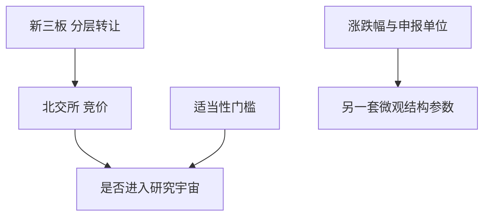

# 北交所与新三板

北交所从新三板精选层而来，投资者适当性、涨跌幅、竞价与信息披露与沪深主板不是同一套参数。把精选层历史直接并进全 A 因子，门槛与流动性会错。

<footer>—— 北京证券交易所交易规则及相关适当性规定；全国中小企业股份转让系统分层与转让规则；对照[科创板/创业板](/quant/star-chinext)</footer>

[上一课](/quant/cn-convertible-market)仍在沪深产品。本课的缺口是**另一交易所层级**：新三板基础层/创新层的协议与做市转让，以及 2021 年设立的北京证券交易所（由精选层平移）。涨跌幅、最小申报、适当性、连续竞价时段与沪深不同。后课注册制主要写沪深 IPO，但北交所也是注册制试点的一支，本课先钉交易与宇宙。不把北交所股票画进沪深[LOB](/quant/lob-structure) 当同一深度。

## 问题

全 A 研究常以沪深为样本。北交所股票代码、指数（如北证 50）与投资者门槛（相对沪深更高的资产与经验要求，以现行适当性为准）使订单流更机构化或更稀疏——两者都可能，取决于阶段，须用数据而不是口号。问题是：因子宇宙是否包含北交所、从哪一日起（开板日 vs 精选层历史）、流动性过滤如何设。用沪深 10% 涨跌停去套北交所 30% 日常涨跌幅（以规则为准），锁定概率与磁吸全部错。

新三板非北交所层级仍可能是协议转让或做市，价格形成不是连续双向拍卖的同一状态机。把做市成交当竞价中间价，价差与冲击模型失效。样本应分转让方式。

### 历史拼接

精选层公司平移北交所，法律主体连续，交易规则切换。回测应在切换日分段：精选层规则 vs 北交所规则。用北交所现行规则回填精选层，属于制度前视。发行与再融资、做市转竞价，都是状态变量。

北向沪深港通不包含北交所。外资与互连通因子不要把北证成分当可买。指数增强的基准若不含北证，偏离进北证是主动风险。

## 方法

主数据：市场层级、转让方式、涨跌幅版本、适当性类别、最小申报单位。组合：客户达不到适当性则权重强制为零。流动性：用成交天数、价差、是否连续竞价过滤，而不是只按市值。与沪深因子比较时报告「含北证 / 不含北证」两套，避免一个显著结果来自十来只小样本。

停牌、信息披露与摘牌规则不同，退市收益处理要单独实现，不能直接套 CRSP Shumway 的数字，只能套其原则：退出价格必须记账。

### 指数与 ETF

北证 50 等指数的编制与调仓冲击在薄市场上更大。ETF 若存在，申赎篮子流动性可能弱于沪深 300ETF，折溢价与冲击见 ETF 课，参数重估。

## 机制

适当性提高门槛，减少噪声交易者，也可能减少风险分担，使波动与价差在薄市场更大。涨跌幅更宽降低锁定频率，但单日跳空可以更大，T+1 仍限制回转（以北交所交易规则为准）。因子的换手与反转在此样本上可能改号，属于另一市场，不是「全 A 的稳健性检验」。

新三板做市：深度来自做市商库存，撤出做市会瞬时改变可成交性，类似国际做市市场，而不是沪深竞价。

## 边界

不提供规避适当性或利用分层信息优势损害普通投资者的方法。老三板、退市板块另算。本课不评估「专精特新」叙事的投资价值，只写规则如何进状态机。

## 小结

- 北交所与新三板不是沪深主板的小市值子集；适当性、涨跌幅、转让方式须单列。
- 精选层到北交所要分段；港股通不可及。
- 因子稳健性应分样本报告，避免小样本驱动。
- 出处：北交所交易规则；股转系统分层与转让规则。
