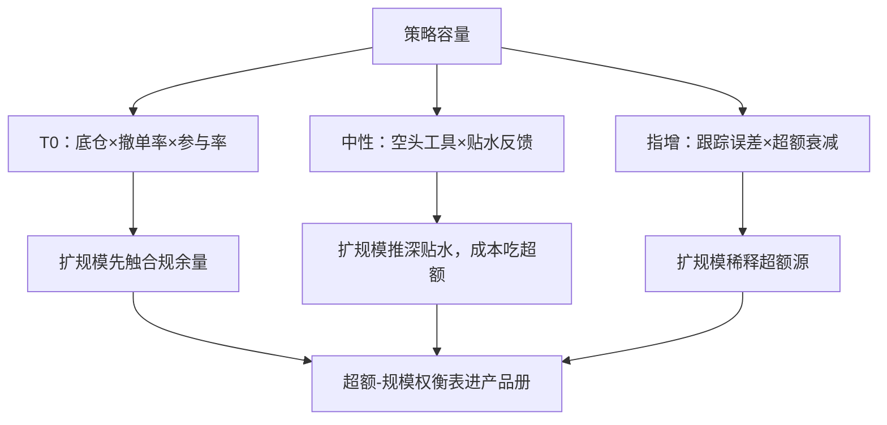

# 策略容量案例

容量的上限往往不在市场深度，而在负反馈藏在哪：藏在监管里的策略监控合规余量，藏在价格里的监控贴水，藏在信号里的监控衰减斜率。

<footer>—— 据本课程各课约束链与容量测算通则整理</footer>

[上一课](/quant/cn-custody-counter)把链路搭通，上线前最后一问是规模：这套策略在中国市场能装多少钱。[策略容量与拥挤](/quant/strategy-capacity)写了容量与拥挤的一般理论，[容量与参与率](/quant/capacity-participation)与[实盘容量估计](/quant/live-capacity-estimate)写了测量方法。本课写中国情境：容量由工具约束与监管阈值决定的部分，往往大于市场深度决定的部分。用三条约束链把问题走成案例，比抽象公式有用。

## 问题

通用容量公式的分母是成交量与参与率，中国实践还要乘三个本地约束：监管阈值——撤单率与申报速率的监控线（[程序化交易的报备实践](/quant/cn-programmatic-filing)与[差异化收费与撤单率监控](/quant/cn-fee-cancel-ratio)）；工具上限——股指期货限仓与券源规模；产品形态——申赎与集中度（[私募与公募的约束差异](/quant/cn-fund-constraints)）。缺任何一项，测算都会给出「理论上装得下、实际上装不下」的答案。

## 方法

案例一，日内 T0：约束链是底仓规模 × 撤单率监控 × 参与率。信号再好，日内可交易的量由「不触监控线的申报节奏」决定；扩规模的边际从市场深度移到合规余量，底仓可用券与券息成本（[融券与转融通](/quant/cn-margin-lending-structure)）再截一道。案例二，市场中性：约束链是空头工具容量 × 贴水拥挤反馈。规模越大，空头腿越把贴水买深（[股指期货与贴水](/quant/cn-stockindex-basis)的负反馈），对冲成本回头吃超额；容量由「贴水加深多少仍能覆盖成本」反推，而不是由期货持仓限额单独决定。案例三，指数增强：约束链是跟踪误差 × 集中度 × 超额衰减，规模扩到一定程度，小市值高波动的超额源被迫收窄（[指增产品超额衰减](/quant/index-enhancement-decay)），容量曲线在超额对规模的边际过零处见顶。

## 机制

三条链的共同点是负反馈位置不同。T0 的负反馈在监管：扩规模先触线，利润上限由合规余量给出；中性的负反馈在价格：扩规模推深贴水、抬高自己的对冲成本；指增的负反馈在信号：规模稀释超额源。识别位置就知道监控什么——T0 监控撤单率余量，中性监控净贴水与对冲成本占超额比（第一课的读数工程在此变现），指增监控分域超额的衰减斜率。容量治理因此不是一次性测算，而是把这些指标写进产品册的持续监控。

容量应写成曲线：横轴规模、纵轴预期超额，每个规模档注明瓶颈是合规余量、贴水还是衰减；只写一个「最大规模」数字的产品册，通常意味着没做过负反馈分析。

## 边界

本课用概括口径讲约束链，不给具名产品与具体规模数字；监管阈值与市场深度随时间移动，测算要用当期参数重跑；容量在组织内的分配与治理超出本课范围。

## 小结

- 中国容量约束链三分支：监管阈值、工具与贴水、集中度与衰减。
- 负反馈位置决定监控指标：合规余量、净贴水、衰减斜率各管一条链。
- 容量是曲线不是点：产品册写超额-规模权衡与各档瓶颈。
- 出处：本课程各课约束链整理；容量一般理论见[策略容量与拥挤](/quant/strategy-capacity)。
