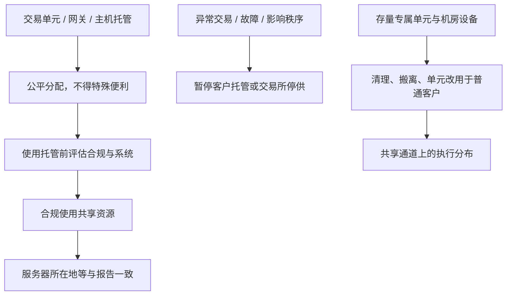

# 主机托管清退与交易单元整改

证券公司应当加强交易单元管理，按照公平原则为各类投资者提供服务；证券交易所应当公平分配主机托管、交易单元、交易信息系统接入等资源。会员不得为程序化交易投资者提供特殊便利。

<footer>—— 《证券市场程序化交易管理规定（试行）》关于信息系统与交易单元的要求；沪深交易所《程序化交易管理实施细则》第二十九条至第三十一条；证监会《关于加强资本市场中小投资者保护的若干意见》关于严禁为个别投资者提供特殊便利</footer>

程序化监管的报告与报撤，约束的是指令形态；主机托管与交易单元，约束的是谁离撮合更近、谁独占网关。证监会《管理规定》把技术系统、交易单元、主机托管、信息系统接入列为公平分配的公共资源。交易所实施细则要求会员对交易单元、交易网关按公平合理原则服务，不得为程序化投资者提供特殊便利；使用交易所主机托管须合理使用并先评估客户合规与系统运行；影响系统安全或秩序的，交易所可暂停托管。客户若一个月内多次异常被盘后限制交易、对重大波动或突发故障负有责任、或系统重大故障，会员应暂停其使用托管资源。后续中小投资者保护意见再次强调统一管理交易单元、严禁特殊便利；交易所据此推动清理独占交易单元、推动托管设备退出交易所机房等整改。本篇把延迟优势写成正在被拆除的制度资产，不是如何保住专线。

## 问题

同一套策略，报单到达撮合引擎的时间差可以决定谁排在涨跌停队列或谁先撤。主机托管把服务器放进交易所机房，交易单元（参与者业务单元）和网关决定委托通道是否独占。若个别客户独占单元、专享机位，公共资源就变成私有速度。问题不是「程序化是否允许使用托管」——细则允许在评估与管理下使用——而是**不得特殊便利、须可暂停、须服务各类客户**。回测若把 2015–2023 年某类极低延迟通道的成交假设外推到整改之后，是在使用已经或正在退出的执行函数。

整改的工程含义是执行质量向中位数回归：队列位置、撤单成功率、开盘抢单的差异缩小。策略若 alpha 主要来自通道而不是预测，整改后期望收益应下调，而不是在模拟器里继续加「托管 alpha」。

### 评估、暂停、清退是三道闸

使用托管前，会员须充分评估并留存结果，内容包括客户交易合规与技术系统运行。这是事前闸。存续期出现细则列明的情形，会员应当暂停该客户使用托管——这是事中闸。交易所对影响安全或秩序的主体可以暂停提供托管服务。清退与搬离机房、取消独立网关，是监管与会员落实「公平分配」的存量整理，把已经不合规的特殊安排从物理上拿掉。三道闸都不是策略参数，而是基础设施契约：评估未通过则根本没有合法托管路径。

行情接入与交易接入是两条线。增强行情须从许可单位获取并可加价，见[差异化收费](/quant/cn-fee-cancel-ratio)。把行情源仍放在机房、交易报盘已经迁出，并不恢复「特殊便利」的合法性。两条线都要按当时有效的接入规范走。

## 方法

合规架构应把通道当成有状态的资源：账户绑定的交易单元是否与其他客户共享、是否仍使用交易所托管、评估报告日期、是否曾被暂停托管。程序化报告里的软件与服务器所在地，应与真实接入一致；高频还须报告服务器所在地。不一致属于报告不实。新开程序化不得假设「可以谈一个独立单元」；公开规则方向是禁止为个别投资者提供特殊便利，存量清理后优先把单元用于改善普通投资者体验。

研究执行成本时，应分样本：专属通道期与共享通道期。冲击、成交概率、开盘滑点在两期不可混用。容量估计若建立在独占网关的报撤密度上，整改后密度受[高频认定](/quant/cn-hft-threshold)与共享队列双重压缩。正确的做法是用共享通道的实测延迟分布重跑，而不是把旧的微秒优势当成仍可购买的服务。

### 交易单元统一管理的可检查含义

「不得独占单一交易单元」一旦落实，委托在会员侧先汇入共享单元再上交易所。会员内部仍有风控闸，但客户之间不再有「这条网关只有我」。由此产生的排队是会员与交易所两级。模拟器至少应取消「确定性的时间优先于全市场」的假设。若仍用本地回放的订单簿、并假设自己的单永远先到，整改后的实盘会系统性偏离。

## 机制

速度差异来自物理距离、网关争用与软件栈。监管选择的公平手段是限制可购买的物理差异，而不是禁止自动下单。于是 alpha 被推向预测与组合，而不是机房选址。这与收费、报撤监控是互补：即使还在托管里，报撤过高仍会被认定高频并加价；即使报撤不高，特殊便利本身也不被允许。主机托管清退针对的是「位置租来的优先权」；交易单元整改针对的是「通道租来的优先权」。

暂停托管的触发含异常交易与系统故障。把托管当备用快速通道、平时不用、异常日再切上去，与「暂停」条款的方向相反：异常日恰恰是最可能被停托管的时候。

### 与会员信息技术与应急义务的衔接

用于程序化的系统须具备验资验券、权限、阈值、异常监测、错误处理，以及故障时快速撤单、暂停、隔离的人工干预。托管清退不削弱这些义务：系统搬到会员机房或合规接入点后，应急撤单仍然必须可用。把服务器搬离交易所却关掉人工闸，用「延迟已经变差」当借口，与系统安全条款冲突。突发故障影响交易正常进行时，仍须立即暂停并撤单报告，见[程序化规定](/quant/cn-program-trading-rules)。

## 边界与工程取舍

交易所托管产品、收费与准入以当时托管业务通知为准；本篇不把新闻里的搬迁进度写成已经完成的全市场事实。各会员整改节奏不同，实盘以本账户合同与会员通知为准。公募等使用交易单元的机构自身也是细则主体，不是只有私募客户。北向接入路径不同，但监控标准内外资一致，不能把境外托管理解成 A 股股票的合法低延迟替代。

不要设计「名义共享、实质独占」的单元划分，不要用非正式机位或未评估的托管继续接入。不要把整改期的混乱当成可以抢跑的窗口。公开规则下，研究止于：通道公平化如何改变执行函数，以及风险系统如何取消对专属延迟的依赖。

中小投资者保护意见把特殊便利直接标为禁止项。任何「支付更高费用购买合法的独占速度」的假设，须有现行公开价目与规则支持；在「严禁特殊便利」的表述下，默认假设应是买不到。

## 小结

- 主机托管与交易单元是须公平分配的公共资源，不得为程序化客户提供特殊便利。
- 使用托管须事前评估；异常与故障情形下会员应暂停客户托管，交易所可停供。
- 存量整改方向是清退专属机位与独占单元，执行优势向中位数回归。
- 报告中的服务器位置须与真实接入一致；应急撤单义务不因搬迁而消失。
- 不得以变通结构维持独占速度。
- 出处：《管理规定》信息系统相关条款；沪深《实施细则》第二十九至三十一条；证监会《关于加强资本市场中小投资者保护的若干意见》；交易所交易单元管理适用指引及会员通知。
