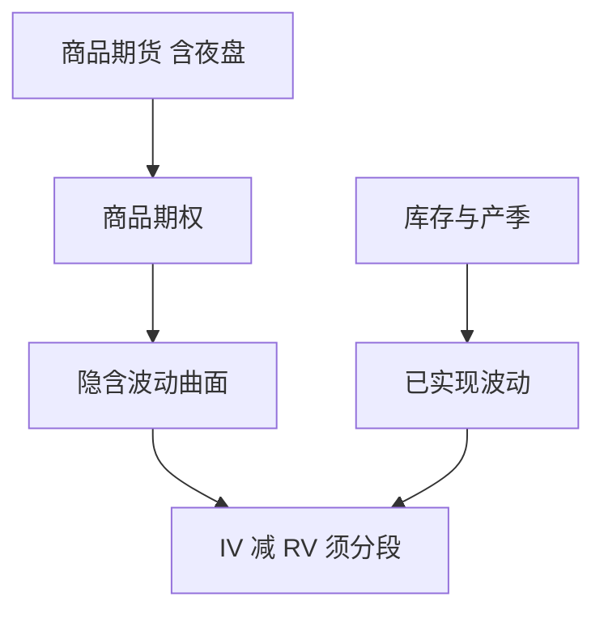

# 商品期权与波动率

商品期权长在期货上：标的是期货合约，时段含夜盘，涨跌停与保证金跟商品所走，波动率的季节性来自库存与天气，不是来自 T+1 股票。

<footer>—— 上海期货交易所、大连商品交易所、郑州商品交易所期权合约与交易规则；对照[到期流程](/quant/options-expiration-process)与商品期货夜盘制度</footer>

[上一课](/quant/cn-etf-options)停在权益 ETF 期权。本课的缺口是**商品所期权**：以商品期货为标的的期权，在大商所、郑商所、上期所（及能源中心等）上市。夜盘、交割月、持仓限额与期权到期必须联立。不把股票 LOB 的直觉搬来；商品微观结构另有开收盘与停板。后课转债回到交易所股票信用混合产品。

## 问题

权益波动率的状态变量是指数与 ETF；商品波动率的状态变量是库存、产季、便利收益与期货曲线形状。期权隐含波动沿期货曲线不同合约而变，近月可以因交割与逼仓预期而显著更高。问题是：商品量化若把「IV–RV」当权益 VRP 同一因子，会忽略季节与期限结构。回测必须按品种–合约月分段，而不是一个「商品期权」池。

制度：期权涨跌停、交易保证金、行权（多为美式或欧式以合约为准）、到期与期货交割月的关系，以各所合约表为准。股票 T+1 不适用。夜盘使信息在 A 股收盘后仍写入商品期货与期权，跨资产对冲有时钟差，见[夜盘](/quant/cn-night-session)。

### 做市、流动性与产业客户

商品期权流动性弱于主力期货，买卖价差宽，产业套保与专业做市占主导。CTA 与期权卖方在保证金上竞争同一现金。容量按期权市场深度与期货对冲可承受冲击估，不按商品现货市场规模估。

黑色、农产品、能化的停板幅度与交易限额不同。2015 年以后各所多次调整，历史必须用当时合约表。

## 方法

主数据按所–品种–合约。波动率曲面挂在对应期货价格上，delta 对冲用该期货，并计入夜盘跳空。季节虚拟变量或库存代理进入 RV 模型，避免把产季高峰当「alpha」。到期：期权到期与期货交割不同步时，基差与转换风险单列。与国债期货期权（若讨论）分开，那是利率市场。

跨市场：用商品期权对冲股票商品链公司，残差含基差、外汇与股票涨跌停。不要假设完美传递。

### 波动率风险溢价的样本

中国商品期权上市偏晚，样本短，危机日少。VRP 估计的标准误大。应报告子样本与流动性过滤，而不是一个显著 t 值打天下。这与研究日志课的尝试次数约束一致。

## 机制

便利收益使近月期货可以高于远月，期权的远期波动与偏斜随之变。库存信息在现货与仓单上，不一定在股票分析师共识里。因此商品期权隐含对农产品与能化有独立信息，对「全 A 情绪」则噪声更大。保证金联立：期货与期权同一 CCP 池，压力日共同抽 VM。

## 边界

不提供逼仓、交割月操纵或利用仓单信息违规交易的方法。原油等特定品种有额外监管。场外商品期权与场内不可混用保证金数字。

## 小结

- 商品期权的标的是期货，时钟含夜盘，季节性来自库存，不是股票 T+1。
- VRP 必须按品种与合约月分段；样本短，勿过拟合。
- 容量看期权深度与期货对冲，不看现货市场规模。
- 出处：上期所、大商所、郑商所期权合约与规则。
