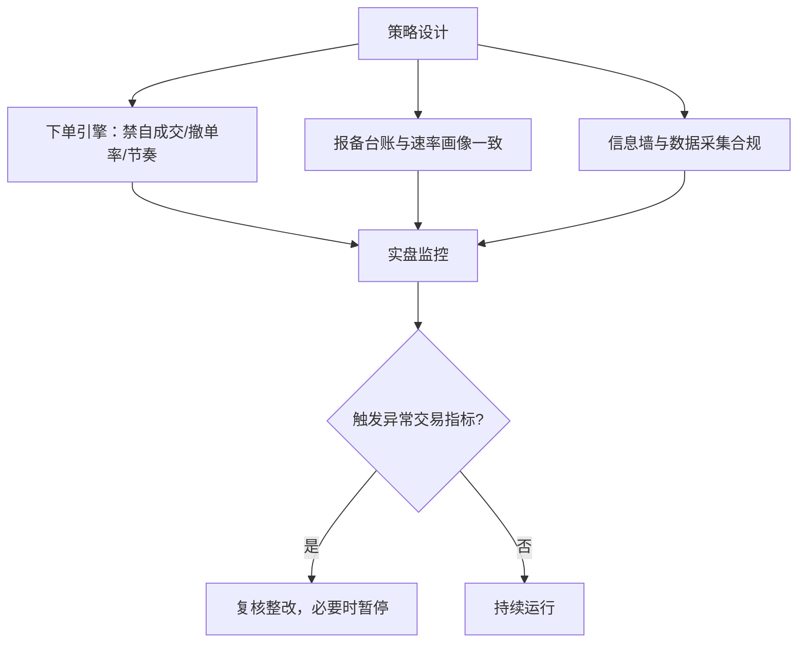
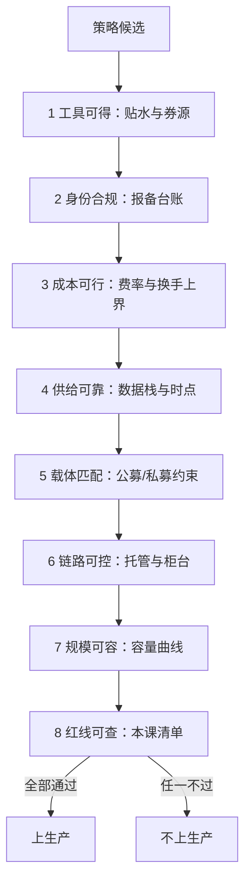

# 合规红线与收束

操纵认定从申报与成交的模式里推定，意图不在辩护清单的第一位；红线要写成行为加数据的清单，预防设计才落得进下单引擎。

<footer>—— 据证券法与交易所异常交易监控口径整理</footer>

[上一课](/quant/cn-capacity-cases)把容量曲线画进产品册，本课程最后一课处理上限之上的东西：红线，并把九课收成一张进场检查单。本课程到此收束。[量化监管演进](/quant/cn-quant-regulation-history)已写监管脉络，[涨跌停与集合竞价](/quant/cn-limit-auction)写过交易制度的边界设计，[幌骚与分层](/quant/spoofing-layering)写过操纵行为的形态学。本课把红线写成可检查的清单：每条红线对应一类行为、一组监控数据、一种后果。

## 问题

量化的失败下限是合规下限：一个回测上再漂亮的策略，可能死于一笔被认定为异常交易的委托。红线的困难不在条文抽象，而在认定方式：交易行为的操纵认定从申报、成交、撤单的模式推定，策略意图不排在证据链第一位。所以清单必须写到数据层——什么行为模式触发什么监控指标，预防设计才能落到下单逻辑与组织流程，而不是停在培训材料里。

术语翻译：「推定」的意思是：不需要证明你「心里想操纵」，只要申报、成交、撤单的模式长得像操纵——比如高频报了又撤、自己实际控制的账户互相成交——就可以认定。意图辩解排在证据链后面，所以预防只能在行为模式上做，不能指望事后解释。

## 方法

清单四类，每类落到行为与数据。交易行为类：连续交易或约定交易操纵、在自己实际控制的账户之间自成交、幌骗型申报撤单；预防设计在下单引擎——禁自成交过滤器、撤单率上限、申报节奏控制，并与报备台账的速率画像一致。信息类：利用未公开信息交易是个人刑责红线，机构侧的墙是隔离与通讯管控；舆情与另类数据的采集与使用另受数据合规约束。程序化义务类：报备不实或拒不报备、达认定标准而未履行额外义务——清单把[程序化交易的报备实践](/quant/cn-programmatic-filing)的台账与速率监控接起来。载体合规类：适当性、披露与利益冲突，落在[私募与公募的约束差异](/quant/cn-fund-constraints)的载体与[托管与柜台](/quant/cn-custody-counter)的链路上。

## 机制

红线为什么用「行为加数据」写。交易所的异常交易监控跑在申报、成交、撤单的统计特征上：撤单率、申报速率、成交账户间的关联、价格逼近涨跌停时的排单与撤单行为（涨跌停边是高危区，见[涨跌停与集合竞价](/quant/cn-limit-auction)）。监管演进的方向是把更多行为纳入监控并抬高违规成本（[量化监管演进](/quant/cn-quant-regulation-history)），清单因此是移动的，检查单要留「当期口径」一栏，按季度重读。组织侧的对应物是留痕：报备台账、策略版本、下单引擎的风控参数都要能复现某个交易日的决策链。

预防设计里最便宜的一条是禁自成交过滤器：在报盘前按实际控制关系合并账户查重，成本是一次账户树维护；省掉它，一次自成交认定可能就把整条产品线停掉。

数字实例：某策略日内申报 10000 笔、成交 1500 笔、撤单 8500 笔，撤单率 85%——无论当期阈值定在 50% 还是 80%，这个画像都必然进入异常筛查。把它压下来不是合规部门的事，而是下单引擎里撤单率上限与申报节奏控制两个参数的职责。

## 边界

本课是合规意识的检查工具，不构成法律意见；认定标准、阈值与处罚尺度以当期法律法规与交易所、协会规则为准。收束全课程，检查次序固定如下：工具可得——贴水与券源两条空头腿；身份合规——报备台账；成本可行——费率预算与换手上界；供给可靠——数据栈与时点质量；载体匹配——公募私募约束清单；链路可控——托管与柜台；规模可容——容量曲线；红线可查——本课清单。任何一项不过，策略不上生产。

常见误区：初学者容易以为合规是法务的事、研究只管信号。实际上红线四类里有三类——自成交过滤、撤单率上限、报备与实际速率一致——必须写进下单引擎的代码。代码里少一个过滤器与故意违规，在认定后果上没有区别。

## 小结

- 红线四类：交易行为、信息、程序化义务、载体合规，每条落到行为模式与监控数据。
- 操纵认定从申报成交模式推定，预防设计在下单引擎与组织墙，不在事后解释。
- 报备台账与速率监控必须勾稽，报备不实本身就是红线。
- 全课程检查次序：工具、身份、成本、供给、载体、链路、容量、红线，一项不过不上生产。
- 出处：证券法、期货和衍生品法与交易所异常交易监控口径；监管脉络见[量化监管演进](/quant/cn-quant-regulation-history)。
