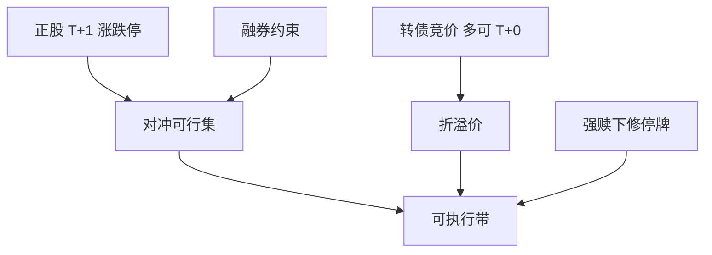

# 可转债市场结构

A 股可转债是「债券 + 转股权 + 下修与赎回条款」在交易所竞价；T+0、涨跌停与正股 T+1 不对称，使联立对冲变成制度问题，而不只是模型 delta。

<footer>—— 沪深交易所可转换公司债券交易规则与上市规则相关条款；Mitchell, Pedersen and Pulvino, Slow Moving Capital, AER, 2007；对照[可转债套利](/quant/convertible-arb)</footer>

[上一课](/quant/cn-commodity-options)停在商品波动率。本课回到交易所信用–权益混合。[可转债套利](/quant/convertible-arb) 已写 delta 对冲与慢资本；[转债信用](/quant/convertible-credit) 写定价核。本课的缺口是**A 股市场结构**：竞价、涨跌停、转股、下修、强赎、与正股 T+1 / 融券约束如何改写可交易带。后课北交所换一层公司宇宙。

## 问题

国际转债套利假设正股可连续卖空、转债与正股同步交易。A 股：转债多数可当日回转，正股 T+1；正股涨跌停 10% 或 20%，转债涨跌停幅度不同（历史上与现行规则以交易所公告为准，回测须分段）；融券正股受标的与券源限制。于是「便宜凸性」可能无法对冲，或只能用期货对冲 beta，留下特异风险。问题是把可交易集写成：条款模型价 − 市价 − 对冲摩擦（涨跌停、T+1、借券、冲击）。摩擦大于折价则不是套利，是风险溢价或不可执行。

下修、强赎、回售是发行人与持有人的博弈，公告窗口伴随停牌，见[停复牌](/quant/cn-halt-resume)。用连续 delta 对冲穿过停牌，路径非法。转股形成的股票仍受 T+1，当日转股当日卖出的可行性以规则为准，不得假设。

### 流动性与投资者结构

转债投资者含公募、私募、银行理财与散户，流动性在条款博弈日集中。平价附近换手高，深虚值更像信用债。容量按转债 ADV 与正股可空量的最小计。2017–2021 供给扩张与 2024 年监管与定价环境变化，使样本不可当成单一制度。

转债在交易所竞价，不是银行间信用债。估值用交易所成交，不要用中债估值去填可交易价。

## 方法

条款引擎：转股价、下修触发、赎回触发、回售、修正后转股价。市场数据：转债竞价、正股竞价、停牌与涨跌停状态。对冲：优先正股融券（若在可行集），否则行业期货或 ETF，并报告残差。回测在正股涨停时停止买入对冲腿、跌停时停止卖出，转债腿按自身停板。事件：下修/强赎公告日用公告时点，不用财报日。

与[指增](/quant/cn-public-quant)：公募持有转债的比例与估值方法受产品规则约束，不能把对冲基金式杠杆转债套利写进公募指增。

### 信用与权益因子拆开

平价低时信用利差主导，应用信用研究方法；平价高时看权益波动与下修期权。混合样本的单一「转债因子」没有对象。Mitchell 等慢资本在 A 股对应：条款博弈日拥挤、融资与正股停牌使折价持续。

## 机制

不对称交易规则制造结构性错误定价带：可以看见、不能锁。带的宽度随融券政策与涨跌停而变。2015 年正股跌停、转债仍交易（或相反，视当时规则），对冲缺口放大。这是微观结构，不是 BS 隐含波动「算错」。

转股稀释与下修改变有效行权价，路径依赖强。模型必须用当时有效转股价，点-in-time 条款与会计 vintage 同纪律。

## 边界

不提供利用未公开下修信息、或在停牌规则边缘阻碍投资者交易的方法。可交换债、分离交易可转债条款不同。银行间转债极少，本课对象是交易所可转债。

## 小结

- A 股转债的可交易带由 T+0/T+1 不对称、涨跌停与融券共同决定。
- 对冲残差必须报告；条款须点-in-time。
- 容量取转债流动性与正股可空的最小。
- 出处：沪深转债交易与上市规则；Mitchell, Pedersen and Pulvino, *AER*, 2007。
