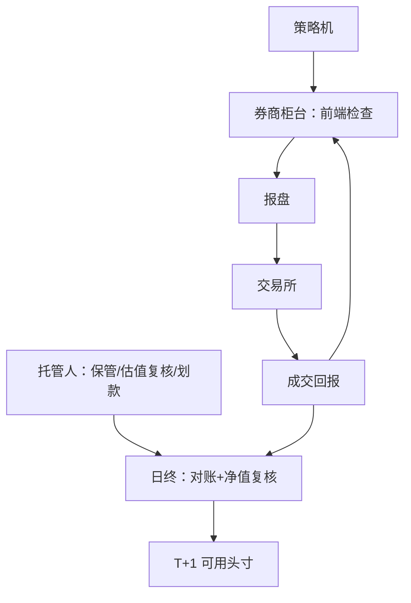
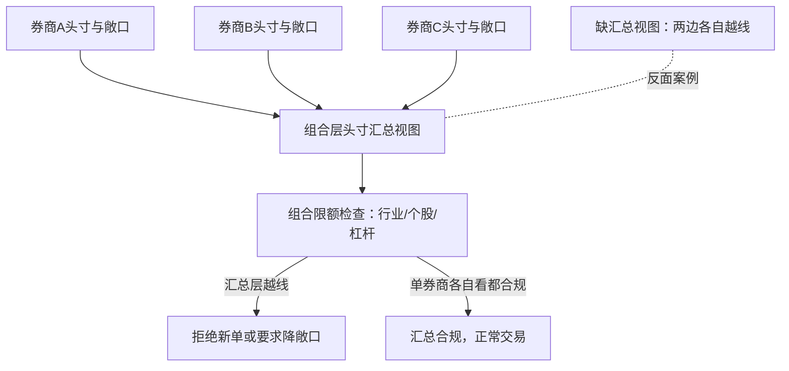

# 托管与柜台

策略机到交易所之间隔着柜台、报盘与清算三道关；制度约束在柜台被翻译成代码，被它拒绝的委托，先查自己的头寸口径，再怪系统。

<footer>—— 据证券托管结算与券商经纪业务口径整理</footer>

[上一课](/quant/cn-fund-constraints)把两类载体的约束清单列完；约束要落地，靠两块基础设施：托管与券商柜台。[T+1 与回转交易约束](/quant/cn-tplus1)写过交易制度侧的 T+1，本课写它在运营链路上的落点：策略机到交易所之间隔着什么，日终净值谁复核，头寸时效卡在哪一步。

## 问题

量化实盘有一类失败不在信号也不在执行，而在链路：柜台的前端检查否掉你以为合法的委托；托管划款晚于保证金追缴时限；多券商拆分后头寸碎片化，组合层面的敞口在两边各自越线。产品视角还有一层：估值核算与净值复核由托管人把关，估值口径与策略预期对不上，申赎与业绩报酬的计算都会歪——这些都在上线之后才暴露，代价最大。

术语翻译：「券商柜台」（PB 系统或集中交易系统）就是券商替你管账户、跑前端风控、并把委托报进交易所的系统——像门口的安检员：所有单先过它，头寸不够、越限、违反 T+1 规则的委托在这里直接被拦下，策略机根本接触不到交易所。

## 方法

链路解剖。下单链：策略机 → 券商柜台（PB 或集中交易系统）→ 报盘 → 交易所；行情下行走专线；低延迟部署涉及托管机房与报备的联动（[主机托管清退与交易单元整改](/quant/cn-colocation-rectify)），对外接口的协议规范见 [FIX 协议](/quant/fix-protocol)。资产链：托管人（商业银行或券商）保管资产、复核估值、执行划款；份额登记与估值核算可外包。日终流程固定：成交与持仓对账、净值复核、头寸冻结——T+1 的可用资金与券以登记结算的清算结果为准，不以委托回执为准。多券商治理：主券商与辅券商的费率、券源、柜台能力分别谈判，但组合层必须有一个头寸汇总视图，风险限额在汇总层执行。

## 机制

柜台是约束的执行点而不是通道。T+1 可用性、涨跌停、提价规则、担保品折算，都在柜台的前端检查里变成代码；策略层绕不过它，也不该试图绕过——被拒绝的委托，要么是策略没算头寸时效，要么是测算用了错误的可用口径。托管复核是操作风险的最后防线：估值与净值由管理人算、托管人核，两边对上才出数。理解这一点，就会把清算数据当成系统里的一等数据源来接，而不是把当日委托回执当成最终头寸；多券商拆分的复杂度也就有边界——拆分换议价与券源，代价是汇总视图与对账成本。

回测与实盘最隐蔽的一条缝：T+1 可用资金在回测里常写成「昨日收盘可知」，实盘以清算数据为准，节假日与清算异常日会晚到——依赖盘前精确头寸的策略要留现金缓冲。

常见误区：初学者容易把「委托回执」或「成交回报」当成最终头寸。实际上 T+1 可用资金与可卖券以日终清算结果为准——当日回执只是过程状态。头寸口径用错一层，柜台的前端检查就会不断拒绝你以为合法的委托。

## 边界

本课不写绕开前端检查或柜台限额的技术手段；系统与券商选型不做商业推荐；估值核算的会计准则细节不在本课。

数字实例：假设盘中收到追保通知要求当日 13:00 前补足 50 万元，托管划款却因双人复核与大额支付批次 13:40 才到账。强平看的是「钱是否到账」，不是「你是否已发起划款」——这几小时的时差就足以触发强平，这正是「托管划款晚于保证金追缴时限」的具体形状。

## 小结

- 实盘两条链：下单链（策略机-柜台-报盘）与资产链（托管-估值-划款）。
- 柜台是制度约束的代码化执行点，被拒委托优先查头寸口径。
- 日终以清算结果为准：对账、净值复核、头寸冻结固定成流程。
- 多券商拆分换议价与券源，代价是必须建组合层头寸汇总视图。
- 出处：托管与结算业务制度口径；交易制度侧见[T+1 与回转交易约束](/quant/cn-tplus1)。
