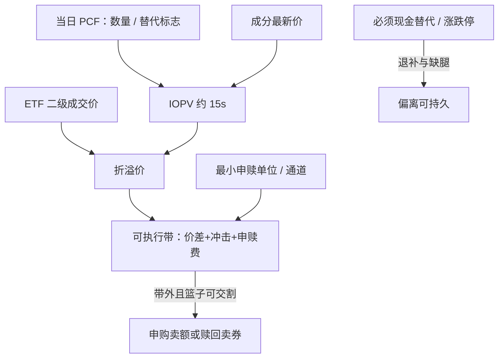

# ETF 申赎与 IOPV

申购、赎回对价包括组合证券、现金替代、现金差额及其他对价。申购、赎回申请一经确认不得撤销。IOPV 按基金管理人当日公布的申购赎回清单与成分股最新价格计算，并随行情发布。

<footer>—— 《上海证券交易所交易型开放式指数基金业务实施细则》；深圳证券交易所对应细则</footer>

[上一课](/quant/cb-equity-link)把转债与正股联立写成可成交价格、条款日历与两套涨跌停；一边停牌时剩余腿是方向性风险。缺口是场内 ETF 还有一级申赎：收敛靠 PCF 与可复制篮子，IOPV 是盘中参考，不是可成交 NAV。偏离只有在申赎管道打开、篮子可复制、现金替代不会把跟踪误差变成系统性风险时，才可能被锁住。本课写沪深交易所的申赎与 IOPV，不重写转债平价。机制综述见 [ETF 与成分股](/quant/etf-arb)。

## 问题

收盘单位净值按成分股收盘价与基金会计规则计算，盘中 IOPV 用的是清单与最新价。二者都会陈旧：停牌股按停牌前价格计入，涨跌停股的「最新价」不是可买价，跨境与债券品种的底层更没有连续中点。于是「折溢价」有一块是信息领先，有一块是口径，有一块才是可申赎的错误定价。用收盘 NAV 对收盘 ETF 价算日频溢价，会把最后一笔 ETF 成交与篮子最后报价的时钟错位写成套利。

申赎不是任意数量、任意时刻的现金进出。最小申赎单位通常为五十万份或一百万份量级，须按当日 PCF 提交成分券或现金替代；申请确认后不可撤。上交所单市场股票 ETF 允许申购所得份额当日卖出、赎回所得股票当日卖出，形成事实上的回转；跨市场及深市不少产品则是 T 日申购、T+1 日份额才可卖。把所有股票 ETF 写成「T+0 申赎套利」，会在跨市场产品上锁住隔夜跟踪误差。

### 现金替代把篮子变成或有交割

PCF 对每只成分股标注禁止、允许或必须现金替代。本市场成分多为允许：申购时可用现金补券，赎回时往往必须交付股票。跨市场、跨境成分多为必须现金替代，由基金管理人代买卖后再多退少补。替代金额通常按最新价加溢价比例冻结，退补在后续交易日完成。于是一级市场交付的不是你在 IOPV 里看到的那一揽子可成交中点，而是「能交的券加一笔事后结算的现金」。现金替代比例一高，套利的现货腿就变成对基金经理执行质量的暴露，风险不是中性的。

IOPV 每十五秒更新，不等于你的成交时钟是十五秒。清单里的数量是开盘前冻结的，盘中权重漂移、停牌、临时停牌都不会重算篮子。用 IOPV 当 NAV 的高精度代理，精度上限是清单频率，不是行情频率。

## 方法

一条可审计的盘中流程。开盘前读取当日 PCF：成分代码与数量、替代标志、溢价比例、最小申赎单位、预估现金差额。盘中用可成交的买一/卖一（而非最新价）重估篮子，加上 ETF 有效价差、申赎费用与预估冲击，得到可执行带。仅当 ETF 买（卖）价相对带的下（上）沿仍有边缘，并且申赎窗口与券商通道可用时，才允许：买篮子申购并卖 ETF，或买 ETF 赎回并卖篮子。若必须现金替代比例过高、成分涨跌停、或已过申赎接受时间，则降级为二级市场相对价值，收敛不再被一级市场保证。

IOPV 用于监控，不用于下单。下单应用自建的可执行篮子；IOPV 与自建价值的差，本身就是数据质量检查。停牌股应从可复制集合剔除或按保守价（跌停买、涨停卖）计入。对债券、商品、跨境 ETF，IOPV 更接近模型价，一级市场往往是现金申赎，定价逻辑接近封闭式基金加申赎期权，而不是股票篮子套利。

### 单市场回转与跨市场 T+1

上交所本市场股票 ETF 的回转，使溢价可以在当日被申购卖出或赎回卖券关掉。跨市场产品（沪深 300、中证 500 一类）深市成分须现金替代或通过跨市场系统，份额与股票的可用时点错开一日。此时「瞬时套利」至少承担一夜的指数缺口与退补款不确定性。工程上应把产品分成：当日可闭环、T+1 才可闭环、只能二级对锁三类，分别设阈值与持有期上限。用同一套 IOPV 偏离阈值打所有 ETF，会把跨市场的隔夜风险当成单市场的库存收益。

## 机制

二级价格由做市与订单流决定；一级价格由 PCF 与参与券商的交割成本决定。申赎把份额供给变成弹性：溢价吸引申购增加供给，折价吸引赎回减少供给。弹性的上限是最小申赎单位、券商垫券与成分股流动性。小于最小单位的账户只能做二级，看到的折溢价对他们不可执行。大于最小单位但成分停牌时，弹性下降，ETF 暂时接近封闭式基金。

成分股涨跌停时，IOPV 仍按最新价跳动，但篮子不可复制。套利者若仍按 IOPV 卖空溢价 ETF、买一揽子，会在涨停股上买不到，留下指数方向性敞口。现金替代表面上补上了数量，退补却按基金经理事后买到的价格结算，可能把你的「无风险」锁成对执行滑点的卖权。指数公司调样、分红、配股日，PCF 与实时指数权重也会短暂不一致，IOPV 相对指数的跟踪误差会跳升，这不是套利信号。

股票 ETF 二级市场本身是 T+1；所谓 T+0 只存在于「申购份额当日卖出 / 赎回股票当日卖出」这条一级管道。把债券、黄金、跨境 ETF 的份额当日回转，与股票 ETF 的申赎回转混为一谈，会写错结算日。

### 容量、做市与拥挤

表面容量由最小申赎单位的整数倍给出，真正约束是篮子里最差成分的深度以及现金替代的退补风险。热门宽基 ETF 的 IOPV 偏离往往只有几个基点，信号在你凑齐一揽子之前消失。人人盯同一 IOPV 下单时，ETF 自身买卖价差先走阔，一级尚未动作，二级已经把偏离打没。债券与跨境产品的一级窗口更短、底层 OTC 或时区更宽，日频折价回归在压力期常常是流动性折扣扩大，而不是均值回归。

## 边界与工程取舍

成本项：ETF 价差、篮子价差、申赎费、现金替代溢价与退补、部分成交、跨市场结算失败。基金管理人可在合同约定情形下暂停申赎；交易所可对异常交易采取监管措施。IOPV 由交易所或指定机构按清单计算，停牌与异常价格处理规则以当时业务通知为准，回测必须用当时的清单而不是事后成分权重。

不要用会计 NAV 的小数位去暗示套利精度。不要在成分涨跌停时把 IOPV 当可买篮子。不要把单市场回转策略拷到跨市场产品上。统计套利若用 ETF 当对冲工具，应把折溢价当作额外残差；反向用成分去套利 ETF 时，频率必须落到申赎与回转的时钟上，而不是日频因子的时钟。

上交所投教材料把 IOPV 写成盘中把握净值的工具，不是一张可下单的策略表。把某日某产品的最大折溢价当成期望利润，忽略了不可锁的信息领先、现金替代退补与申赎暂停。

## 小结

- A 股 ETF 的收敛靠一级申赎，锚是 PCF 与可复制篮子；IOPV 是盘中参考，不是可成交 NAV。
- 现金替代把部分交割变成事后退补，跟踪误差可以是系统性的。
- 单市场股票 ETF 的申赎回转与跨市场 T+1 不是同一策略，阈值与持有期必须分开。
- 涨跌停、停牌、暂停申赎会使弹性消失，折溢价可以停在带外。
- 容量受最小申赎单位与最差成分深度约束；会计净值精度不等于执行精度。
- 出处：《上海证券交易所交易型开放式指数基金业务实施细则》及深交所对应规则；IOPV 与 PCF 字段见交易所特定参与者接口与基金管理人每日清单；套利机制对照 [ETF 与成分股](/quant/etf-arb)。
