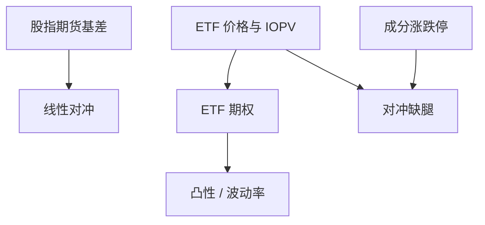

# ETF 期权市场

上交所 50ETF 期权把波动率写成可交易合约；之后 300ETF 等品种把指数波动从期货基差里拆出一截。合约是欧式、有涨跌停与保证金，不是 OTC 权证。

<footer>—— 上海证券交易所股票期权试点交易规则及合约细则；深圳证券交易所上市期权相关规则；对照[期权到期流程](/quant/options-expiration-process)</footer>

[上一课](/quant/cn-index-basis-hedge-cost)的对冲工具主要是期货。本课的缺口是**场内 ETF 期权**：2015 年上交所上证 50ETF 期权试点，其后沪深 300ETF 期权等扩展了行权价与到期月。到期、行权、保证金与涨跌停按期权细则，与股票 T+1 不同。不重写 Black–Scholes 推导；只写 A 股场内期权如何改变中性与增强的可行集。后课商品期权换标的与时段。

## 问题

期货对冲留下基差与 gamma=0 的线性暴露。ETF 期权提供凸性：保护性看跌、领口、备兑，以及波动率买卖。问题是制度：合约单位、做市义务、涨跌停、保证金、到期日与行权（欧式现金或证券交割以合约为准）、投资者适当性。用美股上市期权的假设（T+1 股票交割、无涨跌停、连续行权价）会算错 A 股执行与风险。

流动性集中在近月、近价、主力 ETF。远月与虚值的买卖价差可以吃掉理论边缘。隐含波动率曲面在 2015、2018、2020 等压力期与股指期货贴水同时移动，但两者不是同一风险：一个是凸性价格，一个是线性对冲拥挤。

### 与 ETF 申赎、现货涨跌停的联立

期权定价锚是 ETF 与 IOPV，而 ETF 相对篮子可折溢价，篮子成分可涨跌停，见[ETF 申赎](/quant/cn-etf-creation)。期权做市的对冲可能在成分涨停时无法买齐，希腊字母对冲失败。这是产品风险，不是模型 σ 估错。到期日若遇成分停牌或涨跌停，交割与结算安排以交易所公告为准，回测不得假设完美复制。

期权卖方保证金与股票两融保证金是两套。组合保证金优惠以交易所与会员规则为准，不可把 SPAN 数字从商品所直接套到 ETF 期权。

## 方法

合约主数据：标的 ETF、乘数、到期、行权方式、涨跌停公式、交易时段。波动率研究用可成交的买卖报价，不用中间价假成交。对冲模拟加入 ETF 涨跌停与篮子可复制约束。到期流程用本栏到期课的状态机，日历换成上交所/深交所期权日历。适当性：策略客户若不能开期权仓，该工具从 universes 删除。

与中性产品：用看跌保护替代部分期货空头，改变的是凸性与权利金，不是消灭基差——现货–期货–期权三者仍可联立套利，但受涨跌停切断。

### 做市与程序化

场内期权有做市商报价义务，微观结构与股票连续竞价不同。程序化规则仍可能覆盖报撤。研究期权微观结构要用期权行情契约，不要用股票十档去代理。

## 机制

波动率溢价：卖方收取隐含相对已实现的差，但在 A 股要扣保证金、涨跌停跳空与流动性。2015 年股市压力下，线性期货与凸性期权的保证金同时上升，保护成本在最需要时变贵——与国际危机中的 VRPs 同方向，制度细节不同。

信息：期权隐含可补充情绪与尾部，但样本短、品种少，不可把美股 VIX 产业整套搬来。50 与 300 的隐含差更多反映标的与流动性，而不是一个统一的「中国 VIX 因子」。

## 边界

不提供操纵结算价、诱导行权或规避适当性的方法。权证、场外期权、收益凭证是不同合约。商品期权下一课。港股期权对 A 股 ETF 的交叉不是同一清算池。

## 小结

- 场内 ETF 期权把波动率从期货基差中拆出，但受涨跌停、保证金与 ETF 折溢价约束。
- 流动性集中；中间价不可当成交。
- 对冲须联立篮子可复制性；到期用交易所日历。
- 出处：上交所股票期权试点规则与合约细则；深交所对应规则。
