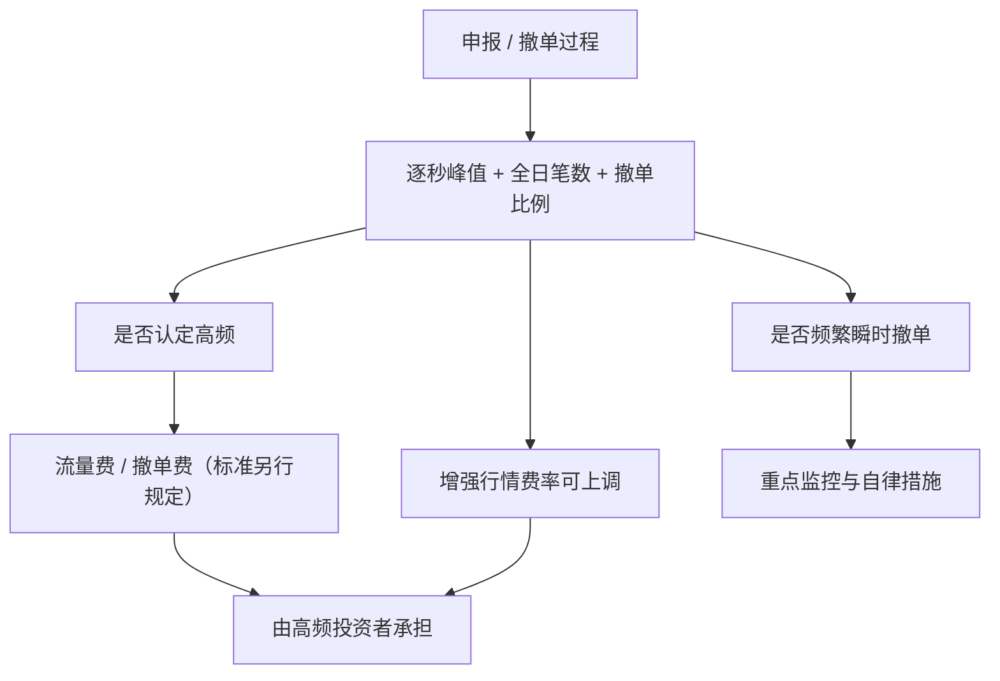

# 差异化收费与撤单率监控

证券交易所可对高频交易实施差异化收费，适当提高交易收费标准，并可收取撤单费等其他费用；实施细则进一步写明可根据申报、撤单的笔数和频率加收流量费和撤单费，并确保费用由高频投资者承担。

<footer>—— 《证券市场程序化交易管理规定（试行）》第二十三条；沪深北《程序化交易管理实施细则》第三十二条、第三十七条</footer>

报撤几乎免费时，探测深度、占队列、瞬时拉抬的最优解是把主机打满。中国证监会把收费写成高频监管工具：提高交易收费，并可收撤单费。交易所实施细则把它具体化为流量费与撤单费，同时对报撤达到一定标准的程序化投资者提高增强行情使用费；许可单位须把行情费收到实际使用人，未付费则停供。并行的不是价目表，而是行为监控：频繁瞬时撤单被列为四类重点异常之一——全日多次出现 1 秒内申报又撤单，且全日撤单比例达到标准。本篇把成本与监控当约束写入执行层，衔接[高频认定](/quant/cn-hft-threshold)。它解释为何「无限改撤的最优做市」在 A 股股票竞价上不是可执行策略，而不提供如何把撤单率刚好压到指标之下继续探测。

## 问题

微观结构模型里，限价单的选择包括价格、数量与取消。取消的影子价格若为零，最优政策倾向于高频更新。A 股规则把取消变成两个可观测对象：笔数（进入 300/20000 认定与流量费税基）和形态（1 秒内报撤次数 + 全日撤单比例）。撤单比例的分母是申报笔数，分子是撤单笔数，具体阈值由交易所监控指标规定并可调整。问题是把策略的报撤过程同时送进收费函数与异常函数。只优化前者会在形态上触线；只盯着比例、把巨量报撤摊到全天，仍可能在某一秒触达瞬时速率异常。

收费标准细则写「由交易所另行规定」「在证监会指导下适时制定出台」。在价目表尚未作为业务通知公开前，成本模型应把流量费、撤单费、行情加价做成**或有项**，敏感度分析用占位费率，不能把境外取消费或历史 A 股普通佣金当成已经实施的高频价目。会员有义务把差异化费用转给高频投资者，不能用普通客户佣金去补贴特殊报撤。

### 频繁瞬时撤单是形态，不是平均率

第十八条第二项的构成是合取：日内频繁出现「申报后迅速撤单」，且全日撤单比例较高。迅速的尺度写明为 1 秒钟内申报又撤单。因此一个全天撤单率中等、但反复在同一秒报撤的账户，仍可被画像。反过来，收盘前一次性取消隔夜残单，若不以 1 秒内来回为模式，不自动等于该项异常。监控指标会给出「全日发生多次」的次数门槛与比例门槛；接近门槛且多次同类型，仍可被认定。研究若用全天撤单率一个数字过滤，会漏掉脉冲式报撤。

流量费按申报、撤单笔数和频率计，与是否成交无关。提供流动性的限价单若频繁取消，同样计费、同样进撤单率。把「做市」当成收费豁免，公开细则没有这一条。

## 方法

执行层应记录每一笔申报的时间戳、是否在 1 秒内被撤、账户日内累计申报与撤单、以及逐秒报撤峰值。这些计数同时服务三件事：是否贴上高频标签、是否触发频繁瞬时撤单、未来价目表下的费用应计。风控限额建议用「距监控指标的距离」而不是用历史平均撤单率：距离收窄时降低新报、延长订单存续，而不是把同一母单切得更碎——更碎会同时推高流量与秒内笔数。

行情侧：程序化投资者须从公示许可单位获取行情；使用增强行情且报撤达标的，费率可上调。未按规定支付，许可单位应停止提供。这意味着低延迟行情不是默认公共品，其边际价格可以与报撤强度挂钩。成本函数应包括：普通佣金、可能的流量费与撤单费、增强行情费、以及异常交易导致的限制交易机会成本。后一项通常大于前几项，不能只比较基点佣金。

### 会员转嫁与内部记账

细则要求会员加强收费管理，确保差异化费用由高频投资者承担；行情费由相应程序化投资者承担。券商若用统一费率包干，再在内部用自有资金填补，与「确保承担」的方向不符。产品与账户的计费主体应在委托协议里写清。私募多产品共用报盘通道时，须能把报撤计到产品，否则无法证明费用未转嫁到非高频产品，也难以满足分拆规避禁令的反面——合并通道却分摊标签。

## 机制

收费改变的是报撤的边际成本，监控改变的是报撤的可行集。两者一起把「用取消当免费期权」的策略区域挖掉一块。瞬时撤单监控针对的是对主机与订单簿的脉冲负载，以及用闪单制造虚假深度的形态；流量费针对的是全日占用的系统容量。即使某策略自认为在做市，只要形态落入第十八条，仍可被重点监控，高频账户还可从重。这与是否有正的实现价差无关。

瞬时申报速率异常（1 秒内笔数巨大）与频繁瞬时撤单常结伴，但不是同一指标。前者可以几乎不撤、只堆申报；后者强调报了又撤。收费税基对两者都敏感。分开计数，才能知道触的是速率、是撤单率，还是两者。

### 与 T+1、涨跌停下的限价逻辑

股票[T+1](/quant/cn-tplus1)本来就限制日内回转，高频报撤更多出现在开仓侧的限价更新、以及可卖库存上的卖出队列管理。涨跌停附近的排队与撤单，本身是[涨跌停与竞价](/quant/cn-limit-auction)的合法动作，但脉冲式 1 秒来回仍可被画像。不要把「停板排队需要改单」理解成频繁瞬时撤单的豁免；豁免须来自规则条文，公开细则没有这一项。可行做法是降低改单频率、接受排队不确定性，而不是用更高频率去「维持队首」。

## 边界与工程取舍

监控的具体次数与比例未在细则正文写死，以交易所当时有效的监控指标为准。回测历史要用当时试运行或正式指标，不能用今日草稿回填。北向适用同一套四类异常。债券、基金、存托凭证参照重点监控，撤单费是否同步适用看相应收费通知。

不要设计「一笔申报拆成多账户各撤一次」来摊薄单账户撤单率。不要在未付增强行情费的情况下继续使用该行情做程序化。不要把尚未公布的费率写成已经确定的成本优势。公开文本下，研究止于：报撤计数如何同时进入认定、异常与或有收费，以及这对净边缘和系统负载的含义。

差异化收费的政策目标，交易所公开表述为引导高频主动降低频率、规范行为。把它理解成「交费即可维持原频率」与「适当提高」「引导降低」的表述不符。交费不替代异常交易监管。

## 小结

- 高频可被加收流量费、撤单费，增强行情可对高报撤用户加价；具体价目由交易所另行公布。
- 频繁瞬时撤单看 1 秒内报撤次数与全日撤单比例，不是只看平均撤单率。
- 费用须由高频投资者承担，会员不得用其他客户暗补。
- 收费与异常监控并行，交费不豁免第十八条。
- 不得以分拆账户摊薄撤单率或拖欠行情费继续使用增强行情。
- 出处：《管理规定》第二十三条；沪深北《实施细则》第十八条、第三十二条、第三十七条。
