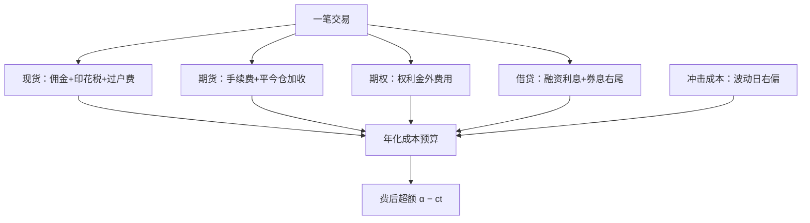

# 费率结构

A 股的费率表不只是价目表，是监管的工具箱：印花税、平今仓、差异化收费，每一项都在改写哪类策略能活，其次才是扣多少钱。

<footer>—— 据交易所收费与税收政策公开口径整理</footer>

[上一课](/quant/cn-programmatic-filing)把交易身份报进系统，接下来把账单拆开。一笔 A 股量化交易从委托到清算，扣钱的位置比多数新手清单长得多。[交易费用与印花税](/quant/cn-fees-stamp-duty)已写显性费率与印花税沿革，[费用对复合收益](/quant/fees-compounding)写了长期复合效应。本课写实践口径：全成本预算怎么编、换手与超额怎么换算、哪些费率要当政策变量读。

## 问题

只按「佣金万几」编预算，会系统性高估可上线策略。显性一侧至少有：佣金（通常含代收规费）、印花税（卖出单边）、过户费；衍生品一侧有期货交易所手续费与平今仓加收、期权费用；借贷一侧有融资利息与融券费率（[融券与转融通](/quant/cn-margin-lending-structure)讲过券息右尾）；隐性一侧是冲击成本。成本以「单边成本乘换手」的倍数放大：双边总成本千分之二的策略，年换手五十倍就吃掉十个点的费前收益——多数中国量化的超额预算没有这么厚。预算不拆格，就不知道政策调一项费率后哪个策略先死。

## 方法

成本台账按「显性/隐性 × 现货/期货/期权/借贷」四格编，每格记当期费率与生效日期，政策变动时整格替换而不是手工改几个数。临界换算给一条：设费前年化超额为 $\alpha$、双边总成本率为 $c$、年换手（双边口径）为 $t$，费后超额约为 $\alpha - ct$，可容忍换手上界 $t^{\ast}=\alpha/c$。算 $c$ 用波动日的右尾分位而不用均值——冲击在高波动日右偏，恰是换手最密的时段。执行侧把冲击从预算里买回来：拆单与参与率约束交给执行算法，接口见[交易成本感知优化](/quant/tcost-opt)。

## 机制

费率结构是监管工具箱。印花税的单边化与税率调整直接改写高换手策略的生存线，历史上每次调整都伴随策略结构迁移；股指期货的平今仓加收改变日内策略的隔夜决策，持仓过夜与否不再只是风险问题；差异化收费按报备的速率画像分层（上一课的报备档案在这里变成定价输入），把高频的边际成本变成合规变量；融资利率与券息把杠杆和空头都变成有持有成本的选择。读懂这一层，政策变动日才能快速重算预算，而不是几周后从净值里反推。

印花税现为卖出单边征收，经 2023 年下调后为万分之五；它是预算表里变动最频繁的一格，台账里务必记生效日期，回测跨政策日要分段取费率。

## 边界

各项税率费率随监管与券商协议移动，本课不给跨期数字承诺；不写返佣与费率套利类安排；冲击成本的建模方法在执行课程展开，本课只留预算接口。

## 小结

- 全成本预算按显性/隐性乘四类工具分格，每格记当期费率与生效日期。
- 可容忍换手上界 $t^{\ast}=\alpha/c$；双边成本千二、年换手五十倍即吃掉十个点费前收益。
- 费率是监管工具：印花税、平今仓、差异化收费都在改写策略结构，不只是扣钱。
- 出处：交易所与税务部门当期收费口径；显性费率沿革见[交易费用与印花税](/quant/cn-fees-stamp-duty)。
