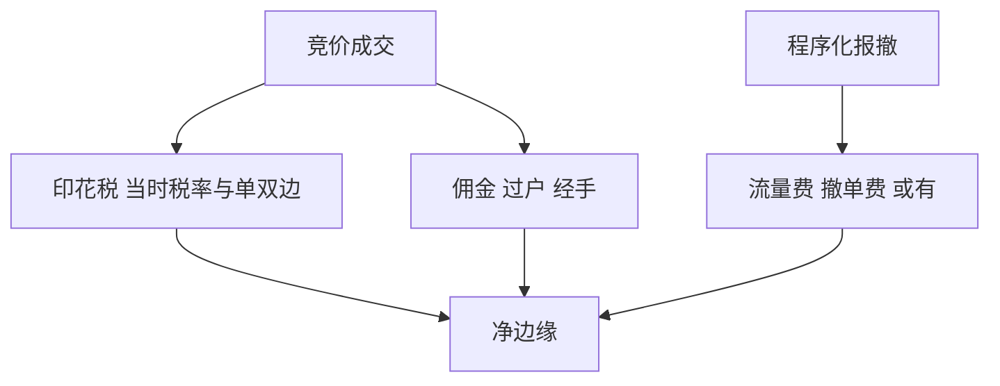

# 交易费用与印花税

印花税是政策变量：单边或双边、税率调整一次性改写高换手策略的净边缘。佣金与过户费是会员与登记结算的价目，不是微观结构噪声。

<footer>—— 《中华人民共和国印花税法》及财政部、税务总局关于证券交易印花税的公告；沪深交易所与中国结算收费规定；对照[差异化收费](/quant/cn-fee-cancel-ratio)</footer>

[上一课](/quant/cn-limit-liquidity-hole)处理不可成交。本课处理**可成交时仍要付的价目表**：印花税、佣金、过户费、经手费，以及程序化差异化收费。印花税由财政部调整，历史经历过高税率、下调、单边征收（对卖方）等。问题不是记住当前 0.05% 还是别的数字——而是回测必须用**当时有效税率**。后课监管演进会把收费当政策工具之一；本课写会计。

## 问题

净收益 $= $ 毛价差收益 − 冲击 − 税费。A 股印花税按成交金额的一定比例、在历史某些阶段对买卖双方或仅对卖方征收。换手 100% 月频的策略，税率 10 个基点量级就会把边缘打穿。用当前单边低税率回填 2007 年高税率样本，夏普虚高。问题是费用函数 $c_t(q,p,\mathrm{side})$ 带时间下标，与特征 vintage 同纪律。

佣金已市场化，研究应用保守的机构费率或产品实际费率，而不是散户广告万 0.5 再往下讲。过户费、经手费相对印花税小，但在做市式报撤里，笔数费与流量费可能主导，见差异化收费课。ETF、债券、基金、北交所的印花税与费率与 A 股股票不同，不可一个函数打天下。

### 单边印花税改变买卖不对称

仅对卖方征税时，卖出比买入贵一块政策价差。调仓「先卖后买」的税收与 T+1 资金约束叠在一起。优化器应把卖出腿的税费写进成本，否则会过度换手。减持、大宗、协议转让可能有不同税务处理，以公开规则为准，本课只管竞价印花税主路径。

印花税调整是宏观公告，市场当日反应是事件研究的对象，不是把税率当秘密 alpha。容量与换手应在新税率下重估 $A^\ast$。

## 方法

费用日历：`(start, end, stamp_rate_buy, stamp_rate_sell, commission, transfer, handling)`。回测每笔成交读取当时行。报告毛、净、以及「若用现行费率」的对照——对照只能当敏感度，不能当主结果。公募产品用合同费用；私募用实际通道。程序化账户另加或有的流量费、撤单费，未实施时做情景，已实施时用会员通知。

与容量课：税费提高等价于 $\mu_0$ 下移，冲击函数未变但 $A^\ast$ 下降。高换手因子（反转、微观结构）对税率的弹性大于低换手价值。

### 期货与期权另一套

股指期货、商品期货、期权的手续费、平今、交割费按交易所与期货公司。印花税一般不套用股票规则。中性产品账单必须分列股票印花税与期货手续费，避免都叫「费用」。

## 机制

税率是对换手征税，直接改变最优换手与信号阈值。政策下调印花税常被当作利好，因其降低摩擦；对量化，它还改变拥挤：更多策略变得可交易，容量曲线外移但竞争增加。上调则反向。这是公开制度冲击，所有人同时面对。

过户与登记费反映中国结算的基础设施，不是 alpha。差异化收费把高频报撤的社会成本内部化，与印花税的「按金额」不同，是「按行为」。

## 边界

不提供逃税、分拆账户规避印花税或把应税转让伪装成非应税的方法。税率以财政部公告为准。本课不构成税务意见。

## 小结

- 费用函数必须带生效日；现行税率回填历史会虚增夏普。
- 单边印花税使买卖成本不对称；高换手策略弹性最大。
- 期货手续费与股票印花税分列；程序化差异化收费另账。
- 出处：《印花税法》及财政部公告；交易所与中国结算收费规定。
