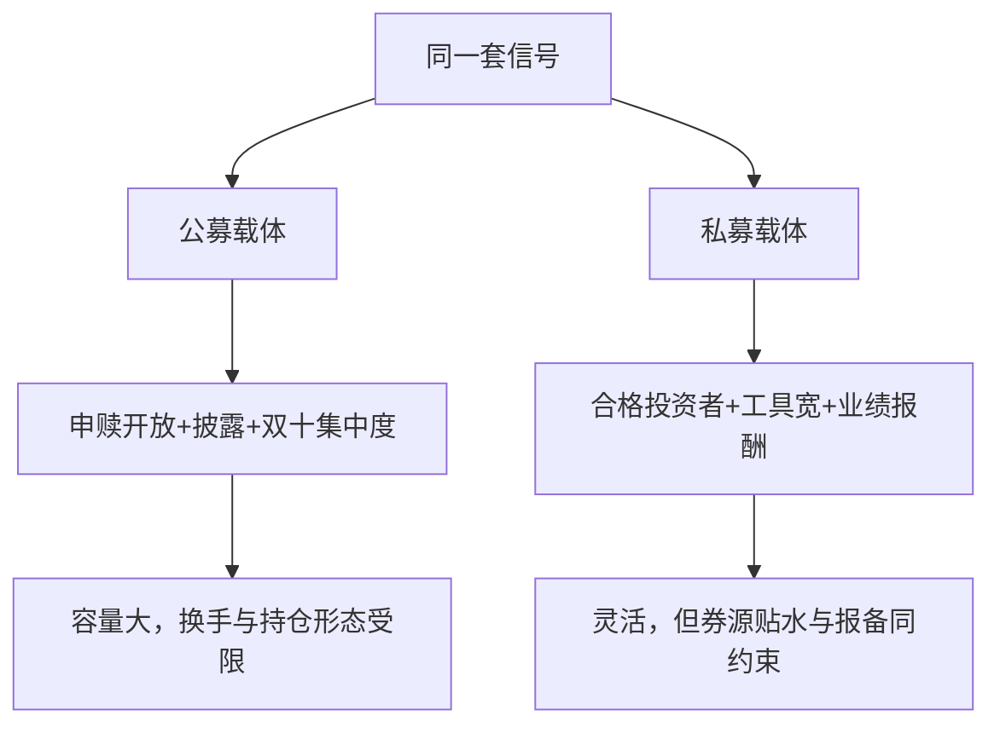
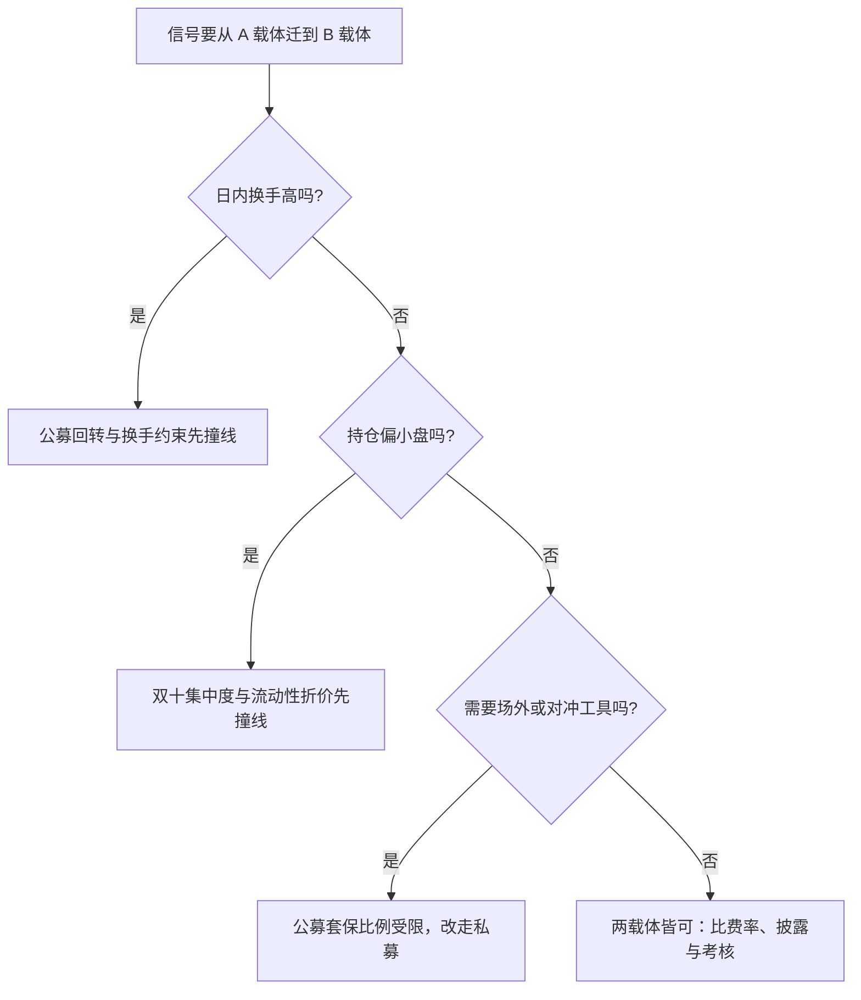

# 私募与公募的约束差异

同一个信号装进不同载体，可行集立刻不同：约束清单逐项告诉你谁定的、怎么度量、违反了怎样，比「公募保守、私募灵活」的印象有用得多。

<footer>—— 据公募基金运作与私募基金监管自律口径整理</footer>

[上一课](/quant/cn-vendor-comparison)把数据栈选好；同样的策略放进不同载体，约束集完全不同。[公募量化与指增](/quant/cn-public-quant)与[私募与中性策略](/quant/cn-private-neutral)分别写过两类产品的运作，本课把它们放上同一张约束清单对照。策略迁移的失败常死在载体而不是信号：先查清单，再谈移植。

## 问题

公募基金申赎开放，日终要应付净赎回，重仓小票的组合要为流动性留折价；定期披露的前十大重仓让策略方向在季报后半个公开；持股集中度与流动性管理规则约束持仓形态与换手。私募面向合格投资者，开放安排写进合同，工具箱更宽，但要承担业绩报酬驱动的规模冲动与同严格的报备义务（[程序化交易的报备实践](/quant/cn-programmatic-filing)的台账在私募侧同样适用）。同一套信号，两边的可交易宇宙、换手上界与容量都不一样，不查清单就移植，等于赌约束不存在。

直觉类比：公募像公交车，线路站点全部公示、上下客自由，只能开宽敞大道；私募像包车，路线在合同里谈好，可以走小路，但乘客门槛与费用条款也写死在合同里。同一批货（信号）装车前，先看车能走哪条路，而不是先装货再改路线。

## 方法

约束清单七行，每行写「谁定、怎么量、违反怎样」。客户与申赎：公募面向公众、每日申赎、有流动性管理义务；私募限合格投资者，开放频率合同约定。投资范围：公募参与股指期货以套期保值为目的、比例受限，衍生品品种有限；私募工具箱更宽，含场外工具，但报备义务同在。集中度：公募受「双十」类约束——单只基金持单一证券、同一管理人旗下全部基金合计持单一证券，各有一条线；私募按合同自定但有底线规则。披露：公募定期公开报告与重仓；私募只对投资者披露。杠杆：公募总体低杠杆；私募依合同与保证金。费率：公募固定管理费；私募管理费加业绩报酬，高水位机制见[业绩费与高水位](/quant/performance-fee-hwm)。考核：公募对基准的跟踪误差与同类排名；私募绝对收益与回撤。

术语翻译：私募业绩报酬的「高水位法」，就是只有净值超过历史最高计提点才提费——净值从 1.20 回撤到 1.00，再涨回 1.15 的过程中一分钱业绩报酬都不提，要等越过 1.20 才恢复计提。它防的是「亏了照收管理费、回本马上再提一次」的重复收费。

## 机制

约束差异塑造策略形态。公募指增被推向容量大、换手适中、以跟踪误差为纲的形态，超额随规模衰减可观测（[指增产品超额衰减](/quant/index-enhancement-decay)）；私募中性的空头腿把券息与贴水成本（前两课的机制）和绝对收益考核一起写进产品结构。行为后果也不同：公募季报披露创造可预测的调仓流，私募的业绩报酬在计提窗口附近制造风险切换动机。选载体因此是策略设计的一部分：把日内信号装进公募载体，先输在回转约束上；把低换手深度信号装进私募，先输在费用结构上。

「双十」的第二条线常被漏算：同一管理人旗下全部基金合计持有一家公司的证券不得超过该证券的一成——大盘量化组合的持仓上限由这一条给出，不是由单只基金的那条。

## 边界

本课不写监管套利与通道安排；具体比例与开放条款以基金合同、托管协议与当期规则为准；两类载体的份额结构与申赎费细节不在本课。

常见误区：以为私募「绝对收益」考核等于没有约束。实际上合同里的预警线、止损线与高水位共同构成一条隐形基准——净值逼近预警线时会被动降仓，约束的是回撤深度而不是对基准的偏离，与公募的跟踪误差考核殊途同归。

## 小结

- 载体对照用七行清单：客户、范围、集中度、披露、杠杆、费率、考核。
- 公募形态由申赎、披露与双十集中度塑造；私募由工具箱、业绩报酬与绝对收益考核塑造。
- 迁移策略先查载体约束：日内信号输在回转约束，深度信号输在费用结构。
- 出处：公募基金运作管理办法与私募基金监管自律口径；两类产品运作见[公募量化与指增](/quant/cn-public-quant)、[私募与中性策略](/quant/cn-private-neutral)。
