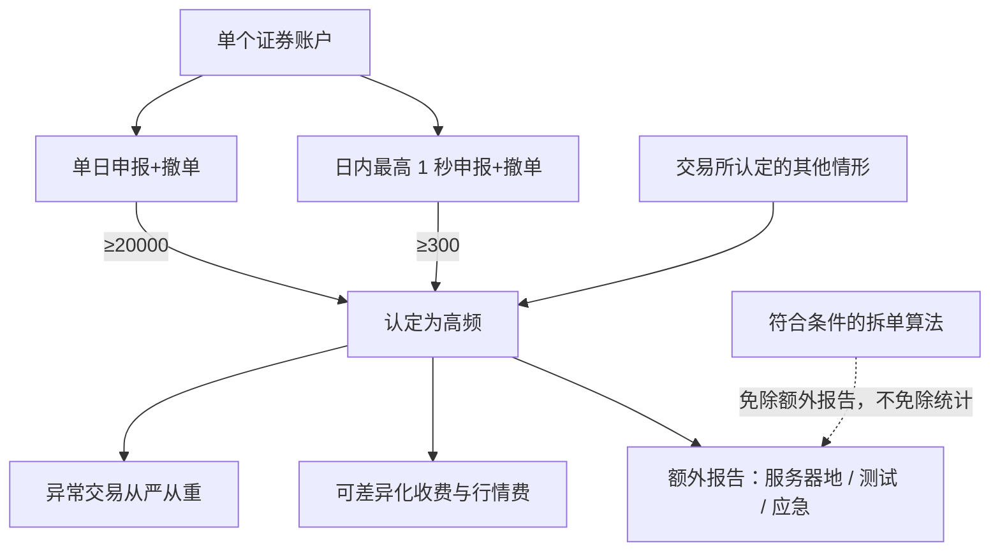

# 高频交易认定标准

单个账户每秒申报、撤单的最高笔数达到 300 笔以上，或者单个账户单日申报、撤单的最高笔数达到 20000 笔以上的，属于高频交易；证券交易所可以认定其他情形，并在报告、收费、监管、行情获取等方面提出差异化要求。

<footer>—— 沪深北证券交易所《程序化交易管理实施细则》第五章；上位依据为证监会《证券市场程序化交易管理规定（试行）》第二十一条至第二十四条</footer>

《管理规定》给高频交易的是特征清单：短时间内申报、撤单的笔数与频率较高；日内申报、撤单笔数较高；以及交易所认定的其他特征。把特征收成可执行阈值的，是 2025 年 7 月 7 日施行的交易所实施细则：流速每秒 300 笔（申报与撤单合计、账户日内最高一秒），流量全日 20000 笔（同样合计）。两个数字是认定门槛，不是「建议的最优报单速度」。一旦触及，账户进入高频子集：额外报告服务器所在地、系统测试报告与故障应急方案；异常交易从严从重；可适用差异化收费与行情费用。本篇把认定写成状态变量，衔接[程序化规定](/quant/cn-program-trading-rules)与[撤单收费](/quant/cn-fee-cancel-ratio)。目的是让回测与风控知道何时必须切换合规流程，不是把报单刚好排在 299 或 19999 上。

## 问题

高频在微观结构文献里常指延迟、撤单与做市。A 股规则里的高频是**账户笔数统计**，不看策略是否提供流动性，也不看盈利。秒级用的是该账户当天最高的一秒，不是全天平均；日级用的是当天最高达到过的申报加撤单笔数。因此一个只在开盘三分钟密集报撤、其余时间沉默的账户，仍可被认定为高频。问题是统计口径：同一产品多个股东账户是否合并、母子基金是否合并，以交易所监控实践与「不得分拆产品规避」条款为准，不能在研究里自行选择最宽松的分母。

《管理规定》要求交易所明确并适时完善认定标准。细则也写明交易所可以调整认定情形与差异化要求。300 与 20000 是现行公开标准，不是永久物理常数。把它们写进合约风控时，应作为可配置阈值，并保留「其他情形」的或有分支——例如交易所认定的其他流速或流量模式。

### 申报加撤单，不是仅成交

阈值计的是申报、撤单笔数，成交不是门槛的减项。未成交的限价单、立刻撤销的探测单，全部进入计数。这与「成交量很大所以不是高频」的直觉相反：做市或扫流动性若伴随大量废单与改撤，更容易跨过门槛。拆单算法把母单切成子单，子单每笔都计。例外条款只免除**额外报告**，不把拆单排除在高频统计之外：公募及其子公司、从事资管的会员、合格境外投资者等，若拆单目的是减少大额冲击或保证组合公平、且已按普通程序化履行第九条报告，则不适用高频的服务器地、测试报告与应急方案等额外报告。它们仍可能被统计为高频并进入重点监管与收费讨论。例外不是「公募不是高频」。

「以上」包含本数。300 与 20000 达到即落入认定。用「小于等于 299」当作合规目标，既不是条文鼓励的行为，也会在时钟对齐、合并计算或「其他情形」下失效。合规目标应是报告真实速率并接受相应管理，而不是贴线。

## 方法

账户状态机至少三档：非程序化、程序化非高频、程序化高频。进入程序化已须报告策略类型、最高申报速率与单日最高申报笔数。所报速率、笔数应覆盖实际可能达到的峰值；实际反复超过所报区间，属于报告与行为不一致，交易所可督促直至限制交易。进入高频后，在普通报告之外增加：系统服务器所在地、测试报告、故障应急方案。测试与应急不是一次性营销材料，细则要求用于程序化的技术系统充分测试、定期验证，并具备快速撤单、暂停、隔离等人工干预。

监控上，会员须对高频客户实时监控，可能出现第十八条异常时立即按协议控制，避免冲击交易所系统。使用交易单元的其他机构须识别自身的高频账户并严格管理。发生异常的，交易所可从严从重采取自律措施。因此高频标签改变的是**监管强度与成本函数**，不是改变涨跌停或 T+1。回测若只加普通佣金，会低估高频子集的可行边界。

### 流速与流量为何被选成标准

交易所公开说明：认定标准不宜过于复杂，流速与流量最直接对应系统负载与市场秩序压力，便于理解与执行。这与学术上用订单存续时间、排队位置或知情交易概率定义 HFT 不同。规则优化的是可观测的报撤计数，不是延迟的纳秒数。主机托管与交易单元另有公平条款，见[托管整改](/quant/cn-colocation-rectify)；即使延迟被抹平，笔数仍可达到高频。把「没有托管就不是高频」与公开定义冲突。

## 机制

认定一旦触发，差异化管理在四条线上同时加厚。报告线：更多技术与应急信息，服务器位置进入可检查范围。监管线：同一类异常，高频可从重。收费线：可按报撤笔数与频率加收流量费、撤单费，成本必须由高频投资者承担，见[差异化收费](/quant/cn-fee-cancel-ratio)。行情线：报撤达到一定标准的，使用增强行情时可提高信息使用费。四条线的共同目的是提高高频报撤的可观测性与边际成本，引导降低对主机的冲击，而不是禁止程序化。

北向投资者适用同一套 300 / 20000 认定与重点监控，报告经香港经纪与联交所转送。把沪深港通当成「高频标准不适用」与内外资一致原则冲突。

### 与异常交易四类的关系

高频认定是账户标签；四类异常是行为事件。标签使事件更易被从重处理，但未贴标签也可以因 1 秒巨量报撤被认定瞬时速率异常。反过来，贴了标签但报撤形态正常，并不自动构成异常。风控应两套计数器并行：是否跨过 300/20000，以及是否出现 1 秒报撤、高撤单率、拉抬打压、短时大额。用其中一套代替另一套，会漏掉「低频账户的瞬时冲击」或「高频但形态合规的做市」。

## 边界与工程取舍

具体收费标准细则写由交易所另行规定，方案在证监会指导下适时出台；在标准公布前，不得把境外市场的取消费数字填进 A 股成本模型冒充已实施费率。拆单例外的主体名单以细则第三十四条第二款为准，私募证券投资基金不在该款列举中，不能自行类推免除额外报告。个人投资者只要笔数达标，同样属于高频，没有「零售豁免」。

不要为保持非高频身份而设计多账户轮转、产品分拆、人工点击模拟自动单。这些直接顶上「不得分拆规避」与报告真实性。不要把认定标准理解成交易所对策略类型的评级。公开规则下，研究只估计：在真实报撤过程跨过阈值时，报告义务、收费与限额如何改变净边缘。

最高申报速率与单日最高笔数是报告项，也是认定输入。故意低报再超跑，会同时触发报告不实与高频管理。模拟器应让「所报峰值」成为硬约束，超报即视为不合规路径，而不是悄悄改标签。

## 小结

- 现行公开标准：单账户最高一秒申报与撤单合计达到 300 笔以上，或单日合计达到 20000 笔以上。
- 计数含撤单，不含「提供流动性」豁免；「以上」含本数。
- 高频触发额外报告、重点监管、可适用流量费与撤单费及行情加价。
- 特定机构的冲击减小型拆单可免额外报告，仍可能被统计为高频。
- 不得用分拆账户或低报速率规避认定。
- 出处：《证券市场程序化交易管理规定（试行）》第二十一至二十四条；沪深北《程序化交易管理实施细则》第三十三至三十七条。
