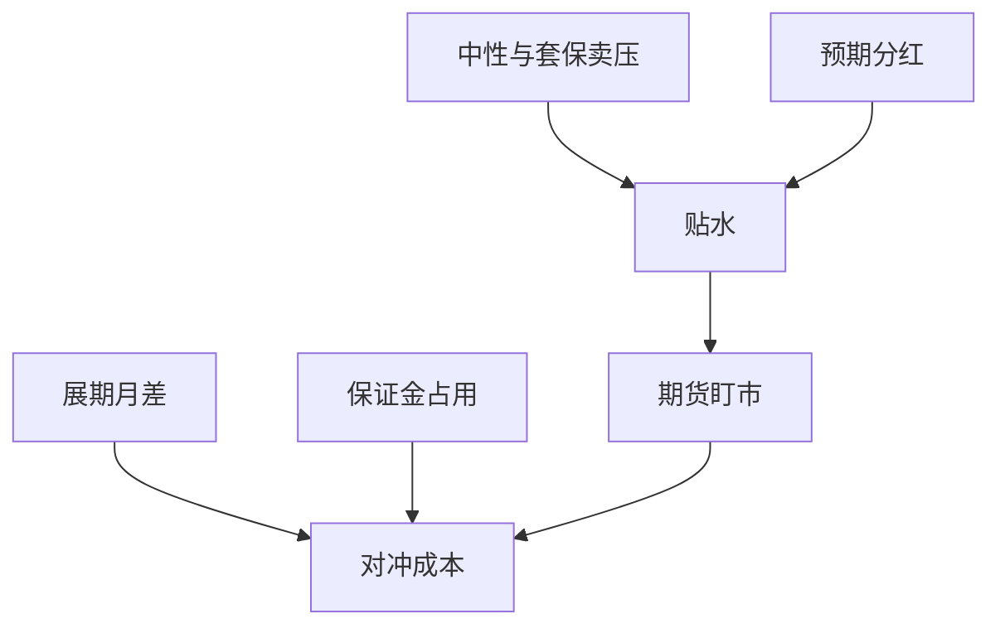

# 股指期货基差与对冲成本

贴水年化不是中性策略的确定收益。它是对冲拥挤、分红、保证金与展期的市场价格；变深时空头赢、多头相对期货输。

<footer>—— 中国金融期货交易所股指期货合约及结算细则；持有成本与基差见指数套利教科书处理；对照[保证金与贴水](/quant/cn-index-fut-basis)</footer>

[上一课](/quant/cn-securities-lending)关闭或收紧了个股空头。[股指期货保证金与贴水](/quant/cn-index-fut-basis)已写合约乘数、结算价、分红季节与 IC/IM 深度贴水。本课的缺口是**把它接到产品账单**：指增、私募中性、期现套利的对冲成本如何从基差、展期、保证金与冲击加总。不重导 $F=Se^{(r-q)\tau}$ 的全文，只补产品层会计。后课 ETF 期权提供另一套波动率工具。

## 问题

中性产品空期货、多选股组合，净值 ≈ 选股超额 + 基差变动 − 保证金与冲击。把期初贴水年化加进预期超额，等于假设贴水单调收敛且保证金免费。现实：贴水可继续变深（对冲拥挤、融券更难）、展期把近月换成远月、VM 抽现金。问题是定义可实现对冲成本

$$
c_{\mathrm{hedge}}=\underbrace{\Delta \mathrm{basis}}_{\text{盯市}}+\underbrace{c_{\mathrm{roll}}}_{\text{展期}}+\underbrace{c_{\mathrm{margin}}}_{\text{占用}}+\underbrace{c_{\mathrm{impact}}}_{\text{期货与篮子冲击}}.
$$

选股超额必须在扣 $c_{\mathrm{hedge}}$ 后报告。公募若只用期货替代股票仓位，成本进入跟踪误差与费用，同样不能当 alpha。

IF/IH 与 IC/IM 的 $c_{\mathrm{hedge}}$ 结构不同：前者更接近分红与利率，后者更接近拥挤。用错合约对冲 500/1000 增强，市值残差会进「选股」。

### 展期日历是强制交易

近月到期必须展期。展期成交的是月差，不是指数。远月更贴则空头展期付费。流动性在远月更差，冲击占 $c_{\mathrm{impact}}$ 的大头。回测用收盘点位展期、零滑点，会系统性低估中性成本。平今手续费历史上曾很高，须按当时费率。

现货涨跌停、期货 ±10% 停板，基差可以超出无套利带且无法对锁。该日 $c_{\mathrm{hedge}}$ 的方差来自制度，应单列。

## 方法

每日记账：期货结算盈亏、相对现货篮子（或 ETF）的基差、保证金占用的融资成本、展期日单独腿。篮子用可复制组合，不是指数点，见期现课。压力：贴水扩大到历史分位、保证金上调、限仓。容量：中金所持仓限额与市场深度给出空头供给上限；超过则 $c_{\mathrm{hedge}}$ 陡增，产品应降杠杆而非提高名义。

与[实盘容量](/quant/live-capacity-estimate) 对齐：中性产品的 $A^\ast$ 常由期货腿决定。与指增对齐：未对冲的增强没有 $c_{\mathrm{hedge}}$ 的期货项，但有基准调仓冲击。

### 分红窗口

二季度 IF/IH 贴水含分红折现。用事后实现 $q$ 会前视。对冲成本分解应把「预期分红」与「拥挤残差」分开，避免把日历效应当选股技能。

## 机制

空头工具越少，期货越贵（贴水越深）。转融券收紧 → 中性需求 → 贴水，是同一供给曲线。做多贴水（买期货、卖现货）受现货借券与卖空约束，收敛可以很慢。因此贴水可以长期存在，不是免费午餐。CCP 每日 VM 把基差变动变成现金，路径依赖强于「持有到期的年化」。

## 边界

不提供逼仓、操纵交割结算价或利用未公开套保额度的方法。交割结算价为指数最后两小时均价，对冲应对该定义。境外指数期货对 A 股的映射有监管与基差，不能当同一工具。

## 小结

- 对冲成本 = 基差盯市 + 展期 + 保证金 + 冲击；贴水年化不是确定 alpha。
- IC/IM 与 IF/IH 结构不同；用错合约留下市值暴露。
- 融券管道影响期货拥挤，两课必须联立。
- 出处：中金所股指期货细则；本栏 `cn-index-fut-basis`；持有成本理论。
