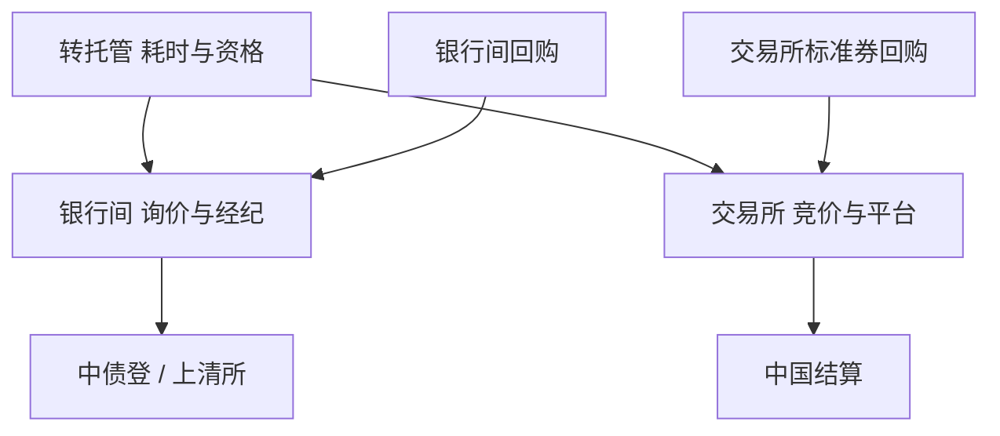

# 银行间与交易所债市

同一只信用债或利率债可以同时在银行间与交易所出现，但投资者、结算、回购与微观结构不同。跨市场利差可以是分割，也可以是不可交割的幻觉。

<footer>—— 中国人民银行与财政部关于银行间债券市场的制度安排；沪深交易所债券交易规则；中国结算与上海清算所的托管结算分工；对照 Duffie 对市场分割与搜寻的讨论</footer>

[上一课](/quant/cn-rates-market)写了利率债曲线。本课是中国进阶课序的收束：**场所分割**。银行间（CFETS、双边与经纪）服务商业银行等，托管多在上海清算所或中债登对应账户；交易所债（竞价、固定收益平台、质押式回购）服务经纪账户，中国结算。跨市场转托管有时间与资格。不要把两个场所的「收盘价」平均成一只债的真值。本课程不重写股票 LOB；交易所债券竞价是另一套产品规则。

## 问题

分割产生价差：同一发行人、相近久期的交易所债与银行间债，因投资者不能无摩擦转移、回购利率不同、税费与可质押范围不同，可以持续偏离。问题是可交易性：转托管是否对你的账户开放、要多久、数量限制；以及两个价格是否同时可成交。用中债估值对交易所收盘算「套利」，往往忽略转托管时钟与最小包。失败则变成方向性信用或利率暴露。

交易所标准券回购与银行间质押式回购的折算率、利率、对手方不同。杠杆策略在两个场所的 haircut 不同，危机时交易所回购与银行间可以同时抽流动性但不同步，见 2013 钱荒与 2016、2022 等公开压力事件的场所差异（细节以当时公告为准）。股票量化团队若用交易所债券质押融资，必须把该 haircut 写进与股票涨跌停联合的现金计划。

### 投资者准入

银行不能把银行间持仓当成交易所可卖，反之散户与许多公募的交易所仓不能直接当银行间报价。产品合同的投资范围决定宇宙。把「全市场信用债指数」当可交易，会包含你买不到的场所。点-in-time 成分须带 `venue`。

可转债主要在交易所竞价，与本课的银行间信用债不是同一微观结构。不要用银行间利差去解释转债折价。

## 方法

债券主数据：`isin/code`、托管场所、是否跨市场、转托管周期。报价：银行间用经纪商或 CFETS 可成交意向；交易所用竞价或综合协议。策略只在账户可达的场所下单。利差交易必须含转托管状态机：发起转托管后券在途，两侧都不可用，类似结算 fail。估值：中债/中证标明场所与样本券，回测声明。

与[结算失败](/quant/settlement-fails)：银行间 DVP 与交易所结算周期不同，资金日终可用时点不同。跨市场策略的现金要按更慢的一条腿备付。

### 价格发现谁领先

活跃券可能在银行间，交易所跟估值；或相反，交易所可转债、公司债竞价更密。领先滞后必须用同步时钟与可成交报价，不能用两个收盘戳相减。这与股票 SIP/直连课同一精神：源与场所先声明。

## 机制

搜寻与准入使一价定律变成带摩擦的不等式。摩擦的时变来自：转托管政策、回购资格、风险事件下的投资者分割（银行 vs 基金）。利差扩大可以是理性的流动性溢价，不必是可锁套利。Duffie 式搜寻模型提供语言：对手难找时价差宽。中国的特点是场所由监管与托管账户划死，搜寻发生在场所内，场所之间是制度桥而不是连续 LOB。

工程课的 CCP：交易所债与银行间清算机构不同，瀑布与净额不共用。跨市场「中性」没有组合保证金，除非通过同一期货（国债期货）间接。

## 边界

不提供利用转托管窗口占用对手券源、或在分割市场之间制造虚假流动性的方法。具体转托管以登记结算机构现行指引为准。国际债、熊猫债、自贸区债另有账户。本课结束「A 股与债市续」课序；附录性质的论文与审计不插入主干。

## 小结

- 银行间与交易所是分割的托管与投资者集合；跨市场价差须扣转托管时钟。
- 回购与结算不共用 CCP；杠杆与现金按场所分列。
- 估值源与可成交场所必须写入债券主键。
- 出处：银行间市场制度安排；沪深债券交易规则；中国结算与上清所；Duffie 搜寻与分割视角。
