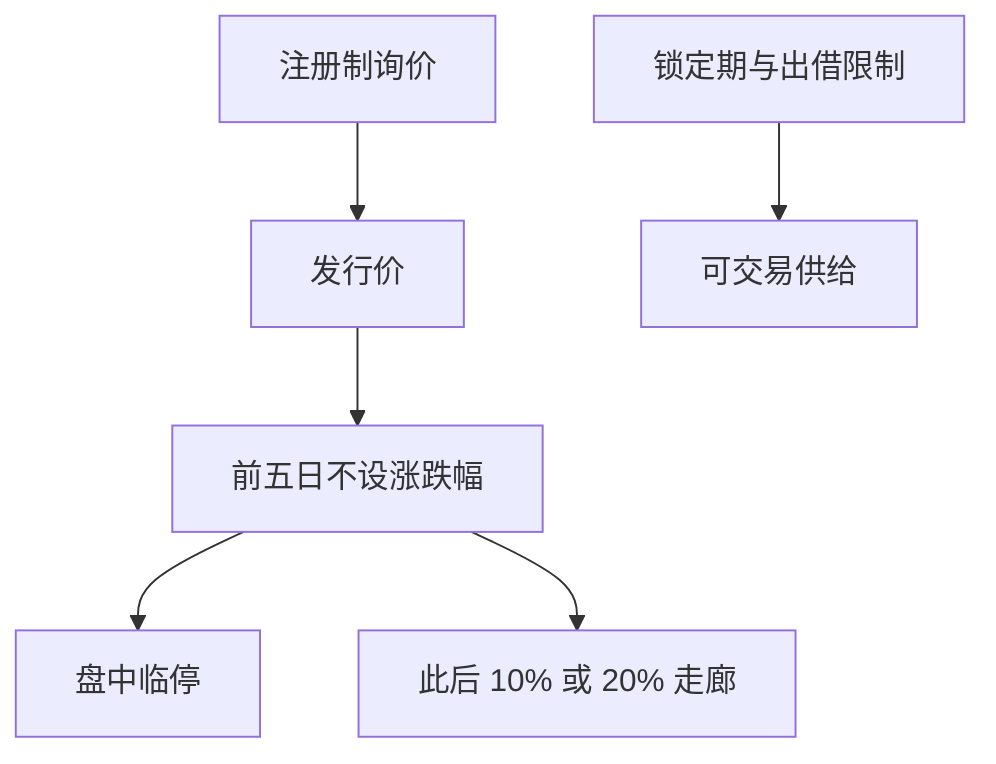

# 注册制与新股定价

注册制把发行条件从实质审批推向信息披露与询价约束；新股前五日不设涨跌幅，使上市初期的价格发现与主板 10% 走廊不是同一过程。

<footer>—— 《证券法》（2019 年修订）注册制条款；科创板、创业板、主板注册制改革相关证监会与交易所规则；对照[科创板/创业板](/quant/star-chinext)</footer>

[上一课](/quant/cn-bse-neeq)扩展了交易所层级。本课的缺口是**发行制度**：核准制到注册制、询价与定价、破发、以及上市初期交易规则。科创板 2019、创业板 2020、主板 2023 年注册制落地，样本必须分段。[星创课](/quant/star-chinext)已写两板交易差异；本课写发行与上市初期定价，不重写 20% 涨跌幅全文。后课涨跌停流动性黑洞处理日常走廊，本课处理「走廊尚未生效」的前五日。

## 问题

核准制下发行市盈率与通道形成隐性上限，新股上市后常连续涨停，首日收益是配给而非可交易价格。注册制下询价范围放宽，定价可以更高，破发成为可能，上市前五日不设涨跌幅（科创板自始、创业板改革后、主板注册制后，以当时规则为准），盘中临停 ±30%、±60%。问题是：新股因子（首日收益、锁定、询价参与）在制度切换后对象变了。用 2010–2018 的打新收益外推 2021 年后，是在交易另一套配给机制。

网下询价、战略配售、锁定期与出借限制（见转融通课）改变可交易供给。量化若在上市首日做动量或反转，成交规则是集合竞价 + 宽幅波动 + 临停，不是连续 10% 板。回测必须实现临停状态机。

### 定价效率与破发

破发说明询价可以高于二级愿意承接的价格，不是「注册制失败」的口号度量。研究应看：发行价相对同业、换手、锁定期满解禁冲击。解禁是供给事件，类似指数调入，须用公告与生效日。把破发当情绪指标可以，但要扣发行质量与行业。

打新收益在核准制下高度取决于中签与连板，容量极小且依赖市值配售规则。注册制后打新期望下降，方差上升。产品宣传「稳健打新」须与当时规则一致。

## 方法

发行事件表：披露日、询价日、发行价、上市日、涨跌幅制度版本、战略配售与锁定期。收益：上市初期用可成交路径（含临停），不要把一字板当成人人可买的收盘价。宇宙：新股是否进入因子样本，应在上市满 N 日或进入指数之后，避免用不可复制的连板收益污染 IC。与[成分历史](/quant/index-constituents-history)衔接：快速入选规则使新股提前进指数，被动资金在宽幅波动期交易。

对照国际 IPO 抑价文献（Rock、Ritter）时声明：A 股的抑价很大一块是制度配给，注册制改变的是配给强度，不是把市场变成无摩擦询价。

### 北交所 IPO

北交所发行与适当性另套，见上一课。不要把沪深主板注册制统计直接加进北证。

## 机制

发行制度决定一级谁获得筹码、二级前五日如何发现价格。涨跌停一旦生效，发现被截断，未完成的发现进入次日开盘集合竞价，见涨跌停课。注册制把更多发现提前到前五日与询价，日常 10%/20% 走廊里的连板现象减少，但未消失。因子若依赖「新股连板动量」，在注册制样本会衰减——这是制度，不是动量因子普遍死亡。

融券与战略配售出借限制，使上市初期做空更难，高估可以持续更久。这与短约束课同一通道。

## 边界

不提供询价串通、利益输送或规避锁定期的方法。规则以证监会与交易所现行发行承销细则为准，本课只给状态机。老股转让、CDR、红筹回归各有专章。

## 小结

- 注册制改变发行配给与上市初期发现过程；回测必须按改革日分段。
- 前五日不设涨跌幅 + 临停，不是主板日常走廊。
- 打新与新股动量的对象在核准制/注册制之间不可比。
- 出处：《证券法》注册制；科创板/创业板/主板改革规则；Ritter 等 IPO 抑价传统（对照用）。
