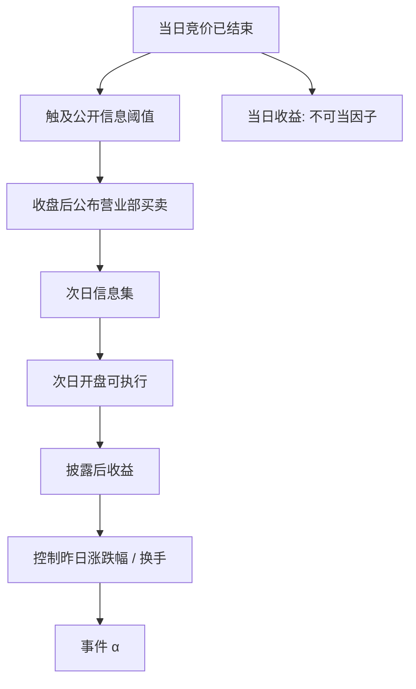

# 龙虎榜异常

竞价交易出现规定的异常波动情形时，交易所公布当日买入、卖出金额最大的证券营业部；这份公开信息改变的是次日的注意力与订单流，不能用来改写当日已经结束的收盘价。

<footer>—— 《上海证券交易所交易规则》交易公开信息；深交所交易规则对应条款</footer>

上交所、深交所对当日涨跌幅偏离值、振幅、换手率等触及阈值的证券，公布买入与卖出金额居前的营业部席位，媒体称为龙虎榜。数据在收盘之后、按交易所规定时点对外披露，对象是**已经发生的公开成交**，不是未公开的订单意图。学术问题是：上榜作为注意力与异质交易者构成的事件，是否预测披露**之后**的收益。把榜上营业部的净买入当成「主力」去解释当日涨停，是把结果叫做原因。本篇只使用交易所公开信息，不讨论非公开席位识别、不讨论规避信息披露。

## 问题

上榜是选择样本。阈值大致包括：日收盘涨跌幅偏离值达到一定百分比（主板常见 ±7% 一档，连续数日累计偏离另一档）、日振幅、日换手率达到规则所列水平等；ST、注册制板块的具体百分比以当时规则为准。因此上榜股票已经是当日极值，无条件平均收益没有意义。要问的是条件期望：给定上榜类型（涨幅偏离 vs 换手 vs 振幅）、买卖席位结构（营业部 vs 机构专用）、净买入金额，**披露后**可执行收益是否还有单调性。

第二个混淆是席位解读。公开的是营业部名称与买卖金额，不是最终受益人。同一营业部可以同时出现在买入前五与卖出前五。把某营业部历史胜率当成「游资风格」再实时跟单，是在用公开标签做数据挖掘，尝试次数进入 [HLZ](/quant/harvey-liu-zhu)。问题应先是事件类型，而不是给席位排行榜。

### 披露时钟决定能不能交易

龙虎榜属于交易公开信息，在当日收盘后发布。用上榜标志解释当日开盘到收盘的收益，信息集里包含了当日已经走完的路径，不是因子。可交易检验：信号在披露时点进入 $\mathcal{F}_t$，第一笔可执行价格是次一交易日的开盘集合竞价或其后连续竞价，且受 [T+1](/quant/cn-tplus1) 约束——次日买入仍不能当日卖出。一字涨停的次日开盘可能继续无量，事件收益应记不可成交，而不是记涨停价。见[未来函数](/quant/no-future-function)与[涨跌停](/quant/cn-limit-auction)。

历史库若把上榜标志对齐到当日 K 线，回测会默认你在 9:30 就知道收盘才会公布的榜。必须把时间戳改到披露时点，或把事件日收益从样本里删掉、只保留披露后窗口。

## 方法

**事件分类。** 按规则原因拆开：涨幅偏离上榜、跌幅偏离上榜、振幅、换手，以及连续多日累计偏离。涨幅偏离样本与涨停邻近高度重叠，见[涨跌停邻近](/quant/cn-limit-proximity)；换手样本与[换手率因子](/quant/cn-turnover-factor)重叠。混在一个「上榜哑变量」里，测到的是极值收益的自相关，不是榜的增量信息。

**席位结构。** 公开字段允许构造：买入前五合计、卖出前五合计、买卖差、机构专用席位是否出现在一侧。这些是披露后才知的构成，只能预测次日及以后。学术上常见的注意力叙事是：上榜提高次日换手与散户净买入，短期有价格压力，随后反转。是否成立，要用披露后窗口的可执行收益，并控制昨日涨跌幅——否则只是动量/反转。

**对照。** （1）达到阈值但因并列或规则细节未展示席位的股票（若样本可构造）；（2）同样极值但未上榜的日期。理想设计接近回归断点：偏离值刚过 7% 与刚不过。实际上并列与「前五只证券」的名额使断点不干净，仍应报告阈值附近的局部样本，而不是全市场极值组。持有期预指定为 1 日、5 日、20 日，不要看完再留最显著的窗口。

### 与大宗、融资融券的交界

龙虎榜统计的是竞价交易席位，不含大宗协议成交。大股东减持走大宗时，竞价榜上看不到这笔供给，见[大宗交易](/quant/cn-block-trade)。融资买入、融券卖出若发生在竞价，会进入营业部金额，但公开榜不标记两融性质。不要把榜上净买入写成「杠杆多头」。机构专用席位出现在卖出侧，也不等于「知情卖出」——可以是指数基金再平衡。所有解释保持在公开可证伪的层面。

## 机制

注意力：上榜进入媒体与交易软件专题，散户在次日追逐昨日极值，造成开盘溢价与高换手，随后均值回复。这与 Barber 和 Odean 的注意力买入、以及 A 股涨停榜效应是同一家族。异质交易者：营业部集中买入表示订单流集中，可能是主题交易；若次日无法持续，价格压力反转。信息：若席位真有私有信息，公开之后信息已经不是私有，价格应在披露时点附近完成调整，后续 alpha 来自调整不足或过度。可证伪的是披露后窗口，不是席位的神秘解释。

上榜与拥挤：公开事件使策略相关，次日开盘集合竞价两侧都挤着「看了同一张榜」的订单，冲击大、可成交价差于纸面收盘。容量极低。把历史平均「上榜次日再涨」当可规模化因子，忽略了你自己就是那个被披露吸引来的订单流。

### 选择偏差与多重席位挖掘

只有极值才上榜，样本的无条件夏普没有定义。在席位名称上搜「胜率」、在原因代码上搜交互、在持有期上搜 t，会制造一个看起来很强的游资跟踪策略，其 $M$ 来自席位数量 × 规则变体。预注册应锁定：原因类型、持有期、是否剔除涨停锁定、宇宙是否含 ST。席位层面的条件统计最多当描述，不当发现。

规则修订会改阈值与公布范围。用现行 7%、15%、20% 去回标十年前的榜，会对错事件。事件表必须用当时有效的交易规则与交易所公告，而不是今日软件的历史回填。

## 边界与工程取舍

不要把龙虎榜写成内幕或「跟庄」教程。不要用未披露的席位映射、打码营业部的民间数据库当研究输入——本篇范围是交易所公开信息。不要假设可以根据榜上净买入在当日收盘前成交。不要在 ST、连板、次新上与蓝筹共用同一事件系数。

与风控：上榜股票波动与涨跌停概率上升，流动性在你需要退出的一侧消失。组合若因因子模型而持有即将上榜的极值股，应有独立的事件限额，而不是用普通日频 σ。复制应报告：披露后 1 日可成交样本占比、开盘相对收盘的跳空、以及控制昨日收益后的残差。

出处：《上海证券交易所交易规则》交易信息公开；《深圳证券交易所交易规则》对应条款。注意力与交易行为的一般证据见 Barber and Odean, *RFS*, 2008。A 股上榜是制度定义的注意力事件，不是美股「极端收益」样本的简单翻译。

## 小结

- 龙虎榜是收盘后公布的竞价席位公开信息，事件日当日收益不可当作可交易因子。
- 须按上榜原因分类，并控制已实现涨跌幅与换手，才能谈披露后的增量预测。
- 营业部名称不是最终受益人；席位胜率搜索是多重检验，不是机制。
- 次日执行受集合竞价、涨跌停与 T+1 约束，不可成交应记缺失。
- 规则阈值有历史版本；注意力拥挤使容量极低。
- 出处：沪深交易所交易规则中的交易公开信息条款。
