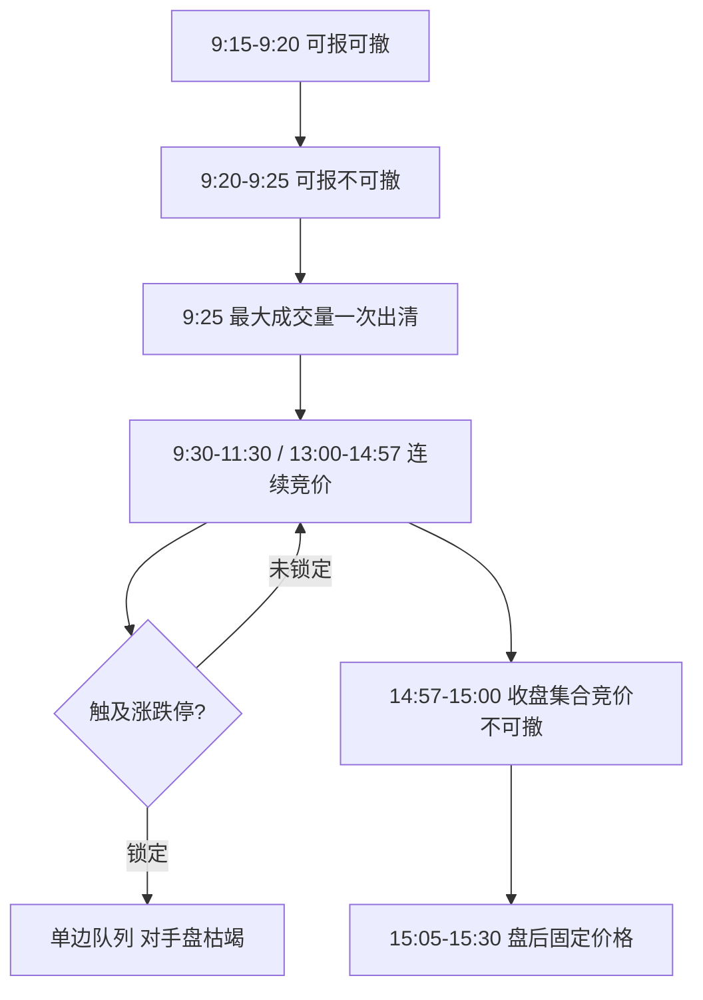

# 涨跌停与集合竞价

集合竞价是在规定时间内接受的买卖申报一次性集中撮合；成交价首先取可实现最大成交量的价格，所有成交以同一价格达成。

<footer>—— 《上海证券交易所交易规则（2026 年修订）》第 3.4.1、3.5.2 条；深交所交易规则有对应原则</footer>

[上一课](/quant/cn-tplus1)把 A 股股票回转写成可卖量与当日锁定量：先卖后买与先买后卖不对称，日频回测用收盘平当日开仓与第 3.1.4 条冲突。缺口是库存拆对了，开盘价、收盘价如何一次性出清、涨跌停如何把申报推进走廊，还没进会话状态。上交所 9:15–9:25 开盘集合竞价、14:57–15:00 收盘集合竞价，9:20 后与收盘段主机不接受撤单；涨跌幅把申报锁在前收盘的百分比走廊内。本课写这条状态机，不重写 T+1 的可卖日历。后课融券、北向与两板默认已经读完开收盘如何生成。

## 问题

T+1 回答的是当日买的股票能不能卖。留下的是价格发现还能否进行。无涨跌幅时，中间价可以连续吸收订单流。有涨跌幅时，一旦意愿价格越出走廊，申报无效或全部堆在涨停价、跌停价。一侧队列消失，Kyle 意义上的深度不再对称，市价（或可立即成交限价）无法沿对手方扫出真实出清价。收盘价可以是涨停价，但该价上可能没有你买得到的量，或只有你卖不掉的量。用这个收盘价计算因子收益，是把配给结果当成了可交易收益。

集合竞价则把「何时下单、能否撤单」变成策略变量。开盘前半段（9:15–9:20）可报可撤，虚拟参考价、虚拟匹配量、虚拟未匹配量在行情里揭示；9:20 后只能报不能撤，博弈从可逆报价变成不可逆提交。收盘三分钟同样不可撤。把美股连续交易的最后一笔当收盘，与 A 股收盘集合竞价不是同一对象。问题是：开盘价、收盘价如何按第 3.5.2 条生成，涨跌停如何截断连续竞价，以及无涨跌幅股票的盘中临时停牌如何插入另一次集合竞价。

### 涨跌幅价格与有效申报范围

第 3.3.13 条：涨跌幅限制价格 $=$ 前收盘价 $\times(1\pm$ 比例$)$，四舍五入到最小变动单位。超出限制的申报为无效。连续竞价还有有效申报价格范围：买入不高于基准买入价的 102% 与十个价位的孰高，卖出不低于 98% 与十个价位的孰低，基准取即时揭示的对手价或最新成交、前收盘。这限制了瞬间打穿的距离，与涨跌停走廊是两层。科创板在第 6.6 条把比例定为 20%；无涨跌幅的前五个上市日等情形，盘中相对开盘价首次触及 $\pm30\%$、$\pm60\%$ 各停牌 10 分钟（第 4.2.4 条）。2026 年修订将主板风险警示股票涨跌幅调整为 10%（自 2026 年 7 月 6 日起施行），历史回测若仍一律用 ST 为 5%，会与现行规则及更早时期分别错位，必须按生效日切换。

停牌、复牌、盘中临停期间可以继续申报或撤单；复牌时对已接受申报做集合竞价，临停跨越 14:57 的，于 14:57 复牌再进入收盘集合竞价。状态机比「连续交易加减一个涨跌停」多几个节点。

## 方法

价格时间序列应带状态标志：连续、开盘集合、收盘集合、停牌、涨停锁定、跌停锁定、临停。因子收益用可成交价：若收盘锁定涨停且你是买方，当日买入收益不可用该收盘实现；卖方亦然。开盘执行应对齐 9:25 的一次性撮合，而不是用 9:30 第一笔连续竞价去代替开盘价——第 4.1.1–4.1.2 条规定开盘价为竞价交易第一笔，优先由集合竞价产生。

集合竞价成交价按第 3.5.2 条：最大成交量；高于该价的买与低于该价的卖全部成交；与该价相同的买或卖至少一方全部成交；多解时取未成交量最小，再取中间价；所有成交同一价格。模拟器必须实现这套规则，不能用连续竞价逐步匹配去「近似」开盘。9:20 后的申报在回测里不可撤销；用 9:24 的虚拟参考价去决定 9:21 的撤单，是未来函数。盘后固定价格交易（15:05–15:30，按收盘价时间优先）是另一场所，2026 年修订将其适用范围扩至 A 股与 ETF，研究收盘后流动性应单独记账，不要并进 15:00 的收盘价。

### 锁定板与部分成交

涨停锁定时，卖出队列若存在，买入在涨停价排队；成交取决于是否有人愿意以涨停价卖出。统计「涨停收益」必须区分：收盘触及涨停但全日可成交，与封死至收盘且买一剩余巨大。后者的买方下一笔可成交价可能是次日开盘，且次日仍可能一字。方法是记录封板时长、未成交买量、打开次数，把不可成交区间从 alpha 样本里剔除或改用下一可成交价，而不是删除股票造成存活偏差。跌停对称。有效申报范围使连续竞价中远离基准的攻击单无效，冲击模型不能假设可以任意远地扫簿。

## 机制

涨跌停把部分发现推迟到次日开盘集合竞价。隔夜信息若足以让均衡价越出走廊，开盘集合竞价会在涨跌停价上出清，未匹配量留在虚拟未匹配里，连续竞价开盘即锁定。于是隔夜收益的实现集中在 9:25 的一次性价格，而不是均匀分布在早盘。这改写[隔夜溢价](/quant/calendar-overnight)的口径：A 股「隔夜」含开盘拍卖。策略若在收盘信号后于次日开盘执行，执行价已经是发现后的价格，IC 会低于用同期收盘算的纸面 IC。

不可撤单时段改变报价策略的期权价值。连续竞价的限价单带有免费的取消期权；9:20 之后这项期权被关掉，提交变成对出清价的硬赌注。虚拟参考价的揭示降低信息不对称，但也成为博弈对象：早期报价可以试探，临近 9:20 必须收敛到愿意被锁住的价格。把这段当成普通限价簿，会高估撤单作为风控的能力。

公开信息里对异常波动、严重异常波动的揭示（第 5.4 节）会改变随后的行为与停牌概率。用这些标志当实时特征，必须用当时发布时点，不能用收盘后最终认定回填。

### 板块差异只改走廊宽度，不改拍卖逻辑

科创板、创业板 20% 走廊更宽，锁定频率低于 10% 的主板，但集合竞价原则、不可撤单时段、盘中临停逻辑是同一家族。无涨跌幅的前五日，价格发现回到拍卖加临停，波动与冲击不能用有走廊时期的系数。创业板与科创板的申报数量、适当性、盘后机制差异见[科创板 / 创业板](/quant/star-chinext)。跨板块用同一个涨跌停过滤器（例如一律删 $\pm9.8\%$）会在 20% 板块里删错样本、在 10% 板块里删不足。

## 边界与工程取舍

涨跌幅比例、ST 口径、盘后固定价格范围都以交易所现行规则及生效日为准。指数熔断等机制历史上出现过、也可能修订，回测要按日历加载规则版本。深市与沪市在细节上可能不同步，标的以所属交易所规则为准，不要用上交所条文去撮合深市订单。

不要在锁定板上假设中点成交。不要用连续竞价引擎生成开盘价。不要把盘后固定价格成交并进竞价收盘价去做因子。不要设计以规避涨跌停或操纵集合竞价为目的的报撤模式；公开规则下的研究只应把这些机制当作约束与状态。有效申报范围、最小申报单位、停牌复牌集合竞价，都是模拟器清单上与冲击函数同级的项目。

开盘价未能由集合竞价产生时，规则允许以连续竞价产生。样本里「无开盘价」与「开盘即涨停」不同：前者可能是停牌或无有效申报，不能填前收盘假开盘。

## 小结

- 开盘与收盘集合竞价按最大成交量原则一次性出清，全场同一成交价。
- 9:20–9:25 与 14:57–15:00 主机不接受撤单，取消期权在这两段关闭。
- 涨跌幅限制使申报与可成交价进入走廊；锁定板的收盘价不是双边可成交价。
- 无涨跌幅情形以盘中临停插入额外集合竞价；规则按生效日切换。
- 因子与执行必须带会话状态，开盘执行对齐 9:25 而不是 9:30 的连续竞价。
- 出处：《上海证券交易所交易规则（2026 年修订）》第 2.4.2、3.3、3.4、3.5、3.7、4.1、4.2、6.6 条；《深圳证券交易所交易规则》对应条款。
