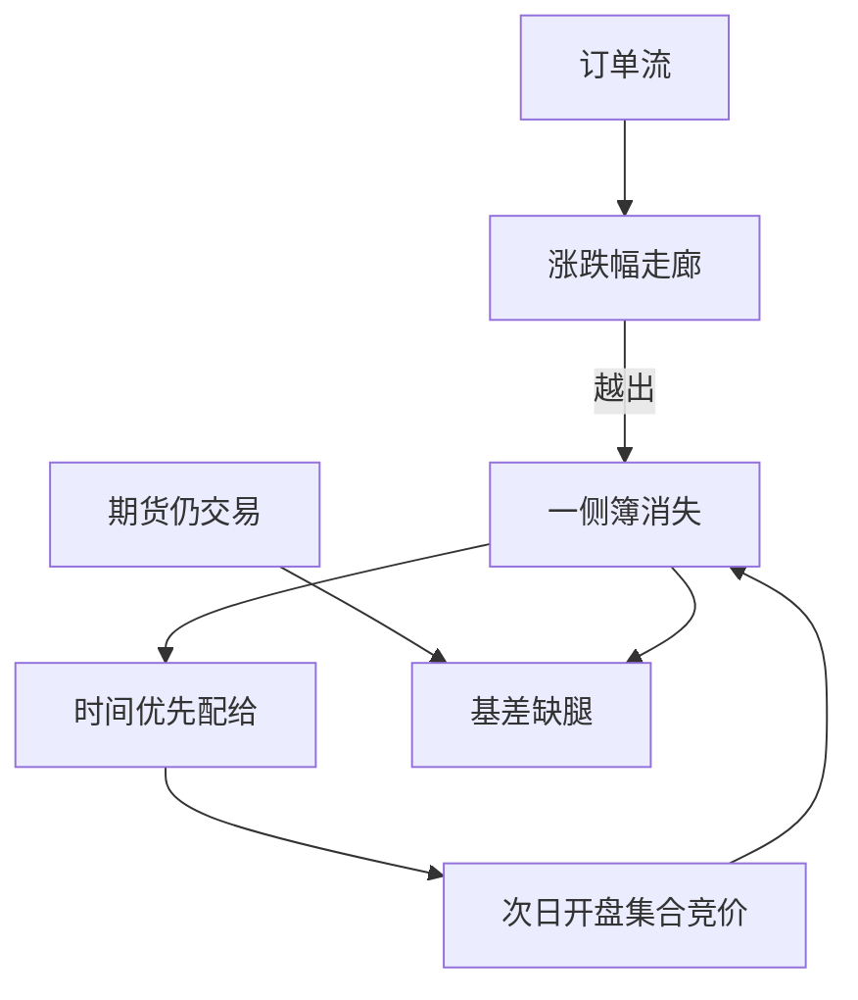

# 涨跌停与流动性黑洞

价格打在涨跌停上，一侧队列消失，连续竞价不再出清；流动性不是变贵，是暂时为零。次日开盘集合竞价承接未完成的发现，收盘价可以是配给而不是可买价。

<footer>—— 《上海证券交易所交易规则》涨跌幅限制与集合竞价；Kim and Rhee, Price Limit Performance, Journal of Finance, 1997；对照[涨跌停与集合竞价](/quant/cn-limit-auction)、[邻近效应](/quant/cn-limit-proximity)</footer>

[上一课](/quant/cn-ipo-registration)写了前五日无走廊。本课回到**日常涨跌停**：规则课已写如何生成开盘价与锁定板；邻近课已写距离走廊的截面状态。本课的缺口是**流动性黑洞**：锁定后 Kyle 深度塌缩、磁吸与延迟发现、以及组合缺腿。2015 年股灾中连续跌停使减仓与对冲同时失败，是制度路径而不是「波动率估错」。不重写集合竞价最大成交量规则。

## 问题

无涨跌幅时，大单沿[LOB](/quant/lob-structure) 扫档，冲击有限。有涨跌幅时，意愿价格越出走廊，申报堆在停板价，对手方消失。买方在涨停、卖方在跌停面对的是配给：时间优先排队，成交不是保证。用停板收盘价计算组合收益，是把未成交当成成交。问题是把「可成交标志」写成收益的乘数：锁定且你处于错误一侧，当日收益不可实现，风险滚到次日开盘——而次日仍可能继续锁定。

Kim 与 Rhee（1997）等价格限制文献讨论磁吸与冷却。A 股证据更常支持延迟发现：触及后次日同向跳开。因子与止损必须把走廊当硬约束。黑洞还传染：股票跌停、期货与 ETF 仍交易，基差与折溢价爆炸，中性与期现缺腿。

### 2015 年的路径

高杠杆融资盘在跌停板上无法平仓，担保比例击穿，强平单堆在同一侧，流动性供给进一步撤退。这与国际闪电崩盘的空簿路径同族，但触发器是涨跌停配给 + 两融，而不是单纯的 E-mini 市价单。回测「2015 年市场中性」若假设跌停可卖，净值是假的。

主板 10%、科创/创业 20%、注册制前五日不设限、ST 历史 5% 与 2026 年修订后的变化，必须按生效日切换。统一「涨跌停哑元」会在 20% 板上漏锁。

## 方法

状态：连续 / 涨停锁定 / 跌停锁定 / 集合竞价 / 停牌。收益：仅在可成交方向与可成交量上实现；否则持有到下一可成交拍卖。冲击模型在锁定日对错误一侧取无穷或拒绝下单。组合优化加入「不允许增加锁定方向的需求」。对冲：期货腿单独风控，缺腿日报告净暴露。

邻近度特征可用于预测锁定概率，见邻近课；本课要求执行层读取同一状态，而不是只在因子里当 alpha。容量：停板日 ADV 的历史均值高估可用流动性——可用是零。

### 开盘集合竞价是泄洪

未完成发现在 9:15–9:25（及不可撤时段）释放。虚拟参考价不是可成交保证。用 9:24 的虚拟价当 9:21 的决策是未来函数。收盘集合竞价同样：停板收盘价上的未匹配量进入次日。

## 机制

涨跌停把连续价格路径截断，把订单流变成配给。流动性黑洞 = 对手方供给的角点解。磁吸：接近限制时方向交易加速，因交易者担心被锁在外面或里面。冷却假说在 A 股日常样本中较弱，因为信息仍在隔夜积累，T+1 又禁止当日用反向交易纠错。于是黑洞的持续时间可以是多个交易日。

与工程课连接：这不是撮合核故障，核在按规则工作。故障课的「不确定成交」与这里的「确定不可成交」不同，监控原因码必须分开。

## 边界

不提供封板、撤单诱多空或利用停牌配合涨跌停的操纵方法。规则以交易所现行交易规则为准。本课对象是竞价股票；债券、基金有不同限制。

## 小结

- 锁定后流动性是配给，收盘价可不可实现必须分侧。
- 延迟发现把风险推到次日拍卖；T+1 禁止当日纠错。
- 2015 年路径是涨跌停 + 两融强平，中性缺腿。
- 出处：上交所交易规则；Kim and Rhee, *JF*, 1997；本栏涨跌停与邻近课。
