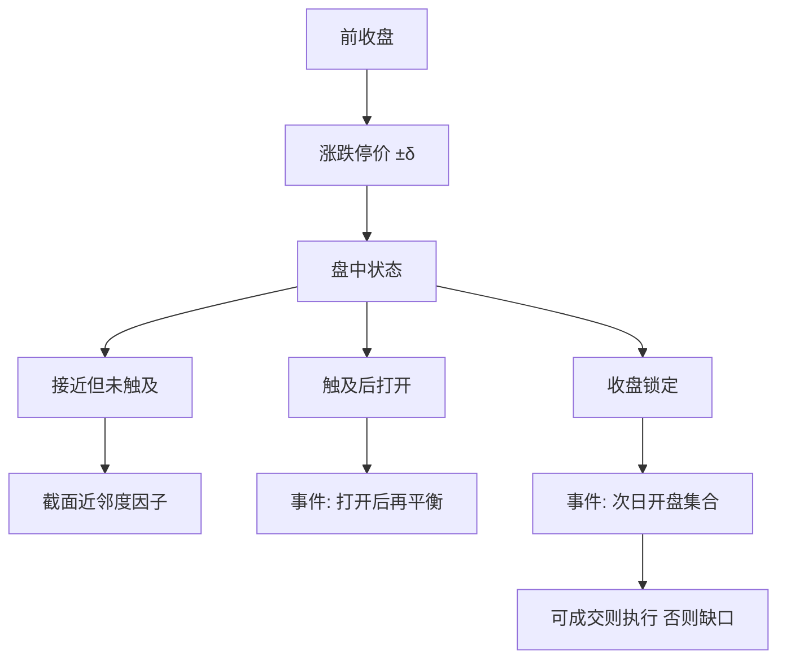

# 涨跌停邻近效应

价格一旦走进涨跌幅走廊的边缘，发现过程被截断，订单流向限制价格聚集；邻近涨跌停本身是可公开观察的状态，不是可以自由穿越的报价。

<footer>—— 《上海证券交易所交易规则》涨跌幅限制与有效申报范围；实证传统上的磁吸与延迟发现，对照 Kim and Rhee, 1997 一类价格限制文献</footer>

[涨跌停与集合竞价](/quant/cn-limit-auction) 写规则如何生成开盘价、收盘价与锁定板。[停牌、涨跌停与不可交易](/quant/trading-halts) 写不可成交状态。本篇把**距离当日限制价格还有多远**收成截面与条件因子：邻近涨停、邻近跌停、当日是否曾经触及。磁吸假说：接近限制时波动与方向加速，像被限制价格吸过去。冷却假说：限制让交易暂停冷静，随后反转。A 股的公开实证更常看到触及后的延迟发现——均衡价在走廊外时，次日开盘集合竞价继续走同一方向。因子与执行必须把走廊当成硬约束，而不是把「再涨 2% 就涨停」写成无约束预测。

## 问题

无涨跌幅时，距离是连续的。有涨跌幅时，设涨停价 $\bar P_t=$ 前收盘 $\times(1+\delta)$，跌停价对称，$\delta$ 主板股票默认 10%，科创板、创业板股票 20%，风险警示另计。定义

$$
d_{i,t}^{+}=\frac{\bar P_{i,t}-P_{i,t}}{\bar P_{i,t}-P_{i,t}^{\mathrm{open\ prev}}},\quad
\mathrm{prox}^{+}_{i,t}=1-\frac{\bar P_{i,t}-P_{i,t}}{\delta P_{i,t-}^{\mathrm{close}}}
$$

之类的近邻度（具体规范化须预指定）。$\mathrm{prox}^{+}$ 接近 1 表示贴着涨停。这个状态同时影响：（1）条件期望收益——磁吸或反转；（2）可成交性——买方在涨停上可能排不到、卖方在跌停上可能出不去；（3）次日开盘的跳跃分布。把收盘涨停价算进组合收益，是把配给当成交。

问题是区分三种邻近：收盘时贴着限制、盘中触及过但已打开、从未触及但距离小于某阈值。三者的次日分布不同。一字板与多次打开的板更不同。用一个「距涨停百分比」把它们塞进同一分位，是把执行状态当成普通特征。

### 磁吸、冷却与延迟发现

Kim 与 Rhee 对东京价格限制的经典讨论区分：限制是阻止了过度反应，还是只把发现推迟到次日。A 股日限幅度相对波动并不宽，触及频繁，延迟发现更常见：收盘封涨停的股票，次日开盘仍偏正向；封跌停对称。磁吸是盘中路径：越接近限制，限价单越往限制价堆，波动上升，触及概率高于无约束外推。冷却若存在，应表现为触及后反转；执行约束常把反转测成「打不开板」。研究设计必须先分样本：收盘锁定 vs 盘中触及后打开。

有效申报价格范围（买入不远离对手方某一百分比）与涨跌停是两层走廊。邻近涨停时，卖出申报仍受有效范围约束，不是任意价都能挂。模拟器只实现 ±10% 而不实现有效范围，会高估临近限制时的可挂单集合。

## 方法

**状态机。** 每个交易日、每只股票记录：是否触及涨停/跌停、触及次数、是否收盘锁定、封板时长、涨停价上未成交买量、打开次数。近邻度用当日已实现的最高/最低价或收盘价相对限制价的距离。因子若用收盘近邻度预测次日，信息集合法；若用收盘近邻度解释当日收益，是同期。可交易版本：用 $t$ 日收盘状态，在 $t+1$ 开盘集合竞价执行，并承认涨停锁定的股票在 $t+1$ 开盘仍可能无量。

**截面排序。** 在未收盘锁定的股票里按 $\mathrm{prox}^{+}$ 排序，看次日收益是否单调——这测的是「接近但未封死」。对已锁定样本做事件研究，而不是放进普通多空：锁定样本的买方收益不可用收盘价实现，应记为缺失或用下一可成交价。主板与 20% 板块分开估，阈值不可都用 9.8%。风险警示 5% 走廊是第三张表。

**对照。** 控制当日已实现收益：邻近涨停与当日大涨几乎共线。要用残差近邻度（给定当日收益后还剩多少距离）或双重排序（收益 × 是否触及）。否则「涨跌停邻近因子」只是动量或反转的截断版本。与[52 周高点](/quant/fiftytwo-week-high)交叉：年内高点与涨停邻近经常同时出现。

### 开盘集合竞价承担隔夜发现

隔夜信息若要求均衡价越出走廊，9:25 的集合竞价会在涨跌停价上出清，未匹配量留在虚拟未匹配。于是「邻近效应」的很大一块其实是**隔夜缺口在开盘一次性释放**，不是连续竞价里的磁吸。方法是把隔夜收益（昨收到今开）与今开到今收拆开。T+1 使 $t$ 日买入的股票必须隔夜，邻近涨停时隔夜风险正是策略被迫承受的那一段，见[T+1](/quant/cn-tplus1)。

## 机制

限制价格是显著数字，交易者把涨停当成「强」、把跌停当成「弱」，订单在到达限制前就往该价聚集，形成磁吸。封板后，一侧队列消失，价格不再更新，未出清的需求挪到次日开盘。延迟发现使触及方向上出现条件动量；打开板则释放堆积的反向意愿，短期波动极高。零售注意力在涨停榜上集中，未封死的邻近涨停票获得超额买入，可能把 $\mathrm{prox}^{+}$ 推到真的封死——这是行为与规则的叠加，不是单独的心理偏差。

风险上，邻近跌停的股票有缺口风险与流动性蒸发，期望收益里应含补偿；但卖不掉的时候补偿无法实现。因子的空头腿在跌停邻近上尤其不可执行。任何把「贴近跌停的反弹」写成 alpha 的回测，都要扣除买不到、卖不出的路径。

### 板块与新股五日

20% 走廊降低锁定频率，近邻度的分布与主板不同，系数不可共用。新股前五日不设涨跌幅，改用盘中临停，不存在本篇的 $\delta$ 走廊，样本应剔除或另建临停邻近。创业板、科创板适当性过滤了部分散户，磁吸强度可以不同，见[科创板 / 创业板](/quant/star-chinext)。跨板块用「距涨停不到 1%」当统一阈值，在 20% 板里几乎从不触发，在 10% 板里过于频繁。

公开揭示的异常波动、严重异常波动会改变随后停牌概率与投资者行为。用这些标志当特征，必须用发布时点，不能用收盘后最终认定回填，见交易规则信息披露节。

## 边界与工程取舍

不要在回测里允许价格穿越涨跌停。不要用锁定日的收盘价作为买方入场价。不要把磁吸写成可交易的「追涨停」策略说明书——本篇只处理公开状态对收益与可成交性的条件分布。不要在 δ、日内分钟近邻、是否曾触及之间搜完只报最高 IC。

风控：临近跌停应降低可卖出假设下的流动性，VaR 用缺口分布而不是正态日收益。临近涨停的未成交买单是库存风险，不是已经实现的头寸。模拟器的状态机应与集合竞价篇一致，本篇只在其上加近邻度这一列。

出处：《上海证券交易所交易规则》涨跌幅、有效申报范围与集合竞价条款；深交所对应规则。价格限制的延迟发现讨论见 Kim and Rhee, *Journal of Finance*, 1997（东京）。A 股幅度与板制度不同，须本地重估。

## 小结

- 涨跌停邻近是走廊内的状态变量，同时改写条件期望与可成交性。
- 须区分接近未触及、触及后打开、收盘锁定；锁定样本不能用收盘价当买方成交。
- 延迟发现使触及方向常延续到次日开盘集合竞价；与当日收益共线，要做残差或双重排序。
- 主板 10%、科创创业 20%、警示股与新股五日不可共用阈值。
- 执行与风控按缺口与一侧簿消失来建模，而不是无约束的连续价格。
- 出处：沪深交易所交易规则；Kim and Rhee, 1997，作为价格限制文献对照。
