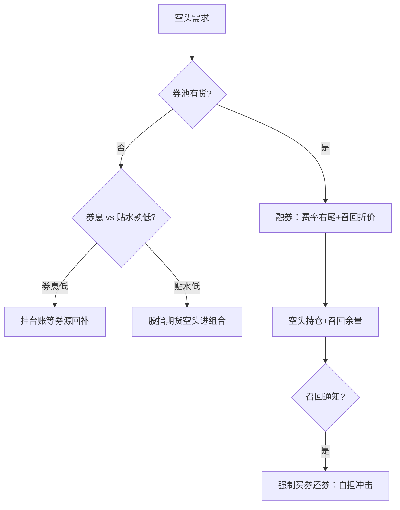
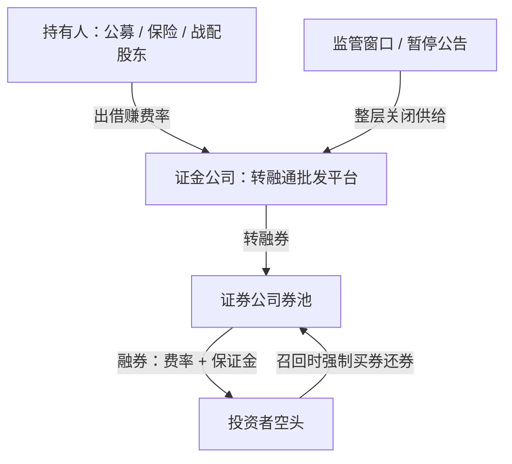

# 融券与转融通

券源不是一条数据接口，是一个政策敏感的批发市场：零售端拿到的永远是余量，而批发的阀门握在公告手里。

<footer>—— 据《转融通业务监督管理试行办法》与券商融券业务口径整理</footer>

[上一课](/quant/cn-stockindex-basis)把股指期货读成贴水状态变量，空头腿的第一种工具立住了。个股空头是第二条工具线：[融券与转融通](/quant/cn-securities-lending)已把转融通管道与 2024 年暂停写成按公告切换的状态变量，[融券与做空约束](/quant/cn-short-constraint)已写标的与提价规则。本课深钻实践层：券源工程——可借清单从哪来、费率右尾怎么读、召回来了怎么办。后课默认你已经在跑一条合规通道。

## 问题

制度课留下的缺口在执行端。回测里的空头腿是一条数列；实盘里它是一份每天在变的券池：哪些券今天可借、借多少、什么费率、什么期限、何时可能被召回，都要在开盘前拿到。用公开的两融余额当自己的券池，等于把全国存量当成个人可借额度——余量早被别人占用。缺口是把券源做成有台账、有状态、有替代路径的工程，而不是回测脚本里的一列负权重。

直觉类比：回测里的空头腿像一张「无限借书卡」，实盘里的券池更像图书馆——你想借的那本只剩 3 本、还被别人预约着，逾期（召回）还得马上还。把全国馆藏当成自己的可借额度，是空头回测最常见的一厢情愿。

## 方法

券池台账。每日快照记四列：标的、可借数量、费率、期限与召回条款；台账必须是时点的——今天借不到不等于上周借不到，反之亦然。借入决策按净口径：预期空头收益减融券费率与占用成本，再对召回概率打折；费率看分布右尾不读均值，特殊券与政策日的费率可以吞掉整个空头溢价。召回管理：召回通知到达后要强制买券还券，冲击自己承担，所以空头持仓集中度要预留召回冲击的余量，到期与展期提前安排。替代路径排序：融券借不到，先比股指期货空头的贴水成本与券息孰低（上一课的读数工程在这里变现），再决定降仓或改中性结构；[融券 T+0 封堵](/quant/cn-margin-short-t0)堵住的日内空回转不在替代集里。

## 机制

券源为什么贵且不稳。供给端是持有人：公募、保险与战略配售股东出借，券才进入市场，出借受产品合同、比例与监管窗口约束，政策一收，供给整层关闭；需求端是所有中性、多空与套利策略共用的一个池子，稀缺定价把费率推到右尾。两端都随政策跳变，零售端只能拿到余量。这决定两件事：空头策略的容量上限写在券池里而不是成交额里；券息与贴水是同一枚硬币的两面——券源收紧，对冲需求挤入期货，贴水加深，两条空头工具共用一个价格（上一课的机制在此闭环）。

出借端同样有账可算：持有底仓的账户把券出借可以赚一笔出借费，代价是出借期间的投票权与召回限制；把「出借增强」写进产品预期收益时，它是政策情景的函数，不能按常数外推。

## 边界

本课不写灰色券源与规避暂停的安排；港股通与 A 股融券的标的、费率规则不可混用；收益互换等场外空头工具的杠杆与合规另论。可融名单与实时费率以券商柜台与当期公告为准。

术语翻译：「转融通」就是券的批发中转——持有人把券借给证金公司（批发商），券商再从证金批发、零售给做空的投资者。所以政策收紧批发阀门（如 2024 年暂停转融券）时，零售端即使什么都没做错，券源也会整层消失。

数字实例：融券费率年化 10% 的券，做空一年的预期超额只有 8% 时，光券息就倒亏 2 个百分点；而特殊券在政策日的费率可以跳到年化 18% 以上——这就是为什么台账要读费率分布的右尾，而不是读均值。

## 小结

- 券池台账按日快照、按时点记录可借量、费率与召回条款。
- 费率读右尾不读均值；公开余量不是你的可借额度。
- 召回是空头腿的隐形尾部风险，集中度要预留买券还券的冲击余量。
- 券息与贴水联动：券源收紧把对冲需求挤进期货，两条空头工具一条价格。
- 出处：转融通试行办法与证监会 2024 年公开说明口径；制度细节见[融券与转融通](/quant/cn-securities-lending)。
