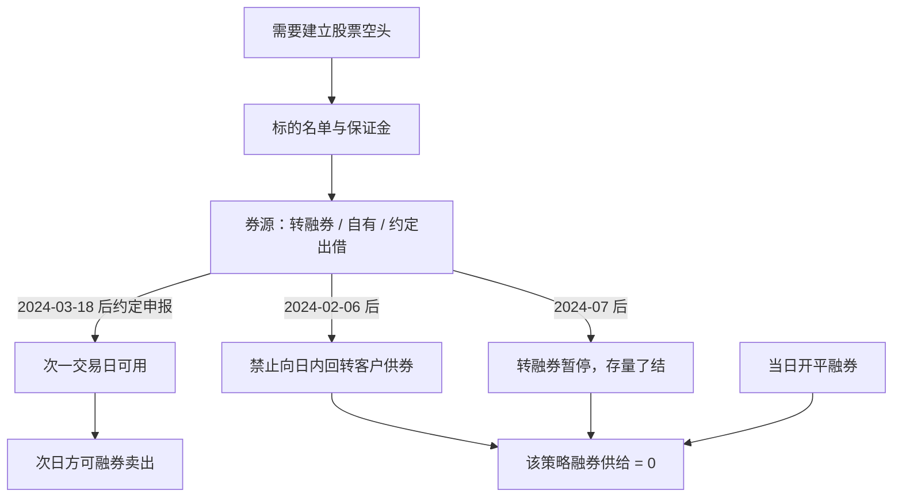

# 融券 T+0 封堵

证监会要求证券公司加强对客户交易行为的管理，严禁向利用融券实施日内回转交易（变相 T+0 交易）的投资者提供融券；并将转融券市场化约定申报由实时可用调整为次日可用。

<footer>—— 中国证监会 2024 年 2 月 6 日新闻发言人谈话；2024 年 1 月 28 日关于优化融券机制的公开说明；中证金融同期转融通通知</footer>

A 股股票竞价默认[当日买入不得卖出](/quant/cn-tplus1)。融券卖出是另一条库存：借入证券后卖出，所得资金与还券时点曾使部分账户能够在同一日内完成「卖出再买回」或「当日借券当日卖出」，形成与普通投资者不对称的回转。2024 年监管用公开措施把这条不对称收掉。1 月 28 日：全面暂停限售股出借，自 3 月 18 日起转融券约定申报由实时可用改为次一交易日可用。2 月 6 日：以当时转融券余额为上限暂停新增证券公司转融券规模，并**严禁向利用融券实施日内回转的投资者提供融券**。7 月 10 日：批准中证金融暂停转融券，存量限期了结，并上调融券保证金。本篇按这些公开文本把融券时钟写成约束，衔接[做空约束](/quant/cn-short-constraint)与[两融保证金](/quant/cn-margin-trading)。不讨论如何寻找仍能当日回转的通道。

## 问题

无约束时，空头腿的持有期可以是一个交易日内的任意区间：开盘融券卖出，收盘前买券还券，隔夜风险为零。普通多头做不到对称操作。于是「T+1 市场里的日内空头」成为一类特殊可行集：它依赖券源实时到账、券商锁券、以及合同允许当日还券。问题是把 2024 年之后的可行集改写为：新借券次日才可用（转融券约定申报口径），券商不得向实施日内回转的客户供券，转融券增量关闭直至暂停。回测若在 2024 年 3 月 18 日之后仍假设「当日借入当日卖出、当日买回还券」的无成本路径，与证监会公开措施和中证金融通知冲突。

限售股出借与战略配售出借的暂停，关掉的是另一条「额外券源」。它与 T+0 不是同一机制，但同时收缩了可融供给，使日内回转更难找到券。把两件事分开：时钟约束禁止的是回转形态；供给约束减少的是可开空规模。

### 实时可用改次日可用，改的是转融券到账日

中证金融通知：暂停执行转融通业务规则中约定申报实时处理的条款，当日以约定申报方式借入的证券，由实时可用调整为次一交易日可用；科创板做市借券参照。这不是改股票竞价的 T+1，而是把机构曾经相对实时的券源管道改成与普通交易日对齐。3 月 18 日前，约定申报实时到账是公开规则允许的效率；之后，同一管道不再提供当日可卖的新借券。券商自有券源与客户约定出借仍须遵守「不得向变相 T+0 客户供券」的监管要求，不能把自有券理解成法规外的日内回转额度。

融券卖出的申报仍受提价规则：不得低于最近成交价，当日无成交则不得低于前收盘。即使时钟允许开仓，执行路径也与普通卖出旧仓不同。封堵 T+0 之后，提价约束仍然在，见做空约束篇。

## 方法

点-in-time 融券状态应至少记录：该日是否允许新开转融券（2024 年 2 月 6 日后增量暂停，7 月后业务暂停）、约定申报借入是否次日才可用、该客户是否被券商标记为禁止供券的日内回转账户、保证金比例（2024 年 7 月起融券保证金不低于 100%，私募不低于 120%）。空头开仓在「无次日可卖券源」时记为零，而不是记为以开盘价成交的日内空头。还券与买券还券的允许时点以当时合同与监管要求为准；模拟器不得在禁供名单上生成当日开平。

评价因子空头腿时，应并列：制度收紧前的可融回转样本，与收紧后「次日可用 + 禁止日内回转」样本。许多所谓高换手空头策略的收益来自被关掉的那一段时钟。用全样本无约束空头的 t 值当作 2024 年之后仍可交易，是把已禁止的动作写进业绩。

### 券商客户管理是前端，不是事后罚单

2 月 6 日谈话把义务放在证券公司：加强对客户交易行为管理，严禁向利用融券实施日内回转的投资者提供融券。这意味着识别发生在供券前：成交回报里出现「融券卖出后当日买券还券」或资金当日来回的，应停供而非继续锁券。研究侧没有全市场客户标签，但回测至少应假设：一旦策略逻辑是日内空头回转，2024 年 2 月后该逻辑的融券供给为零。把识别推给「被查到再说」，与「严禁提供」的表述不符。

## 机制

T+1 的政策意图是限制股票的当日回转；融券若仍允许日内开平，就在空头方向打出一口井。井的经济效果是：利空信息或短线信号可以在当日通过融券实现，而普通投资者买入后无法当日卖出。监管公开把公平作为理由：降低融券效率、统一时钟。机制上，封堵改变的是空头的最短持有期——从可缩到分钟，拉回到至少一个隔夜（新借券）或禁止该策略获得券源。隔夜风险因此成为空头腿的强制项，与多头买入锁定对称了一截，尽管融券仍有保证金、提价与标的名单等额外门。

2024 年 7 月暂停转融券、存量了结，是供给开关而不是时钟开关。即使时钟上不再实时，没有转融券增量后，名单内标的仍可能无券。两个开关要同时进状态机。

### 与两融保证金、逆周期调节的叠加

2023 年 10 月已提高融券保证金、限制战略配售出借；2024 年系列措施是同一逆周期方向上的加码。保证金提高降低杠杆，时钟与禁供去掉日内回转，暂停转融券去掉批发券源。量化组合若把融券当对冲腿，必须用「次日开仓、可能无券、禁止当日翻盘」来替换「连续可空」。对冲失效的降级路径应预先写成减多头或改用公开的股指期货，而不是寻找融券的替代回转。期货有自身保证金与到期，见[期货保证金](/quant/futures-margin)，不能当成 T+0 股票。

## 边界与工程取舍

做市借券、约定申报、市场化申报的细则以中证金融当时通知为准；暂停期间不得假设通知未覆盖的品种仍实时到账。ETF、债券融券有单独条件。北向与两融不是同一套合约，不能把港股通当日回转习惯套到 A 股融券。合同层的还券日、强制平仓与担保划转以管理办法及券商合同为准。

不要设计「用期货或期权合成当日股票空头回转」来替代被禁止的融券 T+0——合成工具须各自遵守其市场规则，且本篇不提供规避供券禁令的结构。不要把融资买入当成对称的日内多头回转；融资买入股票仍受 T+1。公开规则下的研究止于：时钟、供券禁令与转融券暂停如何改变可实现空头。

严禁提供融券给变相 T+0 客户，约束的是券商与客户之间的供券，不是鼓励更换账户继续做同一回转。多账户轮转实施日内融券回转，与监管要求的客户行为管理直接冲突。

## 小结

- 普通股票 T+1 与融券曾经允许的日内回转不对称；2024 年公开措施封堵后者。
- 转融券约定申报自 2024 年 3 月 18 日起次日可用；券商不得向变相 T+0 客户供券。
- 转融券增量暂停直至全面暂停，是供给约束，与时钟约束叠加。
- 空头最短持有期与可开仓规模须按公告日切换，不能用旧时钟回填。
- 不得设计替代通道继续实施融券日内回转。
- 出处：证监会 2024 年 1 月 28 日、2 月 6 日、7 月 10 日公开说明；中证金融转融通通知；《证券公司融资融券业务管理办法》及交易所实施细则。
