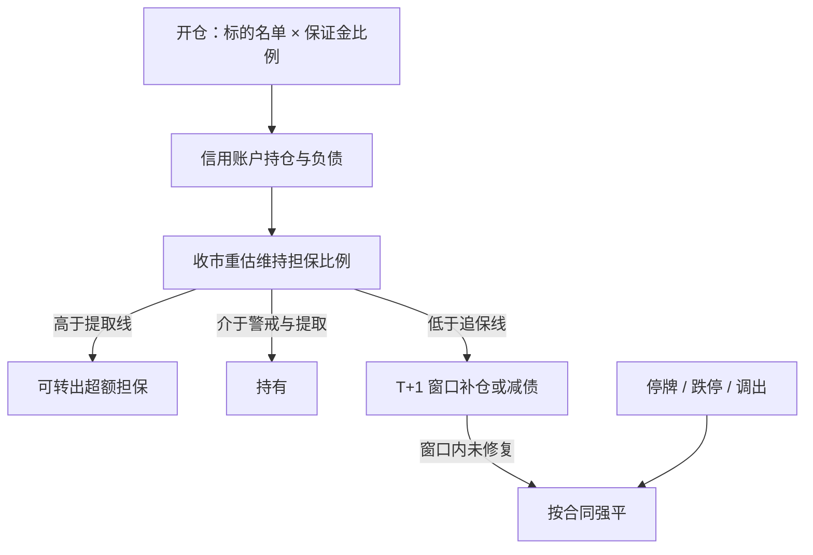

# 融资融券保证金与强平

融资买入时投资者交付的保证金与融资交易金额之比，不得低于证券交易所规定的比例。维持担保比例由证券公司与客户约定并监控；客户未能按约定补足担保物的，证券公司有权按照合同处分担保物。

<footer>—— 沪深北交易所《融资融券交易实施细则》；《证券公司融资融券业务管理办法》</footer>

融资融券把证券当作担保品，让投资者向证券公司借钱买券或借券卖出。杠杆的上限先由交易所给出最低保证金比例，再由证券公司在合同里加码；杠杆的终止条件不是「亏损到零」，而是维持担保比例跌破约定线后的追保与强制平仓。2015 年之后，监管把两融从统一的 130% 维持担保下限，改成券商与客户约定；2023 年 9 月又把融资保证金最低比例从 100% 调至 80%。数字会变，结构不变：开仓看保证金，存续看担保比例，违约看合同里的处分权。把两融当成「固定 2 倍杠杆的股票」，会在标的调出、集中度超限和盘中市值跳水时，把强平当成普通止损。

## 问题

开仓时的融资保证金比例 $m$ 决定最大融资额约为担保金的 $1/m$。$m=80\%$ 时，100 万保证金最多约可融资 125 万买入标的；证券公司可以在此之上对单只证券、单客、单板块再提高比例。融券保证金比例由交易所另行规定，并在 2023 年 10 月逆周期调节中提高了不得低于 80% 的要求，私募证券投资基金参与融券的保证金比例不得低于 100%。开仓杠杆因此不是一个市场常数，而是「交易所下限 × 券商风控 × 客户类别」。

存续杠杆由维持担保比例描述：

$$
\mathrm{维持担保比例}
= \frac{\text{现金}+\text{信用证券账户市值}+\text{其他认可担保物}}
{\text{融资本金}+\text{融券市值}+\text{利息费用}}.
$$

分子随担保品市值波动，分母随负债与融券标的价格波动。正股跌，融资账户的分子降、比例降；融券标的涨，分母升、比例同样降。两边同时动时，同一点指数波动对多空账户的打击不对称。交易所不再统一规定 130% 为法定平仓线，但券商合同普遍仍设警戒、追保、平仓三档，常见仍落在 150% / 130% / 110%–130% 一带，并以收市后清算为准。盘中盯市是否强平，以合同为准，不是以行情软件的「估算维持担保」为准。

### 标的、集中度与平价申报

两融只能做交易所公布的标的证券。标的调出、被实施风险警示、停牌或退市整理，会触发提前了结而不是等到保证金用尽。单只证券的融资余额、融券余量相对流通股本或上市数量有比例上限，触及后不能再开反向于市场拥挤方向的新仓。融券卖出还受价格约束：申报价格不得低于该证券当日最近成交价，当日无成交则不得低于前收盘价，防止连续下跌中的裸打压。融资买入的股票当日不得卖出还款，仍受 T+1 约束。于是「保证金还够」并不等于「仓还能调」：可能缺标的、缺价格、缺卖出权限。

维持担保比例的分子包含担保证券市值。担保品本身可以跌停、停牌、被调出标的。停牌股按规则可能仍按市值计，也可能被券商打折。把停牌股当成足额现金，会在复牌跌停时一次性打穿平仓线。

## 方法

风控应把两融拆成开仓约束与存续约束两套状态机。开仓：检查标的名单、保证金比例、集中度、融券是否有券源、融资买入是否仍在 T+1 冻结。存续：每个交易日收市后用交易所认可的市值重算维持担保比例，并按合同给予 T+1（有的合同给到 T+2）补仓窗口。补仓可以是转入现金、转入担保证券、或了结部分负债；不是只能「再买入同一只股票」。提取线（实践中常见约 300%）以上才允许转出超额担保，避免把账户长期顶在追保边缘。

强平不是单一市价出清。合同通常允许券商选择处分顺序：先卖流通性好的担保证券还款，再买券还融券，对涨跌停、停牌标的可能跳过或留到可成交时再处置。因此强平轨迹会在最弱的担保品上放大冲击，并可能留下无法立即了结的停牌腿。量化组合若把两融当杠杆工具，必须把券商的处分顺序当成清算假设，而不是假设按指数权重同步减仓。

### 追保窗口与盘中缺口

收市后低于追保线，投资者通常须在下一交易日收市前把比例拉回警戒线以上。若下一开盘跳空或连续跌停，窗口内可能无法补足，券商即可强平。盘中比例跌破平仓线是否立即处分，取决于合同与券商盯市系统；有的只在收市清算后执行，有的对科创板、创业板、北交所持仓另设更紧的日内线。工程上应按「收市清算为法定动作、盘中处分为或有动作」来建模缺口，而不是用连续时间的保证金过程去套用期货式盯市。

## 机制

两融的清算所是证券公司，不是期货交易所的中央对手方。保证金是券商的信用风险管理，不是合约乘数自动扣划。因此同样的维持担保比例，在不同券商、不同客户评级下对应不同的追保电话与处分速度。市场压力期，券商会上调保证金比例、收缩标的、提高集中度限制，相当于把杠杆上限下移。这不是价格信号，是供给收缩；此时融资余额下降与股价下跌会互相加强，但不能把「两融余额回落」直接当成反向指标——余额回落可能是强平，也可能是主动去杠杆。

融券一侧还受转融通与出借人约束。战略投资者在承诺持有期内出借获配股份、以及逆周期调节下的费率与保证金，会改变券源价格。融券成本升高时，表面「对冲」的空头腿可能比期货更贵，且有强制还券日期。用融券去对冲多头组合，必须把还券日与费率曲线写进持有期，而不能假设无限展期。

2023 年 9 月融资保证金降至 80%，提高的是开仓上限，不是把平仓线降到 80%。开仓杠杆与存续担保比例是两个数字。用「现在可以加到 1.25 倍」去外推「跌 20% 也不会强平」，把开仓公式和维持公式接错了。

### 与期货保证金的差别

股指期货按合约价值乘以保证金比例占用资金，每日按结算价盯市，不足则追加，方向对称。两融的分子是一篮子证券市值，折算率由券商设定，单只股票可以按折扣计入；平仓针对信用账户而不是单一合约。期货可以在涨跌停板上仍按规则强平；股票可能连续跌停卖不出，强平失败会把信用风险留在券商账上。因此两融的「强平」在涨跌停制度下是或有执行，清算价格可以远差于触发线对应的理论市值。

## 边界与工程取舍

不要用交易所最低保证金当实际可开仓杠杆，券商加码才是约束。不要用全市场平均维持担保比例推断单账户距离强平的距离。不要在标的调出、ST、停牌时仍按普通股票持有期处理合约。回测两融策略必须嵌入：标的历史名单、保证金历史比例、T+1、融券平价申报、以及收市清算的追保窗口。把美股保证金规则或期货维持保证金直接套过来，会写错触发时点。

容量上，单票融资余额触及上限后新开仓被拒，拥挤本身会改变可交易集合。报告应披露：在何种维持担保假设下最大回撤触发追保、强平是否可成交、融券券源中断时组合如何降级为单边。

强制平仓是合同权利，不是交易所对投资者的「保护性止损」。处分价格、顺序与剩余负债由合同与可成交性决定。把强平当成在平仓线上的确定性成交，会低估缺口。

## 小结

- 两融杠杆由开仓保证金比例与存续维持担保比例共同决定，二者不是同一个数字。
- 交易所给出融资保证金下限（2023 年 9 月起 80%）并取消统一 130% 维持担保法定下限；追保与强平以券商合同为准。
- 标的名单、集中度、融券平价申报与 T+1 会在保证金仍充足时切断调仓。
- 强平按合同处分担保物，涨跌停与停牌下未必能在触发线成交。
- 融券还受券源、费率与强制还券约束，不能按无限展期的期货空头来建模。
- 出处：证监会《证券公司融资融券业务管理办法》；上交所、深交所、北交所《融资融券交易实施细则》及 2023 年保证金比例调整通知；2023 年 10 月融券逆周期调节安排以证监会公告为准。
