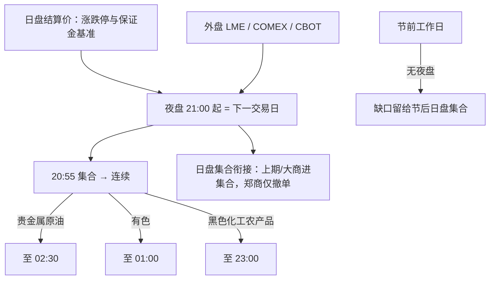

# 商品期货夜盘

连续交易时段是日盘之外由交易所规定的夜盘。夜盘属于下一个交易日，保证金、涨跌停板与结算均按该交易日规则执行。法定节假日（不含双休日）前第一个工作日，相关品种不再进行夜盘。

<footer>—— 上海期货交易所、上海国际能源交易中心、大连商品交易所、郑州商品交易所连续交易与风险控制相关规则</footer>

商品期货的夜盘让国内合约在伦敦、纽约与芝加哥的活跃时段继续交易，使铜、原油、黄金、农产品与黑色链条不必把外盘跳空全部压缩到次日 9:00 的集合竞价。夜盘不是「加一节流动性」那么简单：它在日历上属于下一交易日，涨跌停与保证金以该日结算价为基准；节前夜盘取消；各所对各品种的结束时刻不同——贵金属与原油可到次日 02:30，有色多到 01:00，黑色、化工与多数农产品到 23:00。中金所股指与国债无夜盘。把夜盘收益当成与日盘同质的 24 小时扩散，会写错交易日归属、结算价定义和节假日缺口。

## 问题

交易日 $T$ 的夜盘从日历日 $T-1$ 的晚上开始。周一 21:00 开盘的螺纹，在交易所系统里是周二合约的第一段；其涨跌停相对周一 15:00 后公布的结算价计算，盈亏计入周二。因此「周一夜盘」的已实现波动属于周二因子，不属于周一收盘到周二开盘的股票式隔夜。股票与股指期货没有这段，商品—股票的跨资产信号必须把商品腿移到正确的交易日，否则会把外盘信息提前一天写进股票。

时段长度按品种分层。上期所黄金、白银与上期能源原油：21:00–02:30；上期所有色及不锈钢、氧化铝等：21:00–01:00；螺纹、热卷、橡胶、沥青、燃油、纸浆等：21:00–23:00。大商所、郑商所夜盘品种多为 21:00–23:00。夜盘开盘前 20:55–20:59 申报、20:59–21:00 撮合集合竞价。上期所、能源中心与大商所的夜盘未成交单可进入次日 08:55–09:00 的日盘集合；郑商所夜盘未成交单不自动进日盘集合，仅在 08:55–08:59 提供撤单。同一策略在郑商所与上期所之间不能假设「挂单过夜方式」相同。

### 结算价在日盘，风险在夜盘

国内商品期货的当日结算价通常取日盘某时段（常见为下午一段）的成交量加权，夜盘成交进入下一交易日的持仓与盈亏，但不直接重写上一交易日已经公布的结算价。夜盘若大幅波动，保证金占用按新成交盯市，客户可能在夜间触发追加或强平，而「当日结算价」仍是几个小时前的日盘均价。这与股指期货只有日盘、结算与交易同一段，结构不同。用日盘结算价序列估计波动，会漏掉夜盘已发生、却记在下一交易日的那一截；用 21:00–15:00 的连续路径估计，又必须按交易日而不是自然日切片。

节前最后一个工作日无夜盘，外盘若在节内继续交易，缺口全部留给节后日盘集合竞价。这段缺口的分布与普通周末不同：周末至少还有周五夜盘对一部分外盘定价。回测节假日效应必须把「无夜盘的节前」单独标记。

## 方法

数据规格应同时存两套时钟：交易所交易日（夜盘归下一交易日）与日历时间（用于对齐 LME、COMEX、Brent、CBOT）。每条 bar 标明所属交易日、是否夜盘、是否集合竞价。涨跌停、保证金比例、手续费按交易日生效，不能按自然日零点切换。仓位与风控在夜盘使用该交易日的结算基准与交易所当日标准；节前关闭夜盘后，所有未平仓视为持有至节后日盘，保证金应能覆盖外盘假期波动而不是覆盖普通夜盘两小时。

外盘对冲须对齐品种与计价货币。上期能源原油对标中质含硫原油，与 Brent、WTI 有品质与运费差；上期所铜与 LME 铜有关税、升贴水与汇率；黄金夜盘对 COMEX 有时差重叠但仍有美元汇率腿。所谓「夜盘跟随外盘」是相关，不是 1:1 可锁套利。可锁的是同一交易所内日盘与夜盘的连续合约，中间只有流动性差异，没有交割定义差。

### 集合竞价、挂单与日盘衔接

夜盘集合把日盘收盘后的订单在 21:00 一次性出清，开盘价可以跳到涨跌停板，尤其在外盘已大幅移动时。未成交的限价单是否带着进入日盘，决定了「夜盘挂单」是只服务夜盘还是跨小节。郑商所须在日盘开盘前主动撤或改，否则策略会误以为单子还在队列里。日盘 10:15–10:30、11:30–13:30 的小节休息对夜盘不存在；夜盘内部是否连续，以各所规则为准（贵金属、原油为长连续时段）。高频回放必须用各所的实际小节，而不是把 21:00–02:30 当成无休息的股票盘。

## 机制

夜盘存在的原因是外盘信息在国内日盘收盘后仍连续到达。黑色链条对铁矿与钢材的外盘与汇率敏感，但夜盘只到 23:00，此后至次日 9:00 的缺口仍在。贵金属与原油夜盘覆盖欧美盘，缺口小、隔夜跳空小，日盘开盘的信息含量相对低。于是「开盘 alpha」在品种之间不可比：有长夜盘的品种，信息已经在夜间写入价格；只有短夜盘或无夜盘的品种，日盘集合才承担发现功能。把全部商品的 9:00 开盘收益放进同一张日历效应表，会把制度差异写成品种异质性。

保证金与涨跌停在夜盘按交易日标准执行，交易所可在日盘收市后调整下一交易日的比例与板幅，于是夜盘开盘时约束可能已与上午不同。客户若只按日盘结束时的保证金去扛夜盘，可能在调整后的比例下立即不足。强平在夜盘流动性较差的品种上冲击更大，黑色 23:00 收盘后无法再调仓，风险被推到次日集合。这与股票停牌类似：不可交易时段的信息仍在外盘累积。

广期所部分品种无夜盘，中金所金融期货无夜盘。跨品种价差若一边有夜盘一边没有，夜盘时段的价差变动是单腿的，不能按日内价差的均值回归来交易。

### 与股票隔夜、股指贴水的对照

股票隔夜是 15:00 至次日 9:30，中间没有国内连续竞价。[股指期货](/quant/cn-index-fut-basis)与股票同步，也无夜盘。商品夜盘把一部分「隔夜」变成了可交易时段，剩余不可交易缺口因品种而异。跨资产策略在 21:00–23:00 可以调商品、不能调 A 股，组合的 beta 在夜盘是时变的。日历因子若把商品夜盘收益算进「隔夜」，会高估商品相对股票的隔夜溢价——那一段对商品根本不是隔夜。

## 边界与工程取舍

不要用自然日切商品期货收益。不要假设各所挂单跨夜规则相同。不要在节前按有夜盘去对冲外盘。不要把原油、黄金的 02:30 收盘与螺纹的 23:00 收盘当成同一风险预算。手续费、平今、保证金在夜盘与日盘可能同一标准，但流动性与点差不同，成本应按时段估计。交割月、临近交割的限仓与提高保证金，对夜盘同样生效。

容量上，夜盘盘口通常薄于日盘主时段，同样名义的冲击更大。报告应分时段披露：夜盘集合跳空、21:00–23:00 连续、23:00 之后（若有）、日盘开盘集合，以及节前无夜盘样本的缺口分布。外盘假期与国内夜盘仍开（或相反）的日历，应单独列出。

夜盘归属下一交易日，是结算与风控的定义，不是行情软件的显示偏好。软件若按日历夜着色，不等于盈亏记在当天。对账必须以交易所交易日为准。

## 小结

- 商品夜盘在规则上属于下一交易日，涨跌停、保证金与盈亏按该日结算，不能按自然日切收益。
- 时段按品种分层：原油与贵金属至 02:30，有色多至 01:00，黑色与多数农产品至 23:00；节前无夜盘。
- 结算价取自日盘，夜盘可以在夜间触发追加与强平，风险时钟早于结算时钟。
- 上期所、能源中心、大商所与郑商所的挂单跨夜规则不同，不能共用一种订单状态机。
- 有夜盘品种的日盘开盘信息含量低于无夜盘品种；跨资产隔夜因子必须把夜盘从「隔夜」里剔除。
- 出处：上海期货交易所、上海国际能源交易中心、大连商品交易所、郑州商品交易所交易时间与连续交易相关规则；节假日夜盘安排以交易所公告为准。
