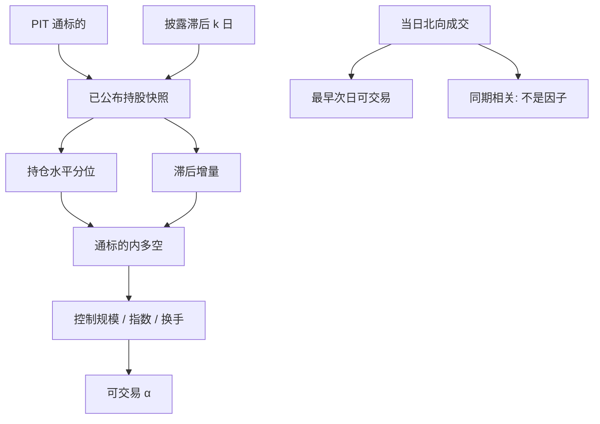

# 北向持股因子

沪深港通北向持股是滞后公布的通道持仓，不是盘中『外资实时观点』；用披露之后才知道的存量去解释披露之前的收益，是未来函数。

<footer>—— 港交所及沪深交易所对通持股与成交的公开披露安排；机制背景见沪深港通实施办法</footer>

[北向资金与沪深港通](/quant/stock-connect) 写的是额度、日历与通道约束。本篇把**可公开观察的持股与成交**收成截面因子：谁被北向持有得多、持有变化、相对流通盘的比例。聪明钱假说说：通投资者更专业，其持仓或增持预测后续收益。竞争性假说说：北向跟踪指数与配置再平衡，流量与收益是同期冲击，滞后持股没有 alpha。无论哪一派，数据都有公布时钟。因子只允许用决策时已经披露的数字，见[时点](/quant/point-in-time)与[未来函数](/quant/no-future-function)。

## 问题

北向有三类常被混用的公开序列。第一，标的名单内股票的**持股数量与占比**（港交所及内地交易所披露的通持仓，有汇总层级与滞后）。第二，**每日北向成交**（全市场或活跃股），是流量不是存量。第三，盘中额度余额与「沪股通 / 深股通」净买入的媒体口径，频率高、定义杂、常含申报与撤单。把三者都叫做「北向因子」，排序对象已经不同。

聪明钱检验要的是：在信息集 $\mathcal{F}_t$（含截至 $t$ 已公布的持股）下，持仓或滞后增量能否预测 $t$ 之后的可执行收益。用 $t$ 日收盘后才完整的持股去回归 $t$ 日收益，测到的是同期相关：价格涨了北向也可能同日在买。问题不是「外资聪不聪明」的口号，而是滞后多少个披露日、在通标的子集上、额度是否截断之后，单调性还在不在。

### 持股、增量与活跃成交榜

持股水平持久，接近风格：大盘、消费、指数权重股北向占比高。截面排序会复制低波、质量、规模的反向。增量（周变化、月变化）更接近订单流，但也更噪、更易与同期收益纠缠。交易所公布的通活跃成交股是注意力变量，样本是当日已发生的成交，对当日收益几乎一定相关，对次日的预测才是因子问题。三者必须分开建特征，不能合成一个「北向综合分」再调权重到 t 最大。

北向只覆盖通标的。非标的持股恒为零，若把全 A 股放进同一分位，零持仓组会被非标的与通标的里的零持仓混在一起。宇宙应先限制在当时的通名单，或对非标的单独一类，见通标的的 point-in-time 名单。

## 方法

**信息集。** 每个决策日只读当时已发布的持股快照。若披露是 T+1 或更晚（以当时交易所与港交所规则为准），则 $t$ 日可交易信号用的是 $t-k$ 的持股，$k\ge 1$。供应商「日频北向持股」若对历史做了回填修订，须用 vintage，否则回测用了修订后的终值。成交类数据若在收盘后公布当日活跃股与席位，最早可交易时点是次日开盘，不能用当日收盘价当买入价还声称「跟着北向买」。

**排序。** 在通标的内：北向持股 / 流通股本（或 / 自由流通），或过去 20 个披露日的持股变化。多高持仓或多增持、空低持仓或减持，价值加权。须控制市值与是否指数成份——否则因子是沪深 300 的影子。双重排序：规模 × 北向，或行业内 rank，见[截面 rank](/quant/cs-rank-features)。额度耗尽日应标记：买盘被拒时，流量因子的含义从「想买」变成「买不了」，见沪深港通篇。

**对照。** 同期北向净买入对收益的回归（不可交易）vs 滞后持股对次日/次月收益（可交易）。若只有同期显著、滞后为零，则没有因子，只有冲击。再对[三因子](/quant/ff3)或 CH-3 做 α。北向重仓往往偏大盘、偏低换手，控制这些之后增量信息可能很薄——这是应报告的结果，不是应隐藏的结果。

### 持股上限与假日错位

境外投资者合计持股接近公开上限时，增量需求被截断，高水平持股不再预测「还会买」。距离上限的余量是状态，不是线性因子。通交易日与 A 股交易日不一致：内地开市、香港假期则北向关闭，持股冻结、境内价格仍在走。假日后第一个通交易日的开盘，北向与境内信息集重新对齐，事件研究应单独切这些日，不要平均进普通 IC。

## 机制

配置通道：被动与主动的海外资金通过通买 A 股，持仓接近其基准，收益预测来自持续流入与价格压力，不是私有信息。信息通道：若通投资者在财报、调研上更快，滞后持仓变化可能含尚未被境内充分交易的信息——但这必须通过滞后检验，且与分析师、北向活跃股的注意力效应难分。额度与名单把需求曲线截断，聪明钱即使想买也可能买不到，因子在额度紧张期应变弱而不是变强。

披露本身改变境内行为。媒体每日播报北向净买入，散户把通道流量当信号，造成二轮追逐。于是「北向因子」的一部分是境内对公开流量的反应，不是外资的私有信息。这在统计上仍可有短期延续，但拥挤、反转与容量问题与龙虎榜一类注意力因子同类。

### 与境内机构持股的不可加总

北向持股、公募季报持仓、融资融券余量都是公开持仓类特征，时钟完全不同：通持股相对高频但滞后短；公募季报滞后长。不能把不同时钟的持仓加成「聪明钱指数」。税费、额度、适当性使同一标的上北向与境内的可执行集合不同，回测不能假设你可以按北向增减的方向无约束跟单。

实时行情里的「北向成交额」口径因供应商而异：成交还是申报、是否含撤单前扣减。特征字典必须写字段定义。用未对齐口径的历史去拟合「北向 IC」，样本外会因为供应商改口径而断裂。

## 边界与工程取舍

不要用当日盘中北向净买入去解释当日收益并当作可交易因子。不要把非标的的零持仓与通标的的低持仓放进同一空头腿。不要设计拆单或分账户去「绕过」额度与持股比例上限；公开研究只把上限当硬约束。不要把通道流量等同最终受益人国籍——名义持有人是香港结算。

样本从 2014 年沪港通、2016 年深港通起才有北向；深市、创业板纳入是后来的事。全 A 长样本回测北向因子，前期大量股票合法地没有北向，应视为缺失而不是零。ETF 纳入通之后，持股在成份与 ETF 之间分流，个股北向下降不等于外资看空该公司。

出处：港交所《沪深港通投资者资料册》；《上海证券交易所沪港通业务实施办法》《深圳证券交易所深港通业务实施办法》。因子含义是对公开披露的检验，不是对未公开订单流的推测。

## 小结

- 北向持股因子只用决策时已公布的通持仓或滞后增量，宇宙是当时的通标的。
- 当日成交与收益的同期相关不是可交易 alpha；执行不早于披露后的下一可成交时点。
- 水平持股接近规模与指数风格；增量更像流量，须控制市值并处理额度截断。
- 假日错位、持股上限与 ETF 分流会改变因子含义，应作为状态而不是噪声。
- 口径与 vintage 必须写进特征字典，避免供应商回填造成的未来函数。
- 出处：沪深港通公开实施办法与港交所资料册；方法论见 point-in-time 与未来函数。
