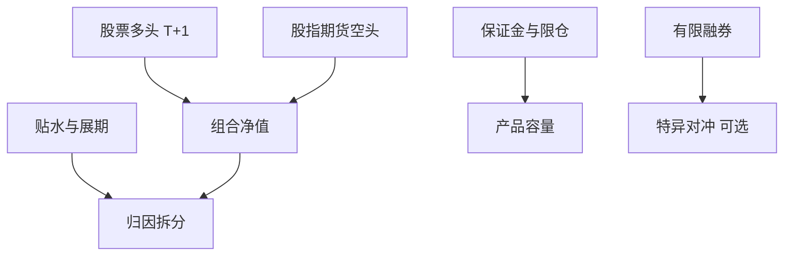

# 私募与中性策略

市场中性要求空头腿真实存在。A 股空头主要是股指期货与有限的融券；贴水、保证金与政策会把「中性」写成时变的净暴露。

<footer>—— 对照《私募证券投资基金运作指引》对杠杆、流动性与程序化的要求；中金所股指期货合约与结算细则；[做空约束](/quant/cn-short-constraint)</footer>

[上一课](/quant/cn-public-quant)把公募钉在跟踪误差。本课的缺口是**私募证券产品**：可更高换手、可用期货对冲，但受协会运作指引、会员保证金与空头供给约束。中性不是收益的统计性质，是头寸结构。后课把融券与转融通单独写细；本课先给产品层的对冲会计。[中基协程序化](/quant/cn-amac-program-trading) 是叠加层。

## 问题

股票多头 $L$ 加股指期货空头 $H$，净值收益 $\approx L-H$ 的 beta 近零当且仅当 $H$ 的标的、乘数、保证金与基差与 $L$ 匹配。IC/IM 对中小盘、IF/IH 对大盘，用错合约会留下市值敞口。贴水变深时空头腿盈利、现货相对基准的超额被掩盖或夸大——归因必须拆：选股超额、基差、保证金成本。问题是把中性定义成「对可复制基准的净暴露在限额内」，而不是「多空名义相等」。

杠杆：期货保证金使名义暴露可以数倍于净值。运作指引对杠杆、流动性、集中度有要求；程序化要报告。2015 年后保证金、平今、限仓多次调整，历史回测必须分段。把 2014 年的杠杆假设用到 2016 年，产品不可复制。

### 融券中性与期货中性不是同一产品

个股融券能对冲特异风险，但标的、费率、召回与 2024 年转融券暂停使个股空头腿极窄，见下一课。多数「市场中性」是期货对冲的指数中性或行业不完全中性。行业中性在空头不可得时退化成低配，[短约束课](/quant/cn-short-constraint)已写。本课要求产品说明书与回测使用同一名称：期货中性 / 有限融券中性，不要都叫 market neutral。

T+1 使多头腿当日不能卖。期货可平今（费率随时点而变）。对冲可以在当日调整 beta，个股特异风险与涨跌停缺腿仍在。

## 方法

账本分列：现货超额、期货基差与展期、借券费、保证金利息、跟踪误差相对对冲指数。压力：贴水再扩大 $x$ 点、保证金上调、涨跌停导致现货不可卖而期货仍结算。容量：期货持仓限额与市场深度可能先于股票 ADV 耗尽；拥挤时贴水是价格信号。与公募指增对照：私募可以主动管理净暴露，但净暴露一旦常驻，产品就变成带杠杆的指数择时，应改名。

程序化与高频认定：中性策略的报撤若靠期货腿完成，股票腿仍受股票程序化规则。不要假设「对冲在期货所就可以在股票上任意报撤」。

### 估值与净值

开放式私募净值用估值政策：停牌股、涨跌停、期货结算价。投资者赎回发生在净值上，策略风险发生在可成交价上。两者差是流动性错配，运作指引关注的对象。回测若用收盘价对停牌股连续计价，赎回压力会被低估。

## 机制

空头工具短缺时，对冲需求挤在期货，贴水是均衡不是错误。中性产品卖的是选股残差，买的是基差风险与政策风险。2015、2017、2023–24 的规则变化证明残差的方差有制度分量。工程课的 CCP 与保证金路径在这里变成产品爆仓路径：VM 抽现金时，名义中性仍可能强制减仓。

多策略私募里，中性、指增、CTA 共用保证金。归因必须分簿，否则 CTA 的趋势会算进中性 alpha。

## 边界

不提供未备案产品、规避运作指引杠杆或分拆产品以逃避程序化报告的结构。收益互换把暴露转到经销商，成本与对手方风险仍在，须披露而非消失。本课不给出具体管理人排名。

## 小结

- 中性是对冲结构：期货中性与融券中性工具不同，须命名诚实。
- 归因拆选股、基差、保证金；压力用保证金上调与贴水变深。
- 制度分段回测；T+1 与涨跌停造成缺腿。
- 出处：中基协《私募证券投资基金运作指引》；中金所合约细则；本栏做空与期现课。
