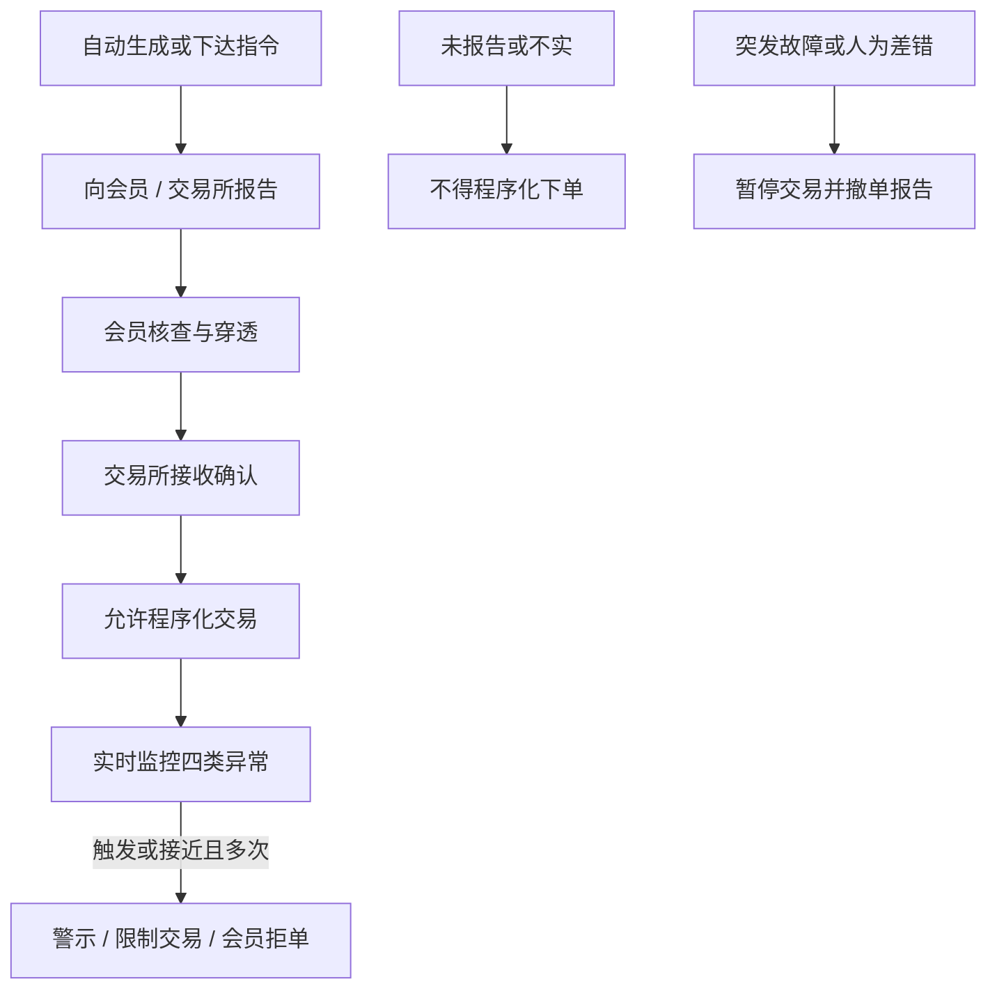

# 程序化交易管理规定与实施细则

程序化交易是指通过计算机程序自动生成或者下达交易指令在证券交易所进行证券交易的行为，相关活动应遵循公平原则，不得影响证券交易所系统安全或者扰乱正常交易秩序。

<footer>—— 中国证监会《证券市场程序化交易管理规定（试行）》（证监会公告〔2024〕8 号），2024 年 10 月 8 日起施行</footer>

程序化交易在《证券法》下已有规制基础。证监会 2024 年 5 月发布《证券市场程序化交易管理规定（试行）》（以下简称《管理规定》），把报告、监测、信息系统、高频交易与监督管理写成部门规章层级的框架，授权证券交易所细化。沪、深、北交易所 2023 年 9 月先以《关于股票程序化交易报告工作有关事项的通知》《关于加强程序化交易管理有关事项的通知》落地报告与重点监控；2025 年 4 月 3 日发布《程序化交易管理实施细则》，自 2025 年 7 月 7 日起施行，把四类异常行为、高频认定、交易单元与主机托管写成可执行条文。本篇按公开文本把约束写进交易状态机：先报告后交易、会员核查、异常行为定义、系统与应急。它不是如何把报单拆到监控指标以下，也不是如何维持未报告账户继续自动下单。衔接[高频认定](/quant/cn-hft-threshold)、[差异化收费](/quant/cn-fee-cancel-ratio)与[中基协自律](/quant/cn-amac-program-trading)。

## 问题

量化回测里的「策略」常被当成一个收益过程。规则里的程序化交易是**指令生成方式**：计算机自动生成或下达，包括选券选时的策略单，也包括把大单拆开的算法单。主体覆盖会员客户（私募、合格境外投资者、个人等）、会员自营与资管、使用交易单元的公募与保险机构。未报告不得交易——《管理规定》落实「先报告、后交易」。问题是把报告状态写成开仓许可：账户基本信息、资金与杠杆来源、策略类型与指令执行方式、最高申报速率与单日最高申报笔数、软件名称版本与开发主体。信息重大变更要改报。回测若对未进入报告名单的历史账户假设全程可自动下单，与现行开仓条件不一致。

第二句话是公平与系统安全，不是「量化好坏」。条文反复出现的禁区是：影响交易所系统安全、扰乱正常交易秩序、利用程序化从事内幕交易、利用未公开信息交易、操纵市场。会员必须按公平合理原则提供交易单元、主机托管、行情，不得为程序化投资者提供特殊便利。策略收益函数不在规章里；规章写的是谁必须报告、谁必须拦住异常单。

### 报告路径是会员转报，不是策略保密协议

客户向接受委托的会员报告，会员核查（含身份穿透、资金、交易与软件信息）后向交易所报，交易所确认后客户方可交易。会员应在收到客户报告后五个交易日内向交易所报告（实施细则口径）。合格境外投资者可与会员约定由会员代为履行报告。会员自身及使用交易单元的其他机构直接向交易所报告。收益互换等通过自身账户做程序化的，还要按交易所要求报告客户信息。拒绝报告、报告不实或拒不配合核查的，会员应按委托协议拒绝其程序化委托，并向交易所报告。这把「策略知识产权」限制在报告内容的粒度上：须报策略类型及主要内容、速率与笔数，而不是把源码交给市场；但不报就不能用程序下单。

交易所接收报告「不代表对策略可用性、安全性、合规性作出判断或者保证」。报告不是牌照，也不是免责。一致性比对会把实际报撤行为与所报速率、策略类型对照；不符可被督促、警示直至限制交易。

## 方法

工程上应把规则做成两层过滤器。第一层是资格：该账户是否已在会员侧完成程序化报告且交易所已确认；软件版本、服务器与所报是否一致；资金与杠杆是否仍在所报区间。不满足则路由到人工或拒绝自动通道，而不是降级为「手工填同一张单」。第二层是行为：实时监控《实施细则》第十八条四类重点——瞬时申报速率异常（1 秒内申报、撤单笔数达标准）、频繁瞬时撤单（多次 1 秒内报了又撤且全日撤单比例达标准）、频繁拉抬打压（全日多次个股 1 分钟涨跌与自身成交占比达标准）、短时间大额成交（主要指数 1 分钟波动与自身主动成交金额及占比达标准）。未达阈值但接近且多次同类型的，交易所仍可认定或要求会员重点监控。机构以产品维度做程序化的，不得分拆产品规避异常交易监管。

会员须把程序化纳入异常交易监控，对可能严重影响价格和流动性的指令加强审核。客户拒不履行报告、系统重大故障、实际系统与验证测试不一致、可能影响系统安全或秩序的，会员应拒绝委托或撤销申报。突发性事件（不可抗力、意外、重大技术故障、重大人为差错）可能影响交易正常进行时，投资者应立即暂停交易、撤销委托并报告；会员对客户同样有暂停与撤单义务。这是公开的应急动作，不是可选的「视 P&L 再停」。

### 四类异常是构成要件，阈值由交易所掌握

条文给出的是行为画像，具体笔数、比例、金额标准由交易所监控指标另定，并可调整。2024 年 4 月起四类股票程序化异常已试运行。研究与风控应订阅现行指标，而不是把新闻里的举例数字写死进代码后不再更新。债券、基金、存托凭证参照股票标准重点监控。北向（沪股通、深股通）按内外资一致纳入报告与同一监控标准，报告经香港经纪、联交所再至沪深所。把北向当成「另一套异常定义」与公开规则不符。

## 机制

《管理规定》把程序化从「一种策略风格」改写成「一种市场进入方式」。进入要登记，存续要与登记一致，退出要变更报告。高频是子集，见[认定标准](/quant/cn-hft-threshold)；收费与撤单是价格工具，见[差异化收费](/quant/cn-fee-cancel-ratio)；主机托管与交易单元是基础设施公平，见[托管清退](/quant/cn-colocation-rectify)。行业协会的检查与私募运作要求见[中基协](/quant/cn-amac-program-trading)。对量化工程的含义是：容量与夏普必须在「已报告、未触发异常、未用特殊通道」的可行集上估。把美股或期货高频的报撤密度直接套到 A 股股票竞价，会在第一层就被会员拒单。

《管理规定》第五条要求证监会指导交易所、中金所、证券业协会、基金业协会、中证数据等建立统计监测与跨市场信息共享。单交易所回测看不到跨市场联动监控。实盘合规要按账户与产品在券商、协会、交易所三条线同时可解释。

### 与交易规则、两融、T+1 的叠加

程序化不创造额外的回转或做空权限。股票竞价仍受[T+1](/quant/cn-tplus1)；融券仍受[做空约束](/quant/cn-short-constraint)与[融券日内回转封堵](/quant/cn-margin-short-t0)。算法可以把可卖库存拆成多笔，但不能把锁定量当日卖掉。涨跌停与集合竞价仍按[交易规则](/quant/cn-limit-auction)。程序化细则是叠加层：同样的价格与库存约束，多了报告与报撤形态约束。

## 边界与工程取舍

《管理规定》自 2024 年 10 月 8 日施行；交易所实施细则自 2025 年 7 月 7 日施行。历史回测必须用当时有效的通知与细则，不能用今日第十八条四类去惩罚 2019 年的报单。细则所称「以上」含本数。交易所可调整高频情形与异常标准。拆单算法若以满足大额减冲击或组合公平为目的、且已履行普通程序化报告，高频的额外报告可有例外，主体限于公募及其子公司、从事资管的会员、合格境外投资者及交易所认定的其他投资者——这是条文里的例外，不是把任何拆单都标成「不是程序化」。

不要设计分拆账户、分拆产品以摊薄秒内笔数或撤单率。不要把未报告通道、非正式系统对接当成执行备选。不要假设报告信息可用于向客户推销「已获交易所认可」。公开文本下的研究止于：报告状态、四类行为、会员拒绝权与应急停机如何进入模拟器的合法动作集。

保存期限：会员及使用交易单元的其他机构对报告信息与交易资料保存不少于二十年。这与中基协对私募程序化资料自清算起不少于二十年的要求同方向。研究日志若短于法定保存，不能作为事后合规抗辩。

## 小结

- 程序化交易以指令自动化定义，须先报告后交易，信息变更要改报。
- 《管理规定》提供框架，沪深北《实施细则》给出四类异常、高频、系统与托管的可执行条文。
- 会员对客户有核查、拒单、撤单与应急义务；分拆产品规避监控被明确禁止。
- 北向按内外资一致适用报告与监控标准。
- 回测必须嵌入报告资格与当时有效的监控指标，而不是只加手续费。
- 出处：证监会公告〔2024〕8 号；沪深北证券交易所《程序化交易管理实施细则》（2025 年 7 月 7 日起施行）；2023 年 9 月交易所报告与管理通知。
