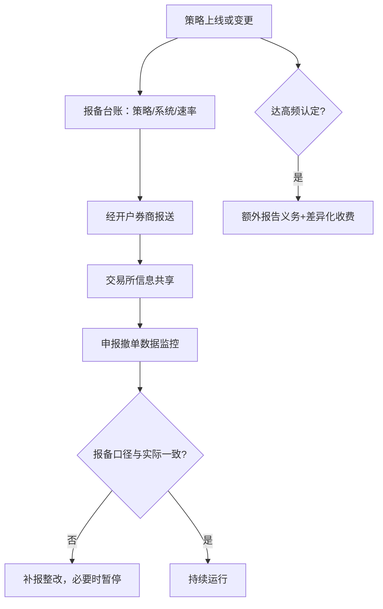

# 程序化交易的报备实践

报备档案是交易所给账户画的肖像：监控跑在申报与成交数据上，画像和真人长期对不上，系统不会先问你是不是忘了更新。

<footer>—— 据证监会程序化交易管理规定及交易所报备通知口径整理</footer>

[上一课](/quant/cn-margin-lending-structure)把空头腿的券源工程立住，工具与约束单元走到第三件：交易身份本身。[程序化交易管理规定与实施细则](/quant/cn-program-trading-rules)已写制度框架，[中基协程序化交易自律要求](/quant/cn-amac-program-trading)写了私募侧自律口径，[高频交易认定标准](/quant/cn-hft-threshold)写了速率认定。本课写实务操作：报备什么、通过谁报、变更怎么跟、报备信息如何与交易所的监控数据互相勾稽。

## 问题

报备在实践里常被当成一次性开户材料，错在这里。它是一份持续有效的技术档案：策略从低频改成日内、系统从外购换成自研、服务器从本地搬进托管机房、速率长到认定线以上，每一项都触发更新义务；多券商开户时同一套策略要在每家分别报备，口径不一致会在监控侧留下两个不同的「你」。报备画像与实际交易特征长期偏离，轻则被要求补报整改，重则在异常交易处置里处于不利位置——而策略团队往往是最晚知道画像过期的人。

## 方法

把报备做成台账治理。字段至少含四类：账户与产品信息；策略类型与换手画像；交易系统（自研或外购及版本）与技术信息（服务器与托管位置、下单方式）；速率类指标——最高申报速率、日均申报与撤单量级——加联系人与应急安排。流程三条：新账户先报备、后启用程序化；重大变更在规定时限内经开户券商更新；达到高频认定标准的，额外报告义务与差异化收费监控直接挂钩（[差异化收费与撤单率监控](/quant/cn-fee-cancel-ratio)）。托管机房的申请信息要与报备台账能互相对上（[主机托管清退与交易单元整改](/quant/cn-colocation-rectify)）。台账与策略版本库联动：任何改变速率画像的上线动作，先过台账、再过生产。

## 机制

报备为什么是数据治理而不是合规手续。异常交易监控跑在申报与成交数据上，报备档案给出「这个账户被允许是什么样」的基准；实际速率与撤单模式长期偏离基准，系统按异常处理，不看你的意图。所以多券商、多产品的一致性是治理问题：同一策略在不同券商处速率画像不同，要么是真实的差异化部署且台账能解释，要么是治理缺陷。私募与公募的报备路径不同，但台账义务同在——载体差异留给生态单元再展开。

最常翻车的一条：回测阶段的换手画像和实盘不同。回测里看着是低频的信号，实盘为了抢单把委托拆碎、撤得更勤，速率指标越过认定线，而台账还停在旧口径。

## 边界

具体报送时限、认定阈值与收费标准以当期规定与交易所细则为准，本课程不做跨期承诺。本课不写规避报备、拆分账户稀释速率的方法——那本身是红线清单的一部分。

## 小结

- 报备是持续技术档案：账户、策略、系统、速率四类字段，重大变更限期更新。
- 高频认定把速率指标与额外义务、差异化收费挂钩，速率画像要进发布检查。
- 报备口径与监控数据勾稽，多券商部署的一致性是治理问题不是文书问题。
- 出处：证监会程序化交易管理规定与交易所实施细则口径；框架细节见[程序化交易管理规定与实施细则](/quant/cn-program-trading-rules)。
