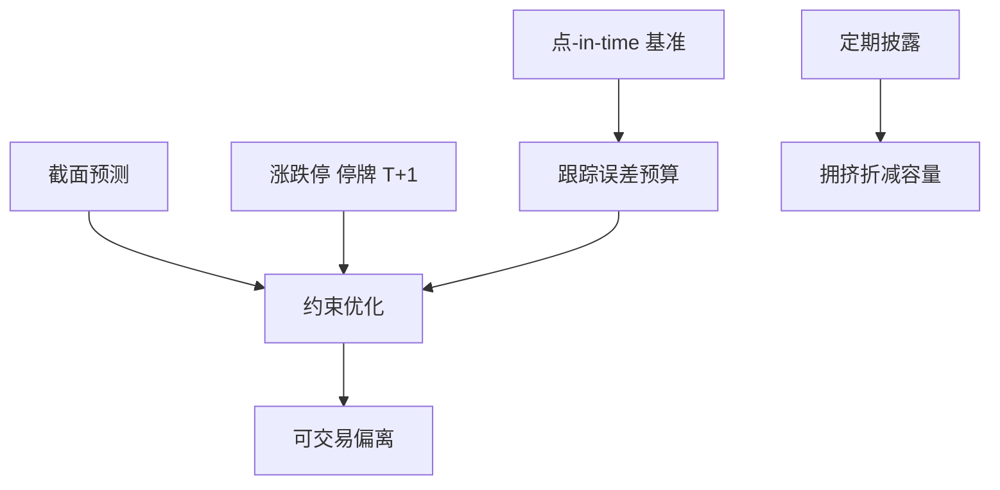

# 公募量化与指增

指数增强把跟踪误差写成约束，把相对基准的超额写成目标。A 股公募还要叠持仓披露、集中度、流动性与对冲工具短缺；超额不是无约束多空。

<footer>—— 对照 Cremers and Petajisto, How Active is Your Fund Manager?, RFS, 2009 对主动份额与跟踪的讨论；《公开募集证券投资基金运作管理办法》对指数基金与持仓的约束；中证、沪深指数编制方案</footer>

[上一课](/quant/live-capacity-estimate)把工程课序收在实盘容量。本课打开课程「中国市场进阶」。缺口是**产品形态**：公募量化与指数增强如何把容量、[成分历史](/quant/index-constituents-history)与 A 股制度写成可销售的跟踪误差。Cremers 与 Petajisto（2009）把主动份额与跟踪误差拆开；中国公募的主动份额还受披露与风格披露约束。后课私募中性换杠杆与空头工具。不要重写[LOB](/quant/lob-structure)。

## 问题

无约束量化可以做多空、高换手、行业偏离。公募指增的契约通常是：相对沪深 300 / 中证 500 / 中证 1000 等基准的跟踪误差上限、信息比率、以及《运作办法》下的股票仓位、集中度、同业存单与衍生品使用限制。超额必须来自权重偏离，而偏离受成分、涨跌停、停牌与流动性限制。问题是把目标写成：在跟踪误差预算 $\mathrm{TE}^2=(w-w_b)^\top \Sigma (w-w_b)$ 下最大化预期超额，且 $w$ 落在当日可交易集合——不是最大化纸面 IC。

披露：公募定期报告持仓，使拥挤可被跟踪；量化模型若依赖「隐匿持仓」，与产品类型不符。指数编制与调仓日是基准的一部分，增强必须处理公告–生效窗口的被动冲击，否则超额只是没付的调仓成本。ETF 联接、增强与主动量化的费用与换手不同，夏普不可横比。

### 对冲不是公募指增的默认腿

公募可以使用股指期货等衍生品做替代持仓或对冲，但仓位、套保目的与估值要符合基金合同与法规。把指增写成「现货多头 + 期货空头的市场中性」，通常是私募结构，见下一课。指增的 beta 应对着基准，而不是对着现金。贴水与保证金若进入公募，须进费用与跟踪误差，而不是当免费杠杆。

基准必须是点-in-time 官方成分与权重。用当前 300 成分回测十年增强，存活偏差与调仓冲击都会变成假超额。

## 方法

优化器输入：基准权重 $w_b$、预测、风险模型、交易成本、涨跌停与停牌掩码、[T+1](/quant/cn-tplus1) 可卖量。输出偏离受 TE、行业、个股权重上限约束。调仓日单独情景：被动基金与 ETF 的冲击下，增强选择跟随、提前或避开，须在研究日志登记，不能事后挑。容量用上一课方法：先碰到的往往是小盘基准里的涨跌停与参与率，不是大盘 ADV。

评价：超额、TE、IR、最大偏离行业、换手、费用后对投资者的净超额。主动份额与 TE 同时报告，避免「高换手但其实在复制基准」或「低 TE 但大量场外暴露」。与美股指增对照时声明：A 股涨跌停使 TE 在板子日跳升，这是制度方差，不是模型突然变差。

### 量化公募的因子要过制度过滤

换手、小盘、反转在 A 股文献里显著，见[换手因子](/quant/cn-turnover-factor)与 Liu–Stambaugh–Yuan。公募实现必须扣：不可当日纠错、披露后的拥挤、以及不可空的一端变成低配而非空头。纸面多空 IC 不能当指增预期超额。

## 机制

跟踪误差预算把因子暴露变成相对基准的倾斜。A 股流动性与涨跌停使倾斜的实现路径不对称：涨停买不进调入股，跌停卖不出调出股，TE 与超额在同一天被制度改写。公募持仓披露缩短隐匿期，容量比同等私募更紧。这是产品设计，不是 alpha 失效。

指数增强的「增强」来自可交易偏离；偏离的可交易性由微观结构决定。工程课的容量曲线在这里变成合同里的规模上限。

## 边界

不提供规避持仓披露、用场外收益互换把杠杆移出报表的产品设计。基金分类与宣传以证监会与协会规则为准。本课不评价具体基金业绩。量化监管演进在后课专写，本课只把公募契约当约束。

## 小结

- 指增是 TE 约束下的可交易偏离，不是无约束多空。
- 基准与披露必须点-in-time；调仓窗口单独记账。
- 容量先满在涨跌停、小盘参与率与披露拥挤。
- 出处：Cremers and Petajisto, *RFS*, 2009；《公开募集证券投资基金运作管理办法》；指数编制方案。
