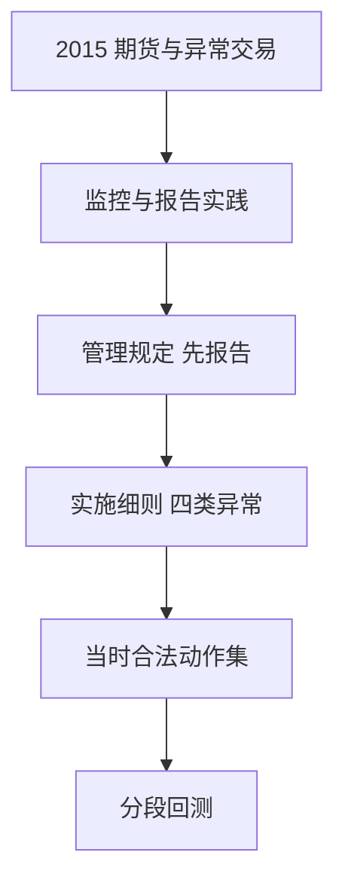

# 量化监管演进

A 股对程序化与量化的约束是分阶段叠加上去的：从异常交易与申报速率，到报告、高频认定、差异化收费与协会自律。回测必须按公告切换可行集，不能用今日细则惩罚十年前的报单。

<footer>—— 证监会《证券市场程序化交易管理规定（试行）》（2024）；沪深北《程序化交易管理实施细则》（2025）；对照 2015 年前后交易所异常交易与股指期货监管措施</footer>

[上一课](/quant/cn-fees-stamp-duty)把价目表时间化。主干[程序化规定](/quant/cn-program-trading-rules)、[高频认定](/quant/cn-hft-threshold)、[中基协](/quant/cn-amac-program-trading)、[托管整改](/quant/cn-colocation-rectify) 已写现行文本。本课的缺口是**演进**：2015 股灾后的限仓与平今、2018–19 异常交易监控强化、2023 报告通知、2024 管理规定、2025 实施细则。后课情绪指标用两融与换手，它们同样被监管窗口改写。不把本课写成如何把报单拆到阈值以下。

## 问题

「中国量化」在 2010 年与 2025 年不是同一合法动作集。2015 年股指期货手续费、保证金、开仓限制使中性产品的对冲腿突然变贵或不可用。其后股票侧对频繁报撤、拉抬打压的监控指标逐步明确。2024 年《管理规定》把先报告后交易升到部门规章；2025 年细则把四类异常与高频写成可执行条文。问题是实验登记必须包含 `reg_regime_id`：同一策略代码在不同制度下的换手与报撤要分开评价。用 2025 年细则回测 2016 年，是制度前视。

公平接入：托管与行情不得为程序化提供特殊便利。境外「付费买更短线」的容量故事，在现行规则下不能当 A 股股票的默认假设，见[托管与微波](/quant/colocation-microwave) 的 A 股对照。

### 监管是拥挤与容量的状态变量

收紧报撤与融券，使高频做市与个股中性容量下降，指数增强相对受益或受害取决于工具替代。放松则反向。把监管当外生冲击做事件研究合法；把「如何刚好低于阈值」当优化目标，越界成本由规则明确禁止的行为组成，本课不讨论。

北向交易按内外资一致纳入程序化报告与监控。把北向当「另一套监管」与公开规则不符。

## 方法

制度日历：重大公告日、施行日、过渡期。回测引擎读取日历以切换：期货费率与限仓、股票异常阈值（若历史公开）、是否需要报告状态、融券管道。缺失历史阈值时，用定性分段（「监控强化期」）做稳健性，而不是发明具体笔数。论文应声明：结论成立于哪些制度区间。

产品层：公募、私募、QFII 的报告路径不同，容量与合规成本不同。同一因子在三类产品上的可实现换手应分列。

### 与故障、熔断的区别

2016 年熔断是价格限制的短暂实验，对象是指数跌幅，不是程序化定义。本课不把熔断细则重写一遍，只强调：制度实验会进入收益方差，须分段。技术故障见交易所故障课，原因码不同。

## 机制

监管改变报撤与空头的影子价格，从而改变最优市场结构参与方式：从高频做市转向低频截面，或从个股空头转向期货中性。这是均衡迁移。样本外衰减若发生在细则施行附近，应先检验制度，再检验拥挤。研究日志的制度登记就是为这一检验准备分母。

国际对照：Reg NMS、MiFID 不是 A 股的替代文本，只能当「高频监管工具箱」的对照，阈值与报告义务不可横搬。

## 边界

不提供规避报告、分拆产品、或把报撤维持在监控指标「刚好以下」的操作指南。以公开规定为准。本课是制度史与回测分段，不是法律意见。

## 小结

- 量化可行集随 2015→2025 的规则叠加而变；禁止现行细则回填全样本。
- 监管冲击通过报撤成本、空头工具与公平接入改变容量。
- 产品类型（公募/私募/北向）报告路径不同，应分列实现。
- 出处：证监会 2024 年《管理规定》；交易所 2025 年实施细则；2015 年以来期货与异常交易公开措施。
