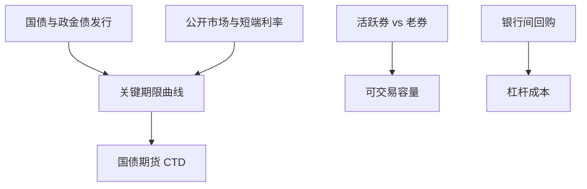

# 利率债市场

中国利率债的定价锚是国债与政策性金融债的曲线，交易主场在银行间。量化要跟踪的是曲线因子、发行供给与流动性分层，而不是把股票换手因子换一个 ticker。

<footer>—— 财政部国债发行与中国人民银行公开市场操作相关制度；中金所国债期货合约；对照 Tuckman 对利率债相对价值的处理；[国债期货 CTD](/quant/cn-tf-ctd)</footer>

[上一课](/quant/cn-sentiment-indicators)停在股票情绪。本课把中国进阶接到**利率债**：国债、地方政府债、政策性银行债（国开、口行、农发）。下一课专门写银行间与交易所两个场所的分割。本课先写产品、曲线与期货对冲，不把[LOB](/quant/lob-structure) 的股票十档当成银行间询价的深度。固收 RV 与 repo 课已给一般机制，这里钉中国曲线。

## 问题

股票因子宇宙是竞价连续盘。利率债大量成交在银行间一对多询价与经纪商系统，价格是对话的结果，透明度与股票 TAQ 不同。中债估值、中证估值是模型价，不等于可成交。问题是：久期、曲线陡峭、国开–国债利差（隐含税收与流动性）如何在点-in-time 估值与可成交报价之间切换。用估值收益当可实现收益，会高估交易策略，尤其在压力日估值平滑、成交稀疏。

供给：财政部与政策性银行的发行节奏改变特定券的特殊性与曲线。地方债有财政与置换节奏。量化「利率债动量」若忽略发行日历，会把供给冲击当价格信号。国债期货提供可保证金的久期，CTD 与基差见已有课；对冲成本同样含保证金与交割期权，不是 beta=1。

### 流动性分层

新券、关键期限、政策金融债的活跃券与老券、奇异期限差很大。容量按活跃券可成交量估。把全部中债财富指数成分当可交易宇宙，冲击被低估。repo 融资是杠杆管道，haircut 与银行间流动性（DR007 等）进入成本，见[回购](/quant/repo-funding)。

货币政策与公开市场操作改变短端；曲线长端还受期限溢价与供求。把所有收益归因于「降准」一句，曲线交易无法记账。

## 方法

曲线：用可成交报价或可靠经纪商报价构建关键期限，声明估值源。因子：水平、斜率、蝶式，对冲用国债期货或活跃券篮子，报告 CTD 切换。事件：发行、缴款、降准、MLF、国债期货交割月。回测用当时估值版本，避免用今日中债曲线回填。与股票组合的宏观对冲：利率债久期对冲的是贴现率一截，不是股权风险溢价。

信用不在本课：中票、公司债、城投是信用利差，场所仍常在银行间，但风险源不同，勿与利率债因子混池。

### 与股票量化的接口

股债风险平价、宏观风险平价类产品同时持有利率债与股票。A 股涨跌停不直接限制国债，但资金与赎回在同一日要现金：股票缺腿时可能被迫卖债。跨资产容量是联合的，见实盘容量课。

## 机制

利率债收益来自票息、资本利得（曲线移动）与融资。特殊性使 CTD 与活跃券偏离估值曲线。银行体系是主要持有人，监管与资本（若适用）改变需求弹性，利差可以因「谁能持有」而变，不必有新的宏观信息。这与国际银行持有国债的文献同方向，制度细节是中国银行间与政策金融债税收。

期货把久期杠杆化，2015 年之后国债期货流动性逐步发展，样本须分段。用美债期货的经验系数填中国 CTD，转换因子与可交割篮不同。

## 边界

不提供利用非公开招标信息或操纵发行的方法。地方债、储蓄国债、央行票据各有规则。本课不预测货币政策。外汇与中美利差是宏观对象，本课只要求曲线数据契约诚实。

## 小结

- 中国利率债以国债与政金债曲线为锚，交易与估值源必须声明。
- 发行供给与流动性分层决定容量；期货对冲看 CTD。
- 估值收益 ≠ 可成交收益，压力日尤其。
- 出处：财政部与国开发行制度；中金所国债期货；Tuckman；本栏 CTD 课。
