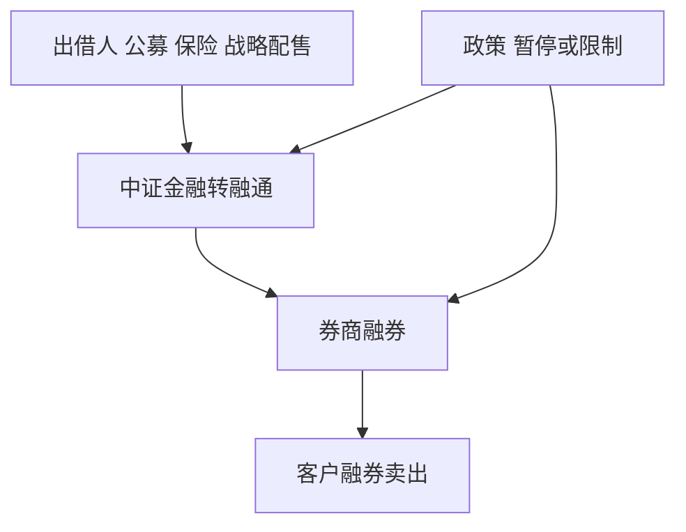

# 融券与转融通

转融通曾是券源从持有人经中国证券金融公司转到券商再融给客户的公开管道。管道收紧或暂停后，空头可行集不是策略参数，是公告日切换的状态。

<footer>—— 《转融通业务监督管理试行办法》；中国证监会 2024 年 7 月 10 日关于暂停转融券的公开说明；交易所《融资融券交易实施细则》</footer>

[上一课](/quant/cn-private-neutral)需要空头腿。[做空约束](/quant/cn-short-constraint)已写标的、提价、保证金与禁止裸卖空。本课的缺口是**券源供给的制度管道**：转融通、转融券、战略配售出借与 2024 年暂停。不重复前端检查细节，只补供给如何进入[借券成本](/quant/securities-lending)的 A 股版本。后课对冲成本把期货基差与融券费放在同一张账单上。

## 问题

无转融通时，券商融券主要靠自有与客户约定出借，供给窄、易召回。转融通把保险、公募、战略配售等持有人的券集中再分配，扩大了可融名单与数量，也使供给对政策更敏感。证监会 2024 年 7 月批准中证金融暂停转融券，存量限期了结，并上调融券保证金。问题是回测必须按公告切换：暂停后假设「转融券库存仍可开新空」的路径结束。把 2019–2023 的可融宇宙沿用到 2024 年下半年，是在交易一个当时关闭的市场。

战略配售股份出借曾被限制：新上市股份进入融券的时间与比例是监管对象。量化若在上市初期做空「定价偏高」的新股，须检查当时是否允许该券进入出借。这与注册制新股课衔接，本课只钉券源。

### 费率与余量是滞后观察

市场公开的融券余量、两融余额是存量，不是你的可借报价。点-in-time 的可融数量在券商柜台，研究常用余量当代理，会高估可开仓规模——余量已被他人占用。成本用费率分布的右尾，不用均值：特殊券与政策日的费率可以吃掉空头溢价。

融券卖出所得一般不能随意取用，担保与平仓规则见[两融保证金](/quant/cn-margin-trading)。把融券当现金杠杆会错科目。

## 方法

状态变量：`transfer_lending ∈ {on, restricted, paused}` 按公告日。宇宙：交易所融券标的 ∩ 当时可获得券源代理。开仓：提价规则 + 保证金类别（私募更高）。持有：召回与标的调出强制了结。报告：无约束多空 vs 管道约束后多空。容量按可借库存与集中度，不按 ADV。

与期货对冲的替代弹性：转融券暂停后，中性需求更挤入期货，贴水机制见下课。不要在暂停期用历史融券费去填空头腿。

### 出借人激励

公募与指数基金出借可增增强收益，但受产品规则与监管窗口影响。供给是内生政策变量，不是稳定的结构性 alpha 来源。把「出借收益」写进指增预期时，须声明政策情景。

## 机制

搜寻与匹配在 A 股被高度中介化：中证金融与券商是节点。政策改变节点流量，费率与余量同跳。价格发现：可空集合变窄，负面信息写入更慢，与 Miller / Hong–Scheinkman–Xiong 方向一致，但识别必须用制度断点，不能只用余量截面当因果。

交收：融券仍要交得起券；T+1 与前端检查把大量 fail 挡在撮合前。剩余的运营失败仍应按[结算失败](/quant/settlement-fails)记账。

## 边界

不提供寻找灰色券源、规避暂停或借用他人账户融券的方法。现行以证监会公告与细则为准。港股做空与 A 股融券不可混用一套费率。

## 小结

- 转融通是券源管道；2024 年暂停是状态切换，须按公告回测。
- 余量不是你的可借量；费率用右尾。
- 管道关闭把中性需求推向期货基差。
- 出处：转融通试行办法；证监会 2024-07-10 公开说明；交易所两融细则。
