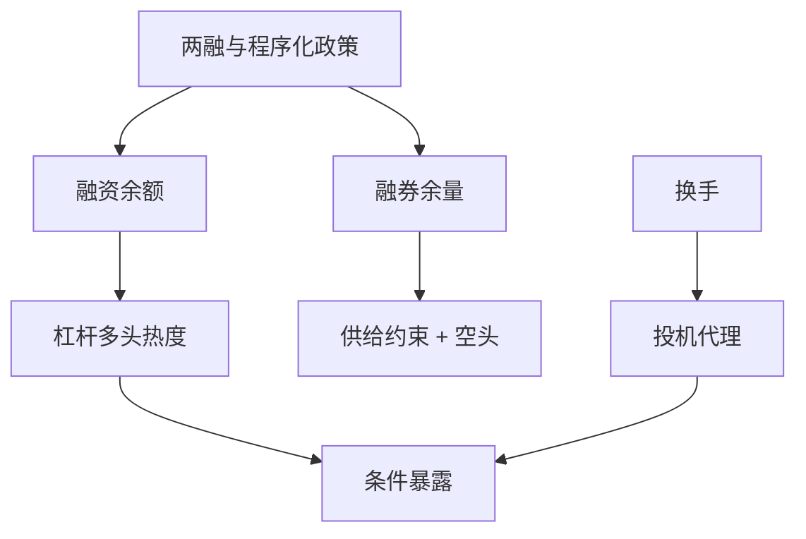

# 情绪指标：两融与换手

两融余额与换手是可公开观察的交易热度：前者混杂杠杆多头与稀薄空头，后者在 A 股更接近投机而不是流动性溢价。当指标当情绪，先拆科目、再扣制度。

<footer>—— Baker and Wurgler, Investor Sentiment and the Cross-Section of Stock Returns, Journal of Finance, 2006；Liu, Stambaugh and Yuan, Size and Value in China, JFE, 2019；交易所两融与成交公开数据</footer>

[上一课](/quant/cn-quant-regulation-history)说明监管窗口会改写交易行为。本课的缺口是**把两融与换手当截面/时序情绪代理**：Baker 与 Wurgler（2006）的情绪对美股截面；A 股最方便的公开热度是融资余额、融券余量与换手。[换手因子](/quant/cn-turnover-factor) 已写高换手随后收益偏低；[两融保证金](/quant/cn-margin-trading) 已写杠杆机制。本课不重做因子构造全文，而写如何把这些量当**情绪状态**进入择时或条件因子，并避免把融资当「聪明钱」。后课利率债换市场。

## 问题

融资余额上升可以是：杠杆乐观、新标的扩容、或股价上涨的机械市值效应。融券余量远小于融资，且受标的与转融通政策截断，不能当对称的悲观投票。把「两融余额」当单一情绪指数，符号与因果都混。问题是分列：融资余额/市值、融券余量/流通、融资买入额、以及换手。制度断点（保证金比例调整、暂停转融券）必须从情绪里剔出，否则 2024 年融券下降会被当成「情绪改善」。

换手：Liu–Stambaugh–Yuan 将其视为中国投机代理。高换手股票随后弱，与 Amihud 流动性溢价符号冲突。当情绪用：市场整体换手高可能对应散户热度与后续弱收益；个股换手是截面。两者不要加总成一个无名指数而不做标准化与制度过滤（涨跌停日换手不可比）。

### 披露时钟

两融数据有交易所披露时点，终端有入库延迟。点-in-time 用披露后可知的最新值，不能用当日盘中尚未公布的余额去「预测」当日收益。这与分析师共识课同一纪律。北向持股披露是另一序列，见北向课，不要与两融混成「外资情绪」除非声明。

涨跌停锁定日成交量塌缩，换手变低，不是情绪突然冷静，是黑洞。情绪指标应标记锁定状态或剔除。

## 方法

构造：市场级融资余额相对自由流通市值、换手的截面中位数或市值加权。标准化用过去滚动而非全样本。条件因子：在高情绪期降低小盘/高换手暴露，或扩大价值——须预先登记，见研究日志，避免挖到 Baker–Wurgler 的 A 股再版。与监管日历正交化：在公告窗口用哑元或分开估计。

验证：情绪应与 IPO 热度、换手、封闭式基金溢价等其他代理同向，但 A 股封闭式基金样本有限，不要硬造 BW 六指标。能解释随后异常收益的增量，才留下；否则只当风险监控（杠杆热度）。

### 融券余量不是空头情绪的充分统计量

余量受供给约束。供给收缩时余量下降，可能是政策而不是空头平仓。应用标的家数、费率（若可得）辅助。期货持仓与基差有时是更好的对冲拥挤代理，见对冲成本课。

## 机制

情绪通过噪声交易者需求进入价格，约束下更难被套利纠正（Shleifer–Vishny；A 股再加涨跌停与 T+1）。高融资 + 高换手是杠杆投机的公开足迹，随后收益弱与去杠杆、涨跌停缺腿一致。把它当因果「情绪」还是「杠杆风险」，识别上依赖制度冲击：保证金上调后融资被迫下降，若随后收益改善，更接近杠杆渠道。

Baker–Wurgler 的美股构造不能原样移植：A 股 IPO、换手、股利的制度不同。移植的是「用公开行为代理不可观测情绪」这一方法，不是六个指标的系数。

## 边界

不提供利用未公开两融客户明细或诱导散户加杠杆的方法。公开统计是聚合。本课不构成「融资盘将崩」的交易指令。指数与行业的两融集中度另有风险含义，须单独看。

## 小结

- 融资与融券必须分列；融券余量首先是供给政策。
- 换手当 A 股投机代理，锁定日不可比；披露要点-in-time。
- 情绪指标须与监管日历正交，并预先登记用法。
- 出处：Baker and Wurgler, *JF*, 2006；Liu, Stambaugh and Yuan, *JFE*, 2019；交易所两融公开数据。
