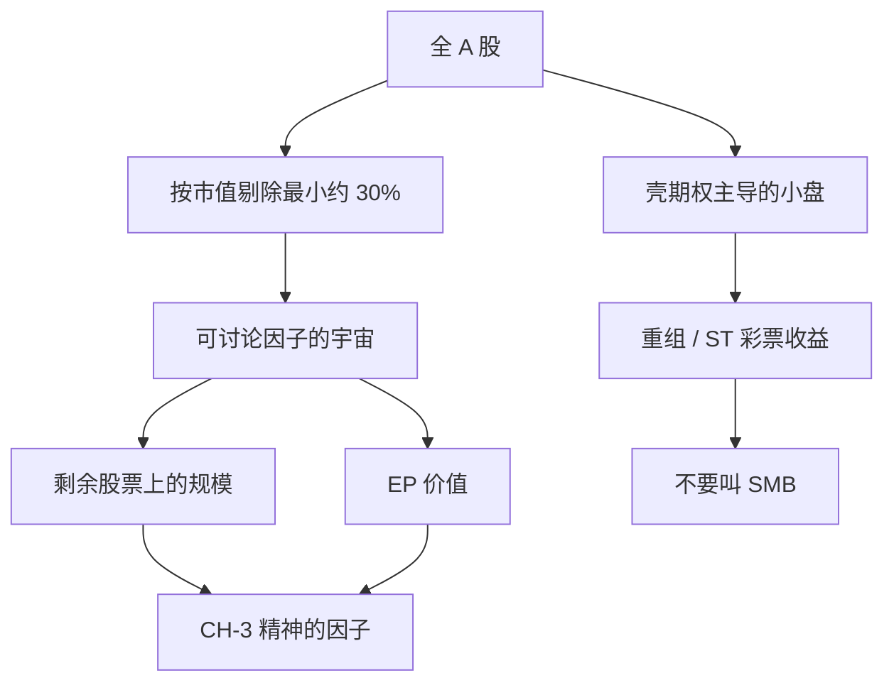

# 壳溢价 / 小市值

中国最小的那一截股票，很大一部分价值来自作为借壳上市标的的期权；把最小百分之三十剔除之后，规模与价值的形态才接近可讨论的因子，而不是壳的投机。

<footer>—— Liu, Stambaugh and Yuan, Size and Value in China, Journal of Financial Economics, 2019</footer>

美股 [SMB](/quant/ff3) 是小盘减大盘的风险或错误定价争论。A 股把同一套 2×3 直接套上去，会得到一个看起来极强的「小市值溢价」。Liu、Stambaugh 与 Yuan 指出：这截溢价高度集中在**最小的约 30%** 股票里，它们的定价对象往往不是经营资产，而是稀缺的上市资格——壳。IPO 长期配额与审核制让借壳成为曲线上市通道，壳有正的期权价值；退市松的年代，这个期权更贵。本篇写壳如何污染规模因子、CH-3 宇宙为何要先剔除最小一组，以及 2024 年退市与重组规则收紧后，旧样本的小盘夏普不能外推。

## 问题

公司市值 $= $ 经营资产价值 $+$ 壳（上市资格）价值。大公司里壳占比可忽略；市值小到与壳的历史成交价同一量级时，股票更像一张「未来可能被借壳」的彩票。彩票的收益来自重组传闻、借壳概率的跳跃，以及散户对极值的偏好，不是来自规模风险。若把这些名字放进 SMB 的小盘腿，因子赚的是壳的彩票，却用规模的名字去解释。

A 股还有一层制度：上市资格曾经稀缺，退市不畅，ST 公司仍可能被当成壳来炒，见[ST / 退市](/quant/cn-st-delist)。于是「小」与「差」与「可借壳」绑在一起。问题是把宇宙切开：哪些股票的市值主要反映壳期权，哪些才进入与美股可比的规模讨论。

### 最小 30% 不是随便切的一刀

Liu–Stambaugh–Yuan 按市值把全市场分成组，显示平均收益与因子载荷的异常集中在最底下一截；剔除后，剩余约 70% 股票上，规模与（用盈利收益率而不是账面市值比度量的）价值呈现更干净的单调。30% 是他们的工作切分，对应「壳价值相对市值不可忽略」的区域，不是物理学常数。复制应报告 20%/30%/40% 剔除的稳健性，但不能看完再挑使 SMB t 最大的切点——那是[多重检验](/quant/harvey-liu-zhu)。

壳价值随借壳监管与退市严格执行程度而变。2010 年代重组停牌长、退市弱，壳贵；2016 年后借壳按 IPO 标准审核、2024 年退市指标收紧，壳期权贬值。用 2013 年小盘溢价去校准 2025 年的 SMB 暴露，是在给一张已经便宜的期权按旧隐含波动率标价。

## 方法

**宇宙。** 每个再平衡日按流通市值（或总市值，须固定口径）排序，剔除最小 30%，以及当时的风险警示、上市不足某月的次新股（预指定）。在剩余股票上做规模与价值的独立 2×3，价值用盈利收益率（EP）优于 B/M——LSY 发现 A 股 B/M 弱、EP 强，这与会计与壳扭曲账面有关。市场因子用剩余宇宙的价值加权超额。这就是他们的中国三因子（CH-3）精神：先切掉壳，再谈规模与价值。

**对照列。** 必须同时报告：全市场等权小盘、全市场价值加权 SMB、剔除壳后的 SMB。三列差多少，就是壳对「规模溢价」的贡献。等权全市场小盘几乎总是最强、也最不可交易。[融券](/quant/cn-short-constraint) 下，空头腿很难做在真小盘上，纸面 SMB 的空头往往不可实现；剔除后的中盘空头稍好，仍要可行集过滤。

**壳的代理。** 直接度量壳期权没有交易所报价。可公开观察的是：市值水平、是否 ST、是否长期亏损、是否多次重组停牌、借壳相关公告。事件研究应对齐重组报告书与交易所问询的公告日，而不是传闻日。量化因子若用「重组概率模型」，特征只能是当时已公告的财务与交易状态，不能用后来才完成的借壳结果回填标签。

### CH-3 与美股三因子不是同一套 β

即使都叫 SMB，载荷不可比。美股小盘含流动性与困境；A 股未剔除的小盘含壳彩票。把 A 股组合对美股方法构造的 SMB 回归，α 的含义是「相对被壳污染的规模」，不是相对规模风险。风险模型与绩效归因应使用与投资宇宙一致的中国因子，并在文档里写明剔除规则。向[五因子](/quant/ff5)或 [q 因子](/quant/q-factor-hxz)叠加时，同样先切宇宙，否则 CMA、投资因子也会被壳腿带跑。

## 机制

壳是看涨期权：标的是「把一家未上市企业装进来」的资格，执行取决于监管是否放行、借壳方是否出现。市值越接近期权费，股票对借壳概率的弹性越大，对经营现金流的弹性越小。散户偏好正偏态，愿意为这张彩票付溢价，于是**持有壳的期望收益可以很低甚至为负**——你买的是彩票，平均要付房钱。这与「小盘风险补偿所以收益更高」的美股叙事可以相反：A 股最小一组常常是高投机、低后续收益，或收益来自几次借壳暴利、均值被极值拽出。LSY 强调的是：不把这组放进因子构造，规模在剩余宇宙里才恢复可解释的形态。

退市改革提高了壳的作废概率，期权价值下降。财务类、交易类退市缩短了「亏成壳再卖」的路径，见退市篇。于是小市值因子有制度 β：规则紧的年份，壳腿与 ST 炒作的历史均值失效。这不是因子衰减的拥挤故事，是状态变量被政策改掉。

### 存活、停牌与重组时钟

壳策略的历史收益含长期停牌：重组停牌期间没有可成交收益，复牌一字板又不可买。回测若用停牌前收盘接到复牌涨停价，会把不可交易跳跃算进小盘溢价，见[停牌复牌](/quant/cn-halt-resume)与[存活偏差](/quant/survivorship-bias)。正确处理是：停牌期标记不可交易，收益在下一可成交时点实现，并承认经常买不到。借壳成功后的存续公司已不是原来的经营实体，证券代码连续会造成基本面错配；因子应用公司事件表切断。

北交所、注册制扩容增加了「正门」上市供给，壳的稀缺性下降。这是可公开观察的供给冲击，不是内幕。因子研究应把注册制试点与全面注册制作分段，而不是假设 2008–2020 的壳溢价平稳。

## 边界与工程取舍

不要把 A 股全市场等权小盘的夏普写成「中国有更强的规模溢价」。不要在未声明宇宙时把 CH-3 的 SMB 与 Ken French 的 SMB 放进同一张国际表。不要用未完成的重组结果给历史贴「是壳」标签。不要把最小市值组当成可容量的 alpha：涨跌停、停牌与流动性会吃掉纸面利润。

投资上，剔除最小 30% 是可投资性过滤，也是定价模型的设定。若策略故意做壳，那是事件驱动与监管风险，应单独账户、单独合规，而不是藏在「多因子小盘」里。2024 年退市意见之后，壳账户的左尾是摘牌而不是「总会有借壳方」。

出处：Liu, Stambaugh and Yuan, *Size and Value in China*, Journal of Financial Economics, 2019。退市与风险警示的现行规则见交易所上市规则与证监会 2024 年退市意见。美股规模见 Fama & French, 1993。

## 小结

- A 股最小一截股票的市值含上市资格期权；其收益不是美股意义下的规模溢价。
- Liu–Stambaugh–Yuan（2019）主张剔除约最小 30% 后再构造规模与 EP 价值，即 CH-3 的宇宙纪律。
- 壳期权随借壳审核、退市执行与注册制供给而贬值，全样本小盘夏普不能外推。
- 停牌与复牌板使壳收益大量不可交易；回测须切断事件并标记不可成交。
- 报告 A 股 SMB 必须声明是否含壳；空头腿还受融券约束。
- 出处：Liu, Stambaugh and Yuan, *JFE*, 2019。
