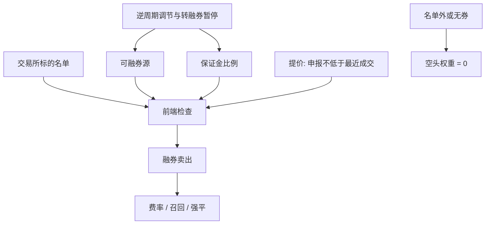

# 融券与做空约束

投资者必须向证券公司融入相应证券才能卖空；严格禁止裸卖空。证券交易所对融券卖出指令进行前端检查。

<footer>—— 据《证券公司融资融券业务管理办法》及中国证监会公开说明；交易所《融资融券交易实施细则》禁止无券卖空并对申报价格作出限制</footer>

多空因子在学术构造里假设空头腿可以按收盘价建立。A 股的空头不是符号取负，而是融资融券制度下的**融券卖出**：必须先有可融的标的、保证金、券源，申报价格还不得低于最近成交价（当日无成交则不低于前收盘价），即提价规则。标的由交易所从符合流通市值、换手、波动等条件的证券中选取并公布，会员公布名单不得超出交易所范围。中国证监会 2024 年 7 月 10 日公告：批准中证金融自 7 月 11 日起暂停转融券，存量不得晚于 9 月 30 日了结，并上调融券保证金比例。本篇按公开管理办法与交易所细则写约束如何进入组合，不讨论如何寻找灰色券源或规避提价与保证金。它决定[多空排序](/quant/long-short-sort)在 A 股能实现多少空头，以及[行业中性](/quant/industry-neutral)为何常退化成低配。

## 问题

无约束时，多空组合 $r_L-r_S$ 的空头与多头对称。有融券约束时，$S$ 只能来自当时可融、且保证金与集中度允许的名字。不可融的股票在空头腿上的权重必须为零，于是「高减低」变成「高减可融的低」，或变成多头相对基准的低配。Miller 的经典论点是：卖空限制下悲观意见无法进入价格，高估更易持续。A 股把这一论点写成可检查的制度：标的名单、券源供给、保证金、提价、信息披露与逆周期调节。问题不是「能不能做空」的口号，而是在决策日 $t$，空头可行集 $\mathcal{F}_t$ 是什么，以及 $t$ 到 $t+1$ 券源被召回或名单调出时持仓如何强制了结。

转融通曾是券源从持有人经中证金融转到券商再融给客户的公开管道。暂停转融券之后，券源更依赖券商自有与客户出借等仍被规则允许的渠道，供给更窄、更不稳定。策略若在回测里对所有股票无成本做空，是在用一个已经不存在（或从未存在）的市场。

### 标的、保证金与提价是三道门

交易所实施细则规定股票成为融券标的的条件（上市时间、流通股本或市值、股东人数、流动性与波动相对基准指数、非风险警示等），并可根据市场调整名单。风险警示、终止上市程序会调出标的，未了结合约按细则了结，不是继续按旧名单做空。保证金方面，细则给出比例公式；证监会 2024 年 7 月批准将融券保证金比例上调至不低于 100%，私募证券投资基金不低于 120%（自 7 月 22 日起）。可用保证金不足则不能开新空。提价规则使融券卖出无法在最近成交价之下主动砸价，执行路径与普通卖出旧仓不同：空头开仓更难在弱报价上立即成交。三道门任意一道关闭，纸面空头就不存在。

融资买入与融券卖出同属融资融券，但本篇的约束对象是空头腿。融资加杠杆做多不创造卖空能力；把两融余额当成「市场做空意愿」还要拆开融资余额与融券余量，前者通常大得多。

## 方法

点-in-time 空头可行集：每个决策日加载交易所公布的标的名单、券商可融库存（若不可得则至少用全市场融券余量与标的过滤）、保证金比例与折算率。不可融则该票空头权重记为零，不要记为以收盘价成交的空头。借券费用与强制平仓应进入[净边缘](/quant/net-edge)：费率是右偏的随机过程，召回使持有期随机缩短。提价规则在模拟器里限制融券卖出的申报价，不得用跌停价或任意低于最近成交的价格假设成交。

组合构造要报告两个版本：无约束学术多空，与可行集约束后的多空。差额就是制度造成的实现缺口，往往集中在小盘、低流动、刚进入风险警示或刚被调出标的的名字——而空头腿的异常收益经常来自这些名字。行业中性、市场中性在空头不可得时，应改称为「多头相对行业或市场的偏离」，并单独报告净暴露。集中度方面，管理办法要求券商与交易所对单一证券融券量占流通量的比例等实施控制，容量不能按无约束 ADV 外推。

### 逆周期调节是状态变量

管理办法授权交易所对保证金比例、标的范围、融券卖出价格限制等动态调整。2023–2024 年监管公开采取限制战略配售股份出借、上调保证金、降低转融券效率、直至暂停转融券等措施。这些不是回测噪声，而是 $P$ 的制度转移。方法是按公告日切换参数：暂停转融券之后，假设「转融券库存可开新空」的路径应结束。评价因子在 2015、2023–2024 等监管收紧期的表现时，必须用当时规则，否则是在评价一个当时非法或不可执行的组合。

## 机制

卖空约束从两条渠道进入收益。识别渠道：空头腿建不出，因子的空头溢价无法实现，只留下多头超额相对基准的部分，风格暴露与论文表格不再对应。价格渠道：可空头集合变窄，负面信息写入价格更慢，高估与动量在不可空的一端更持久，这与 Hong、Scheinkman 与 Xiong 一类意见分歧加卖空限制的理论同方向。提价规则额外改变执行：下跌行情里融券开仓不能贴在更低的价位上抢先成交，冲击与等待与普通卖出不同。

保证金把空头变成带强平期权的杠杆负债。维持担保比例跌破阈值，券商按合同平仓，平仓时点往往是波动最高、流动性最差的时候。学术多空假设可以持有到月末再平衡；融券账户可能在月中被强制减仓。回测若不嵌入担保比例路径，会把本应实现的强平缺口当成未实现的继续持有。暂停转融券后，即使标的仍在名单上，券源价格与可得性使「名单内」不等于「可开仓」。

裸卖空在管理办法与交易所前端检查下被禁止。任何回测若允许账户证券余额为负且无融券合约，都与公开规则冲突，结果不可解释为 A 股可交易策略。

### 与多空因子文献的对接

Fama–French 式空头腿在美股依赖证券借贷市场；A 股必须把 $\mathcal{F}_t$ 写进定义。Asness 等人讨论的「做空成本后的价值与动量」在这里变成制度开关而不仅是费率。报告 A 股因子时应同时给出：全样本无约束、仅标的内、标的内且扣融券费、以及 2024 年 7 月之后券源收缩样本。不要只贴无约束的 t 统计量再在脚注写「忽略卖空限制」。可交易性论文（Novy-Marx–Velikov）的精神是成本改变哪些异常还活着；融券约束是 A 股上比价差更硬的一刀。

## 边界与工程取舍

细则中的保证金比例与证监会逆周期调整可能不一致，以当时有效的监管规定与交易所通知为准。不同会员的可融库存、费率、强平阈值不同，全市场余量只是上界。ETF、债券作为标的有单独条件。科创板证券出借与融券另有信息披露指南，内部人与限售股出借受减持与短线交易规则约束，不能把出借当成普通券源。

不要用融券余额的变化当实时 alpha 而不核对公布时滞。不要把融资盘平仓写成「空头攻击」。不要设计规避提价、虚假出借或规避保证金的交易结构。公开规则下的研究止于：可行集、费率、提价、保证金与公告过的供给变化如何改变可实现的多空。

融券卖出所得资金的用途、担保划转与权益处理以管理办法及合同为准。策略上应把融券头寸当成受合同约束的负债，而不是与现券空头在国际市场上等价的工具。

## 小结

- A 股卖空通过融券实现，禁止裸卖空，受标的名单、券源、保证金与提价规则约束。
- 学术多空的空头腿在可行集之外必须记为零，行业中性常退化为低配。
- 2024 年 7 月起转融券暂停、融券保证金上调，是公开的供给与杠杆状态变化。
- 提价规则使融券开仓的执行不同于卖出旧仓；强平使持有期随机。
- 因子报告应并列无约束与约束后的版本。
- 出处：《证券公司融资融券业务管理办法》；上交所、深交所《融资融券交易实施细则》；中国证监会 2024 年 7 月 10 日关于暂停转融券与上调保证金的公告；中证金融同期通知。
