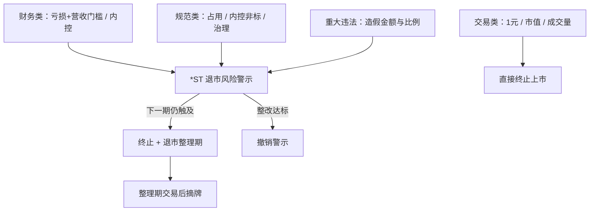

# ST / 退市风险

上市公司触及财务类、规范类、重大违法类或交易类强制退市情形的，证券交易所对其股票实施退市风险警示或终止上市。主板亏损公司营业收入指标已提高，市值退市指标同步上调；交易类退市没有退市整理期。

<footer>—— 证监会《关于严格执行退市制度的意见》（2024 年）；《上海证券交易所股票上市规则》（2024 年 4 月修订）及深交所对应规则</footer>

[上一课](/quant/cn-block-trade)把大宗写成收盘后协议价：折价含流动性与锁定期，不保证次日向收盘回归；停牌与涨跌停会截断可成交折扣。缺口是另一套离散状态：ST / \*ST 是上市规则下的警示，退市分财务、规范、重大违法、交易四类，时钟与是否有整理期不同。2024 年修订提高主板亏损公司营收门槛，并将市值退市门槛上调。本课写规则触发的状态，不把 ST 当成大宗折价的延伸，也不重写大宗价格带。

## 问题

退市四类标准同时存在，触发时点与可交易性完全不同。财务类看年报：利润总额、净利润、扣非净利润孰低为负，且扣除后营业收入低于主板 3 亿元（创业板维持 1 亿元量级），实施 \*ST，下一会计年度仍触及则终止上市。规范类看资金占用未整改、内部控制审计非标连续、信息披露或控制权混乱等。重大违法类看财务造假金额与比例、欺诈发行等，标准在 2024 年进一步下调。交易类看连续 20 个交易日收盘价低于 1 元、连续 20 个交易日市值低于门槛、或成交量过低；一旦满足，退市程序短、没有年报等待期。把四类合成一个「ST 哑变量」，会把 1 元退市的路径依赖与年报爆雷的会计事件当成同一种风险。

涨跌幅与投资者适当性随警示状态切换。主板 \*ST / ST 为 5%；科创板、创业板股票被实施警示后仍适用 20% 涨跌幅的，以当时交易规则为准，不能把主板 5% 外推到所有板块。退市整理期（财务类、规范类、重大违法类终止上市后进入，期限 15 个交易日，主板整理期涨跌幅常见为 10%）与交易类直接终止，是两条完全不同的价格路径。用「进了 ST 就会有整理期可以出逃」来写交易类样本，会在面值退市上假设一个不存在的缓冲。

### 面值、市值与财务组合指标不是同一时钟

1 元退市是路径依赖的障碍期权：连续 20 个交易日收盘价低于 1 元即锁定。中间任何一日收盘回到 1 元以上，计数清零。市值退市把价格乘以总股本，股本大的低价股更早触及；主板 5 亿元、科创板与创业板 3 亿元（以规则文本为准）使同一价格对不同板块含义不同。财务类则以 2024 年年报为首个适用新营收门槛的年度，且「营业收入」须按规则扣除与主业无关的收入。用年报公布前的分析师预测营收去交易「不会 \*ST」，误差是会计口径而不是价格噪声。

交易类退市按收盘价与收盘市值计，盘中回升不算。用当日最低价或盘中市值去预判「还差几天」，会提前计数。停牌日不计入连续期间，长时间停牌可以把 20 日窗口拉长，复牌后连续跌停则可能迅速锁定。

## 方法

状态应做成规则引擎而不是情感分类。每个交易日更新：是否风险警示、警示原因类别、20 日最低收盘价、20 日最低市值、成交量累计、财务类 \*ST 所处的年报年份、是否已进入整理期。仓位约束随状态切换：警示股从普通股票的涨跌幅、融资融券标的资格、指数与 ETF 调出名单中移除或降权。指数公司通常在实施风险警示或终止上市时把股票调出核心指数，ETF 篮子与期现套利的可复制性随之变化，这是[ETF 申赎与 IOPV](/quant/cn-etf-creation)与[指数套利](/quant/index-arb)的缺腿来源之一。

事件研究须对齐公告时钟：交易所风险警示公告日、年报披露日、行政处罚事先告知书公告日、终止上市决定日、整理期首日。财务造假类在告知书阶段就可能被实施其他风险警示（2024 年新增，即使尚未达到重大违法退市阈值）。把「处罚决定生效日」当成信息首日，会漏掉告知书窗口的价格跳跃。

### 整理期、直接终止与可交易集合

进入退市整理期的股票在专门的整理交易时段交易，投资者适当性更严，流动性通常急剧恶化。15 个交易日结束后摘牌，转入全国股转系统或其他场所的预期不能按连续复利定价。交易类退市没有这段整理，锁定后按规则终止。量化组合的正确动作是：一旦交易类计数进入不可逆区间（例如即使后续全部涨停也无法在 20 日内让市值回到门槛以上），将该名字从可交易集合删除，而不是继续用 5% 涨跌幅的反转因子去「抄底」。财务类 \*ST 在下一个年报前仍可能恢复，但是恢复条件包括营收、利润与内控审计，不是价格涨回去即可。

## 机制

风险警示改变的是交易者集合与杠杆，不只是标签。5% 涨跌幅降低了日内发现价格的速度，信息更多在开盘集合与连续涨跌停板上释放，已实现波动的日频看起来被压低、隔夜跳空变大。融资融券标的资格取消后，空头不能再靠融券表达，多头不能再靠融资加杠杆，订单流转向现金账户。ETF 与指数调出带来机械卖盘，时间点由指数公司规则决定，往往在警示公告之后若干交易日，与「ST 公告日异常收益」不是同一天。

壳价值曾经是 ST 价格的下限叙事。退市标准收紧、重组停牌缩短、借壳监管从严之后，这条下限不再是制度承诺。用 2010 年代 ST 反转来训练 2024 年之后的模型，是在训练一个已经被规则改掉的期权。财务类组合指标把「微利 + 无关营收」的保壳路径堵窄，价格应对的是持续经营能力，而不是年报窗口的会计技巧。

主板市值退市 5 亿元自 2024-10-30 起施行，此前 3 亿元标准在过渡期仍可能被连续计算。样本要按施行日切，不能用新门槛去回标 2023 年的收盘市值。

### 因子暴露与不可卖出

ST 组合在质量、盈利、杠杆因子上天然极端，直接把 ST 放进多空排序会把退市跳跃写成因子收益。更干净的做法是：在可投资宇宙里事先剔除已警示及进入 20 日不可逆计数的名字，把剔除名单的收益单独做成「规则风险」账户，而不是让它们污染价值或反转。涨跌停使日频反转在 5% 板上大量封死，开仓后可能连续一字板无法退出——这是执行不可行，不是因子衰减。

## 边界与工程取舍

不要用 ST 历史平均收益暗示可交易溢价。不要把创业板营收 1 亿元与主板 3 亿元混用。不要假设交易类退市还有整理期。不要用未扣除的营业收入判断财务类阈值。北交所标准与沪深不同，须单独规则表。回测必须嵌入历史规则版本：2020 年退市新规、2024 年 4 月修订、市值指标施行日。

容量上，警示股流动性差、涨跌停频繁，任何「ST 反转」的表面容量都会在你需要成交的一侧消失。报告应给出：规则引擎的触发准确率（对照交易所公告）、不可逆窗口内的退出成功率、以及指数调出日的冲击。

重大违法退市的造假金额与比例以证监会行政处罚认定的年度财务指标为准，不是媒体估算。用新闻标题里的「造假 X 亿」去触发模型，会与上市规则的科目口径不一致。

## 小结

- ST / \*ST 是上市规则下的警示状态，退市分财务、规范、重大违法、交易四类，时钟与是否有整理期不同。
- 2024 年修订提高主板亏损公司营收门槛至 3 亿元，并将利润总额纳入孰低；主板市值退市 5 亿元自 2024-10-30 施行。
- 交易类 20 日计数按收盘计，锁定后通常无整理期；财务类有年报周期与撤销路径。
- 涨跌幅、两融资格与指数调出改变可交易集合，不能把 ST 当普通困境股。
- 规则版本必须写进回测；旧样本的壳价值叙事不适用于现行出口。
- 出处：证监会《关于严格执行退市制度的意见》（2024 年 4 月）；《上海证券交易所股票上市规则》《深圳证券交易所股票上市规则》2024 年 4 月修订及施行衔接通知。
