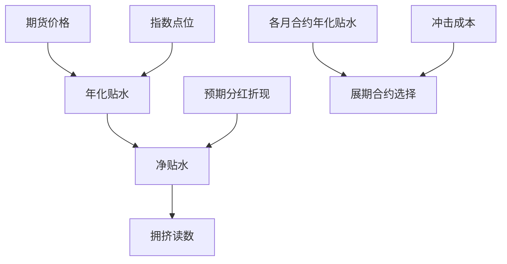

# 股指期货与贴水

A 股股指期货的长期贴水不是错误定价，而是对冲需求找不到足够多头对手时给出的出清价；把它当确定收益与把它当确定成本，犯的是同一个错误。

<footer>—— 据《中国金融期货交易所股指期货交易细则》与对冲拥挤口径整理</footer>

[上一课](/quant/gm-case-map)把全球市场的制度差异收成对照表，把环境常量显式化：策略等于公式加制度假设，制度变更日按事件日处理。深钻层由此转入中国市场：本课程写在中国把一个策略真正跑起来要过的工具关与生态关。第一件工具是股指期货。[股指期货基差与对冲成本](/quant/cn-index-basis-hedge-cost)已把对冲成本记成基差盯市、展期、保证金与冲击四项账单，[股指期货保证金与贴水](/quant/cn-index-fut-basis)已写合约要素与贴水形态。本课不重复会计，写每天要回答的实践问题：贴水读数怎么统一、分红怎么剥、展期选哪个月、贴水为什么长期不消失。后课默认已经读完本课。

## 问题

成本账单是事后的，实践是事前的。每个收盘后要做三件事：把四个品种的基差换算成可比的年化贴水；把分红预期从贴水里剥出去；为下一次展期挑合约。没有统一口径时，团队对「贴水深」各说各话：有人看当月、有人看季月，有人忘了分红季节，把二季度的日历加深当成对冲拥挤恶化，反过来把拥挤缓和当成选股超额变好。读数错了，后面的展期与预算全错。

## 方法

读数工程。统一口径：年化贴水取 $b_t=-\ln(F_{t,\tau}/S_t)/\tau$，$F$ 为期货价、$S$ 为指数点位、$\tau$ 为剩余期限。IF 与 IH 对应大盘蓝筹，IC 与 IM 对应中证 500 与 1000，四个品种各自成序列，不跨品种混谈。剥分红：二季度前后到期的合约，名义贴水里含预期分红折现，按成分股公告口径估计分红时序，扣掉后得「净贴水」，拥挤读数只看净贴水。展期决策：比较各月合约的年化贴水加冲击成本，取最优而非机械滚近月；贴水环境里远月往往更深，多锁一段深贴水等价于锁定一段对冲成本，但远月流动性差，按参与率分批执行。

## 机制

贴水为什么长期存在。对冲需求天然压在期货卖出侧：中性产品的空头腿、发行雪球的券商对冲盘（高抛低吸的对冲行为与成本结构见[雪球结构与定价](/quant/snowball-pricing)与[对冲商的障碍期权堆积与 gamma](/quant/snowball-dealer-hedging)）都在卖期货。反向套利本该把贴水拉回来，但它要买期货、融券卖出整个现货篮子，被 T+1、涨跌停与券源掐住（[T+1 与回转交易约束](/quant/cn-tplus1)），收敛通道窄而慢，贴水因此可以常年不消失。均衡位置由多头承接决定：吃贴水的多头替代资金进得越多，贴水越浅；贴水浅则对冲便宜、中性规模回升、卖压再把贴水买深，负反馈把贴水钉在一个带宽里。所以贴水是状态变量：读它的水平与变化率，比猜它的方向有用。

年化贴水要除以剩余期限，临到期时基差一点抖动都会被放大成年化读数的剧烈跳动；到期前两周应改看基差绝对值与收敛斜率，不要再看年化。

## 边界

本课不给贴水预测模型，也不把吃贴水写成无风险：多头替代承担完整的指数贝塔与保证金盯市的现金流风险。限仓、保证金比例与套保额度是政策变量，读数体系必须能容纳制度跳变。用 IC 对冲中证 800 组合这类跨品种对冲留下市值残差，属另一课的问题。交割结算价的可能操纵不在讨论范围。

## 小结

- 贴水读数统一成年化口径、四品种分列、剥除分红后再当拥挤读数。
- 展期比的是年化贴水加冲击，机械滚近月在深贴水期多付成本。
- 贴水长期存在，机制是对冲需求单边压价、反向套利通道被做空约束掐窄。
- 贴水是状态变量：水平与变化率进监控，方向不进预测。
- 出处：中金所股指期货合约与结算细则口径；成本记账见[股指期货基差与对冲成本](/quant/cn-index-basis-hedge-cost)。
