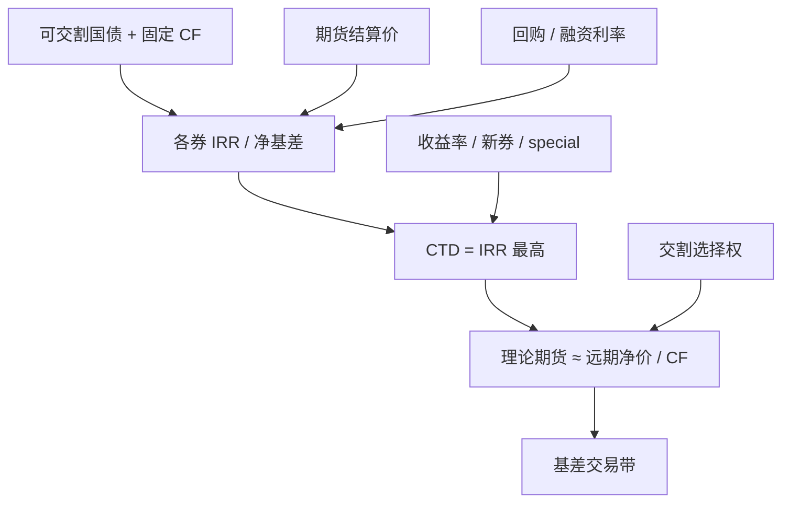

# 国债期货 CTD 与基差

国债期货的标的是票面利率为百分之三的名义标准国债。卖方有权在可交割国债中选择实际交付的券。转换因子由交易所在合约上市时公布，存续期内不随市场收益率调整。

<footer>—— 中国金融期货交易所 2 年、5 年、10 年、30 年期国债期货合约及交割细则</footer>

中金所国债期货把一篮子记账式附息国债映射成 3% 票面的名义券：TS、TF、T、TL 分别覆盖约 2 年、5 年、10 年、30 年关键期限。空头拥有交割券选择权，会交付对其最有利、通常也是净成本最低的券，即最便宜可交割券（CTD）。期货价格因此跟踪的是 CTD 经转换因子调整后的远期，而不是篮子的久期平均。基差交易与曲线交易的对象是 CTD 切换、隐含回购与交割期权，不是「国债指数的 beta」。久期工具见[久期、凸性](/quant/duration-convexity)；本篇写中金所的转换因子、CTD 与基差。

## 问题

转换因子 $\mathrm{CF}$ 是面值 1 元的可交割券，在交割月用 3% 收益率折现得到的净价。发票价格为

$$
\mathrm{发票全价} = F^{\mathrm{settle}} \times \mathrm{CF} + \mathrm{交割日应计利息}.
$$

若所有可交割券的到期收益率都恰好是 3% 且曲线平坦，则各券经 CF 调整后无差异。真实曲线既不平坦、收益率也不等于 3%，CF 在合约存续期内又固定，于是各券的交割成本不同。空头选择使

$$
\mathrm{净基差} = P_{\mathrm{dirty}} - (F\times \mathrm{CF} + AI_{\mathrm{delivery}}) - \text{持有期票息净融资}
$$

最小（或隐含回购利率最大）的券。CTD 随收益率水平、曲线斜率、券的流动性与回购是否 special 而切换。把期货当成「10 年国债」的固定久期头寸，会在 CTD 从一只券跳到另一只时，把久期缺口写成说不清的基差噪声。

可交割范围按合约到期月份首日的剩余期限划定，并对外发期限有上限（具体区间以当时合约条款为准，例如 5 年期约 4–5.25 年、10 年期约 6.5–10.25 年、2 年期约 1.5–2.25 年、30 年期为剩余期限不低于约 20 年的长券）。新发国债进入篮子、旧券滚出，会在发行日附近改变 CTD 候选。忽略发行日历的 CTD 模型，会在新券上市日出现无法解释的期货跳定价。

### 隐含回购、净基差与经验法则

隐含回购利率（IRR）是买入现券、卖出期货、持有至交割的年化融资利率。IRR 最高的券为 CTD。净基差最小与 IRR 最高在无中途付息、无融资摩擦时应指向同一只券；有中途付息、交易成本与不可交割的流动性折价时，二者可能短暂不一致，应以可执行的发票与融资报价为准。经验法则：市场收益率明显高于 3% 时，久期更长的券更易成为 CTD；明显低于 3% 时，久期更短的券更易成为 CTD。这是对 CF 在 3% 处线性化的近似，凸性、票息与 special repo 都会打破它。当前利率若长期低于 3%，短久期、高票息券成为 CTD 的概率上升，期货有效久期会短于名义 10 年。

转换因子按 3% 一次性算死，市场收益率再变也不改 CF。收益率从 3% 移到 2% 或 4%，改变的是哪只券成为 CTD，而不是 CF 表。用新收益率去「重算 CF」再定价，与交易所交割公式不一致。

## 方法

每日流程：拉取该合约可交割名单与 CF、各券净价与应计、期货结算价、融资/回购利率、距交割天数。对每只券算 IRR 与净基差，排序得到 CTD 与次 CTD。期货理论价由 CTD 的持有成本给出：现券远期净价除以 CF。基差 $B = P_{\mathrm{clean}} - F\times \mathrm{CF}$。可交易带还要加现券买卖价差、期货价差、交割费用与最廉券流动性折扣。仅当净基差低到覆盖带且现券借得到、融得到，才允许买现卖期（正向基差）或反向。

CTD 切换是期权。当两只券的 IRR 接近，空头持有交割选择权，期货相对当前 CTD 应略便宜（交割期权价值）。用当前 CTD 的持有成本去套期货而不扣选择权，会在切换频繁的区间系统性买贵或卖便宜。数值上可用一篮子远期加最优交割的树或 Monte Carlo，至少应对收益率平行移动与扭转做 CTD 扫描，而不是只盯一只券。

### 交割月、交割方式与资金

国债期货实物交割，交割在交割月按交易所细则分滚动或集中安排（以当时交割细则为准）。空头申报交割券，多头按发票付款收券。资金与债券在银行间或交易所债市结算，期货保证金在中金所盯市，两条腿的结算日与托管场所可能不同，期现对锁要管理结算日缺口。交易时间上午 9:30–11:30、下午 13:00–15:15，比现货债市与股票多出尾盘十五分钟，期货可以在现券已停报价后继续定价。无夜盘。保证金比例远低于股指，但按合约面值计，TS 面值更大，绝对占用并不小；会员加收与交割月提高保证金是常态。

## 机制

期货价格 ≈（CTD 远期净价）/ CF − 交割期权。现券上涨、CTD 不变时，期货按 $1/\mathrm{CF}$ 的比率跟。CTD 切换时，期货的有效 CF 与久期跳变，现券篮子若仍按旧 CTD 对冲，会露出曲线与凸性残差。曲线陡峭化有利于长久期券成为 CTD（在收益率高于 3% 的区域），平坦化或牛市延长期则偏向短久期券。回购 special 使某券融资成本下降、持有期收益上升，IRR 提高，可能把流动性最好的券「买成」CTD，也可能把 special 券从 CTD 里挤走——取决于 special 发生在你持有的那只还是竞争对手那只。

基差的均值回归来自交割强制对齐：到期空头必须交券、多头必须收券，基差在交割日附近被发票公式锁住。此前的回归来自期现套利资本。资本在银行间流动性分层、质押券不足时撤退，基差可以离开历史分位数而不触发可执行套利。这与股指期货类似，只是现货腿换成了具体国债与回购，而不是股票篮子。

名义标准券 3% 是 CF 的计算约定，不是对市场利率的预测。不要把「期货隐含收益率」直接当成 10 年国债收益率报价，除非已按 CTD 的剩余期限和 CF 做了映射，并声明忽略交割期权。

### 与关键期限现券的久期错配

TL 的可交割区间宽，CTD 可能在 20 年附近或更长端之间跳，期货久期波动大于 TF。用 TL 对冲 30 年现券，会在 CTD 落在 20 年时对冲不足。TS 剩余期限短、票息高，对短端资金利率更敏感。组合若用「对应关键年期期货」一对一套现券，应每日检查 CTD 久期与现券久期之比，而不是锁定合约名称。曲线策略（蝶式、斜坡）必须同时对 CTD 切换做情景，否则看起来的曲线超额只是篮子换券。

## 边界与工程取舍

不要用经验法则替代 IRR 排序。不要假设 CTD 在合约期内不变。不要忽略新券发行与篮子滚动。不要把期货尾盘十五分钟的价格，用已经收盘的现券中债估值去算「瞬时套利」而不加估值时滞。交割月保证金上调、持仓限额与交割违约处理以中金所公告为准。商业银行、保险与私募的参与资格和套保额度会改变谁能做正向基差。

容量受 CTD 现券深度与回购市场约束。报告应给出：CTD 身份的时间序列、次 CTD 的 IRR 差（交割期权的粗糙度量）、净基差可执行带的命中，以及收益率 ±25bp 平行与扭转下的 CTD 切换表。

中债估值与交易所期货可以暂时偏离可成交的银行间报价。用估值净价算出来的负基差，若询不到券或融不到钱，仍不是套利。执行应以可成交报价与回购为准。

## 小结

- 国债期货跟踪的是 CTD 经转换因子调整后的远期，不是名义期限的固定久期。
- CF 按 3% 在上市时算死；CTD 由 IRR 或净基差排序，并随曲线与发行切换。
- 基差在交割日被发票公式对齐；此前的偏离受回购、流动性与交割期权约束。
- 低于 3% 的利率环境里，短久期券更常成为 CTD，期货有效久期短于合约名称。
- 期现结算场所与期货尾盘十五分钟会造成时钟错位，估值价不是可成交价。
- 出处：中国金融期货交易所 TS/TF/T/TL 合约表、转换因子计算公式与交割细则；可交割国债名单与 CF 以交易所公布为准。
