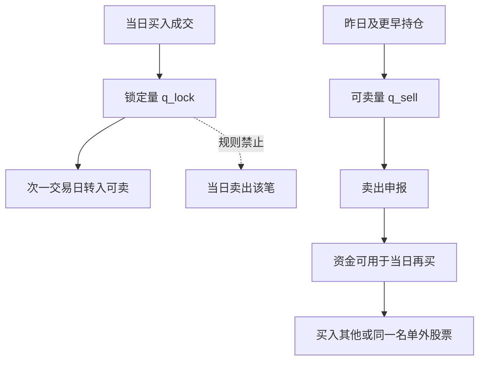

# T+1 与回转交易约束

投资者买入的证券，在交收前不得卖出，但实行回转交易的除外。证券的回转交易是指投资者买入的证券，经确认成交后，在交收前全部或部分卖出。

<footer>—— 《上海证券交易所交易规则（2026 年修订）》第 3.1.4 条；深交所交易规则有对应表述</footer>

[上一课](/quant/simulator-impact-bias)把机器学习方法课序收在模拟器冲击。本课打开中国市场微观结构。美股常说的 T+1 多指清算交收周期缩短；交易层面仍允许当日买卖同一股票。A 股的约束更硬：股票竞价交易默认**交收前回转受限**，当日买入的股票不能当日卖出。上交所《交易规则》第 3.1.4–3.1.5 条把原则与例外写死：债券 ETF、货币 ETF、黄金 ETF、商品期货 ETF、跨境 ETF 与跨境 LOF（跟踪标的本身当日回转）、权证等实行当日回转；B 股为次一交易日起回转；普通 A 股股票不在当日回转名单里。中国结算对 A 股证券交收为 T+1，与交易侧的不可回转叠加。本篇只解释公开规则如何改写库存、奖励与对冲，不讨论任何绕过交收前不得卖出的做法。它直接改写[日历与隔夜](/quant/calendar-overnight)和[交易 MDP](/quant/trading-mdp-pitfalls)里的状态。

## 问题

策略语言里的「仓位」常是一个标量 $q_t$。T+1 下至少要拆成：昨日及更早持仓形成的**可卖量** $q^{\mathrm{sell}}_t$，以及今日买入形成的**锁定量** $q^{\mathrm{lock}}_t$。卖出只能动 $q^{\mathrm{sell}}$；买入增加 $q^{\mathrm{lock}}$，到次一交易日才并入可卖。资金侧不对称：卖出所得通常可用于当日再买入（具体可用时点以会员结算与中国结算备付为准），因此「先卖后买」与「先买后卖」不是同一操作。日频反转、做市式日内回转、以及「买错了立刻平掉」在股票上不可用。问题是把这条硬约束写进回测与风控，而不是在收盘价上来回画箭头。

交收与交易要分开读。交易规则限制的是交收前卖出；结算规则决定法定所有权与资金何时完成交收。即使结算周期未来调整，只要第 3.1.4 条的交易限制仍在，日内卖出当日所买股票仍然不被主机接受。把 DTC 的 T+1 交收改革与 A 股回转限制当成同一制度，会在模拟器里放出非法动作。

### 可卖量是状态，不是收盘持仓

收盘持仓 $q^{\mathrm{sell}}+q^{\mathrm{lock}}$ 看起来已经买到，却不能用于下午的对冲或止损。早盘买入、午后信号反号，股票策略只能持有到次日，隔夜风险强制暴露。这把「日频」策略的真正风险窗口拉长到开盘到次日可卖，而不是开盘到当日收盘。涨跌停再叠加：次日若一字板，可卖权存在但没有对手盘。回测若用当日收盘平仓价计算收益，是在虚构一个规则禁止的成交。正确的第一笔可平仓价格是次一交易日的可成交价，通常从开盘集合竞价算起。

融券卖出再买回、当日回转品种、以及债券逆回购，适用各自的规则，不能从股票 T+1 类推。本篇对象是竞价交易下未列入当日回转名单的 A 股股票。例外名单以交易所现行第 3.1.5 条及后续公告为准。

## 方法

回测引擎在每笔买入成交后，把量记入 $q^{\mathrm{lock}}$，卖出订单的数量不得超过当时 $q^{\mathrm{sell}}$，超出部分废单而不是部分虚构成交。日终，$q^{\mathrm{lock}}$ 转入下一日 $q^{\mathrm{sell}}$（停牌、冻结、司法扣划等另按结算与会员规则）。信号若在 $t$ 日收盘产生，股票买入在 $t$ 日能执行，$t$ 日不能反向卖出同一笔；卖出信号只能针对已有可卖库存。执行层应把「目标仓位」翻译成「对可卖库的减仓」与「对新买额度的加仓」两条指令，避免一个目标仓位数字直接生成一买一卖。

评价收益用可执行路径：买入以可获得信号之后的集合竞价或连续竞价成交，卖出不得早于该券可卖日。隔夜收益不再是可选择的因子，而是制度强制的持有。与美股日内策略对比时，必须声明 A 股版本是「隔夜强制版」，夏普不可横比。ETF 中在第 3.1.5 条名单内的品种，可单独标记为当日回转，用于对冲工具，而不是把股票也当成可回转。

### 对冲与多腿

指数期货、期权与部分 ETF 的会话与交收与股票不同。用股指期货对冲当日买入的股票，可以减少隔夜 beta，但不能消除个股特异风险，也不是股票的回转。配对交易若两腿都是股票，开仓后当日不能同时反向平掉两腿；一腿若用期货替代，基差与涨跌停缺腿仍在，见[指数套利](/quant/index-arb)。方法是在组合层记录每条腿的可卖日历，禁止生成「当日开当日平」的股票多空来回。风控的止损价在当日对新买腿不可执行，只能降为「次日开盘可成交则减仓」，并接受缺口。

## 机制

T+1 把日内均值回复的可交易性切断。短周期反向若依赖当日平仓，纸面 IC 来自不可执行的路径。能留下的是隔夜到次日开盘的那一段，而这正是集合竞价与隔夜信息释放最剧烈的一段，见[涨跌停与集合竞价](/quant/cn-limit-auction)。于是「日频反转」在 A 股往往退化成隔夜因子或次日开盘执行的隔夜动量，名称还叫反转，机制已经变了。

资金先卖后买，使调仓在减持旧仓、买入新名单时仍可在同一日完成，只要旧仓可卖。换仓能力来自可卖库存的周转，不是来自新买股票的回转。这解释了为何高换手策略在 A 股仍能换名单，却不能对同一只股票做日内来回。容量与冲击要从「跨股票换仓」去估，不要从「同股票日内双向」去估。

北向沪深港通投资者同样不可对通股票做即日买卖，前端检查要求卖出前账户内已有证券。境外 T+0 习惯不能经港股通通道进口到 A 股股票上。

### 与交收周期、融资融券的交界

融资买入的证券作为担保物，其处置与平仓遵循《证券公司融资融券业务管理办法》及交易所实施细则，不等于恢复股票当日回转。融券卖出后买券还券的时点，也受合约与细则约束，不能写成无限制的日内空头回转。把融资融券当成 T+0 通道，既不符合管理办法对交易与担保的规定，也不属于本篇允许讨论的范围。公开规则下，股票竞价的回转名单以交易所公告为准，策略只能订阅名单，不能创造名单之外的回转。

## 边界与工程取舍

规则会修订。上交所 2026 年修订仍保留第 3.1.4 条的原则，并列举当日回转品种；回测历史必须用当时有效的名单与交收制度，而不是用今日名单回填 2010 年。ETF 纳入或移出当日回转，会突然改变对冲工具集合。B 股、存托凭证、北交所另有条文，不要与沪深 A 股股票混用一个库存状态机。

不要在研究里用收盘价减开盘价当股票的「日内可实现收益」并据此调仓。不要为了拟合美股论文而关闭 T+1。不要把结算 T+1 改革的新闻理解成交易 T+0。模拟器应在废单日志里统计「超过可卖量」的次数；若次数为零却声称有大量日内来回，引擎没有实现规则。

可卖量还受冻结、质押、司法扣划、未交收认购影响。交易规则给出的是一般原则；账户层以前端检查为准。回测至少实现交易规则这一层，实盘必须与会员柜台的持仓性质字段对齐。

## 小结

- A 股股票竞价交易默认交收前不得卖出；当日回转只适用于交易所列举的品种。
- 库存必须拆成可卖量与当日锁定量；先卖后买与先买后卖不对称。
- 日频回测用当日收盘平当日开仓，与《交易规则》第 3.1.4 条冲突。
- 强制隔夜改变短周期反转与止损的可执行路径，收益应从次日可成交价起算。
- 对冲可用其他品种的公开机制，但不能把股票写成 T+0。
- 出处：《上海证券交易所交易规则（2026 年修订）》第 3.1.4、3.1.5、2.4.2 条；深交所交易规则对应条款；中国结算 A 股交收安排。
