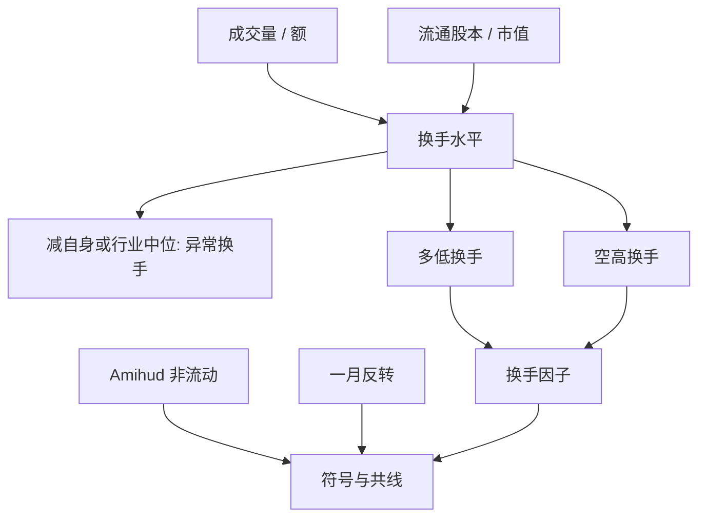

# 换手率因子

在中国，换手高的股票随后收益系统性偏低；换手度量的是投机交易的热度，而不是美股文献里那种「非流动所以补偿更高」的流动性水平。

<footer>—— 综合 Liu, Stambaugh and Yuan, Size and Value in China, JFE 2019，以及对 A 股换手与预期收益的公开实证传统</footer>

[Amihud 非流动性](/quant/liquidity-factor) 预测：难交易的股票期望收益更高。A 股最显眼的交易行为变量却常常给出**相反的符号**：换手率高的股票接下来更弱。换手是成交股数（或成交额）相对流通股本（或流通市值）的比率，高意味着交易频繁、注意力高、意见分歧大。在零售占比高、[T+1](/quant/cn-tplus1) 不能当日回转的市场里，高换手更接近过度交易与题材投机，而不是「流动性好所以溢价低」那么简单。Liu–Stambaugh–Yuan 在剔除[壳](/quant/cn-shell-premium)之后，仍把换手当作中国截面里需要单独处理的投机代理。本篇写构造、与非流动性的符号冲突、以及不能用的未来函数。

## 问题

换手有两种经济学。微观结构：换手高表示容易找到对手方，冲击小，持有成本低，期望收益可以更低——这与价差、ILLIQ 一致。行为：换手高表示投机共识或意见分歧，价格被推离基本面，随后收益为负——这与过度自信、注意力驱动买入一致。美股大盘样本里两种力量混在一起，净效应不稳定；A 股公开实证里，后一种经常占上风，尤其在小盘、高波动、非北向标的上。

因此不能把「换手因子」直接叫做流动性因子。问题是：用哪一个换手（日度、月度平均、异常换手）、在哪个宇宙、与 ILLIQ 和反转如何共线。把过去一个月日均换手排序做成多空，名字叫流动性，会在归因里把投机当成风险补偿。

### 原始换手与异常换手

原始换手有持久的截面差异：有些股票天生交易活跃。异常换手是相对自身过去中位数或相对行业、市值组的偏离，更接近「这只票这周被炒起来了」。两者预测的 horizon 不同：水平更像风格，异常更像短周期反转的近亲。必须预指定。用同一只股票的当日换手去解释当日收益，是同期相关，不是可交易预测；信号至少要用 $t-1$ 及更早的已实现换手，收盘后才能算全，执行在 $t$ 的次日开盘或 $t+1$ 收盘，视频率而定。

流通股本变更（解禁、增发）会让换手的分母跳跃。用总股本或用自由流通市值，排序会变。解禁日附近的高换手是供给事件，不是同一投机因子。构造须对股本时点对齐，并对解禁窗口单独标记。

## 方法

月度因子：在 $t$ 月末用过去 20 个交易日（或过去一个月）的日换手均值排序，剔除停牌过多、上市不足窗口、以及 LSY 意义下的最小市值组。多低换手、空高换手（若接受「高换手随后弱」的 A 股符号），价值加权，持有一个月。等权会把小盘高换手的投机腿放大，纸面更强、成本更高。与规模 2×3 交叉，避免做成第二个反转壳因子。

日度或周度：用过去 5 日异常换手，持有期更短，换手成本急剧上升，且与[短期反转](/quant/short-term-reversal)、涨跌停后的延迟发现纠缠。A 股 T+1 下，因高换手而「当天该空」的股票若当日才买入，并不能当日卖出——空头还要融券可行集。短周期换手策略的可执行路径往往是次日，IC 应在可执行收益上算。

对照：同一宇宙上的 Amihud ILLIQ 组合、一个月反转、换手。报告相关与双重排序。若换手的 α 在控制反转后消失，它只是反转的交易量版本；若仍在，才有独立的投机热度信息。Liu–Stambaugh–Yuan 的中国因子讨论里，换手与规模、价值不是同一方向，这是它被单独提出的理由。

### 量纲、停牌与涨跌停

换手率 $= $ 成交量 $/$ 流通股本，或成交额 $/$ 流通市值，两者在股价平稳时近似，拆股后应用复权股本。停牌日成交为零，若计入均值会把刚复牌的股票判成低换手；通常换手均值只在有成交的交易日上取，并要求最少交易日数。涨停封死时成交量可以很小（一字形）或很大（打开又封），换手与「热度」脱节。应把涨跌停日的换手单独标记，或计算换手时剔除锁定板日，否则高换手组会混进打开板的投机，低换手组会混进一字板。

## 机制

注意力：高换手股票出现在涨幅榜、换手榜与媒体里，散户净买入，价格短期被推高，随后反转。意见分歧：换手是分歧的实现，Miller 的卖空限制下乐观者定价，A 股融券窄，高分歧更易高估，见[融券约束](/quant/cn-short-constraint)。过度自信：交易越多越说明投资者认为自己有信息，平均而言他们没有。这些机制都指向**高换手 → 低后续收益**，与「非流动补偿」相反。

流动性补偿仍然可能存在于 ILLIQ、价差、零成交天数上，只是换手这个代理在 A 股被投机污染了。工程上应把「成本类流动性」与「活动类换手」拆成两列特征，不要合成一个「流动性得分」。北向标的与大盘蓝筹上，换手更接近机构再平衡，符号可能弱于小盘；因子应分宇宙报告，而不是全 A 等权一个 t。

### 与容量、拥挤

换手因子的空头是高换手股票，表面上流动性好、容易做空——但融券供给不一定跟着换手走，且高换手名字的借券费和召回可以很差。多头是低换手股票，冲击大、价差宽，账面溢价含不可实现的部分。Novy-Marx–Velikov 式的成本过滤会显著削薄。拥挤：换手是公开排序，主题基金与日内游资都看换手榜，信号在高关注期衰减更快。

用 $t$ 日盘中已实现换手去预测 $t$ 日收盘到 $t+1$ 的收益，看起来像「实时因子」，信息集却包含了当日已经发生的价格路径。合法做法是用 $t-1$ 收盘后锁定的换手，对 $t$ 日开盘或 $t$ 日可执行成交定价，见[未来函数](/quant/no-future-function)。

## 边界与工程取舍

不要把 A 股换手因子的负号直接写成对 Amihud（2002）的否证——对象不是同一个代理。不要在日换手、周换手、异常换手、换手波动之间搜完只留最好。不要对 ST、次新、连板股与蓝筹用同一套分位。科创板与创业板 20% 走廊下的换手分布与主板不同，见[科创板 / 创业板](/quant/star-chinext)。

风险模型可以纳入换手风格以解释协方差（高换手股票一起动），即使它的 α 过不了 [HLZ](/quant/harvey-liu-zhu) 门槛。交易账户则必须看成本后与样本外。换手对成交额口径（是否含大宗）敏感，见[大宗交易](/quant/cn-block-trade)：含大宗的换手会在减持日跳升，那是供给不是题材热度。

出处：Liu, Stambaugh and Yuan, *JFE*, 2019（中国因子与投机/换手语境）；Amihud, 2002（非流动性，符号对照）；A 股换手与预期收益的负相关是大量公开中文与英文实证的共同方向，复制须写明宇宙与滞后。

## 小结

- A 股换手率因子通常是多低换手、空高换手：高换手代理投机热度，随后收益偏低。
- 它与 Amihud 非流动性不是同一列；活动性与交易成本必须拆开。
- 构造要处理股本变动、停牌、涨跌停日的换手失真，并用滞后换手避免同期相关。
- 短周期版本与反转、涨跌停纠缠，且受 T+1 与融券约束。
- 分宇宙（剔除壳、大盘 vs 小盘）报告；等权全市场 t 值不可当作可交易证据。
- 出处：Liu, Stambaugh and Yuan, *Size and Value in China*, JFE, 2019；对照 Amihud, *Journal of Financial Markets*, 2002。
