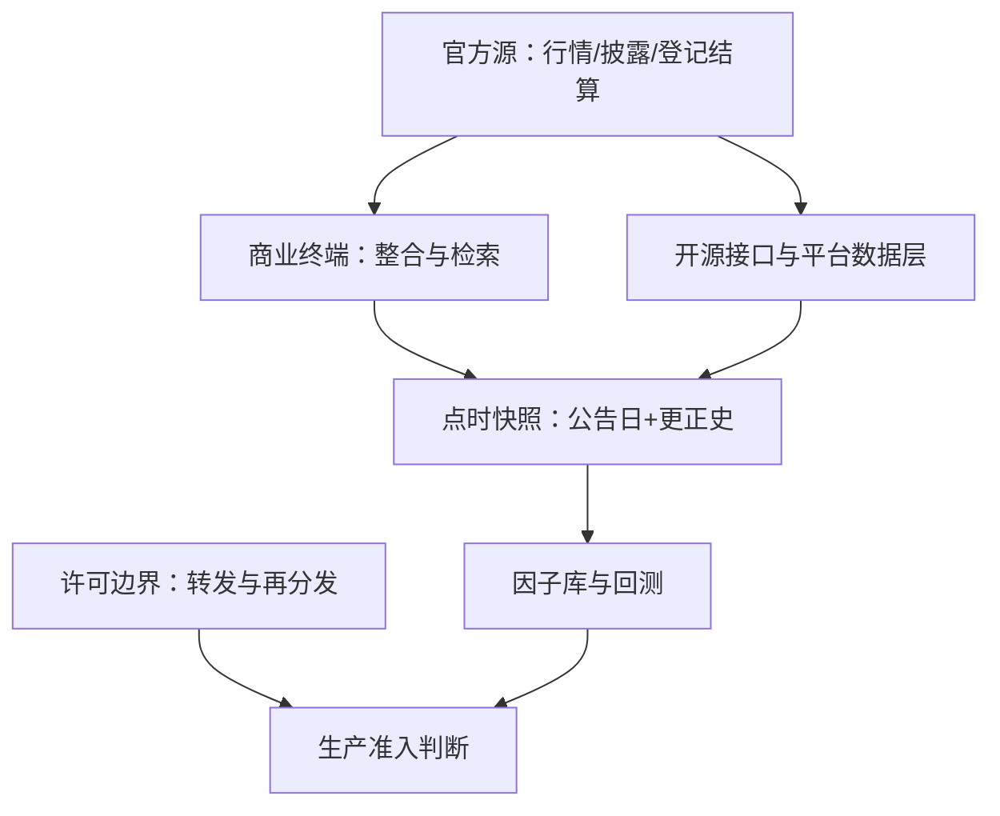

# 数据供应商对照

回测事故里最贵的两类偏差——前视与幸存者——大多能追到采购合同：没买公告日字段、没买历史成分快照，工程再好也补不回来。

<footer>—— 据交易所信息服务与信息披露制度口径整理</footer>

[上一课](/quant/cn-fee-structure)把成本预算编到换手上界；预算再准，喂进策略的数据错了就全错。[数据供应商对照](/quant/data-vendors)已写全球数据商的分层与采购逻辑，[时点基本面](/quant/point-in-time)已写时点原则。本课对照中国数据生态的特殊结构：官方源、商业终端、开源接口与量化平台各占一层，而最大的暗坑不在覆盖而在时点。

## 问题

同一个科目在三个日期上不同：报告期末、公告日、更正日；财报追溯调整后，历史数据被悄悄改写。同一只股票的复权价在不同商家的算法不同，除权日口径差直接改收益序列。指数成分的历史名单若无存档快照，用今天的成分表回测十年前就是幸存者偏差。这三件事在中国数据生态里都高发：披露的结构化程度参差、更正与追溯调整频繁，而多数商业终端默认只给「最新真相」。

## 方法

分层采购加勾稽仲裁。底层官方源打底：交易所行情（Level-1 免费、Level-2 增值付费）、法定披露文件、登记结算的持仓与股东数据。中层商业终端做整合与检索，按五个维度对照选型：覆盖、时点质量、口径（复权、行业分类、停牌处理）、许可、工程接口；财务数据必须拿到公告日与更正史两个字段。外层开源接口与量化平台承接落地与实验：研究框架的数据层如 [Microsoft Qlib](/quant/qlib-quant)，时序库如 [DolphinDB](/quant/dolphindb)。勾稽次序固定：官方披露 > 商业整合 > 开源聚合，对不上以上游为准并留差异日志。许可边界单独立项：行情转发与再分发受交易所信息服务的合同约束，直接决定哪些数据能进生产、哪些只能留在研究环境。

## 机制

生态形态是制度给的。行情是交易所特许经营的增值服务：深度行情付费、转发受限，这决定了数据成本的下限与再分发红线；披露是法定义务但颗粒度不均，商业终端的价值在整合与标准化，代价是抹平时点信息；开源接口近乎零成本，但稳定性与口径责任全在用户。三层勾稽才能既省成本又保时点正确。实践中把「更正史」当成采购的硬指标：没有它的数据库会在回测里用更正后的值，把一次业绩暴雷从历史里抹掉。

财务数据的「更正史」比「数值」贵：同一份年报，更正公告可以把关键科目改掉一个量级；采购时少要这一个字段，研究端就要多养一套人工核对流程。

## 边界

本课不做商家排名与选型推荐；许可边界以采购合同与交易所信息服务协议为准；爬虫与另类数据的采集合规不在本课范围。

## 小结

- 中国数据栈分四层：官方源打底、商业终端整合、开源接口交叉、平台层落地。
- 时点是最大暗坑：财务数据必须带公告日与更正史，成分名单要历史快照。
- 勾稽次序固定官方 > 商业 > 开源，差异留日志。
- 许可边界决定生产准入：行情转发与再分发受合同约束。
- 出处：交易所信息服务与信息披露制度口径；时点通则见[时点基本面](/quant/point-in-time)。
