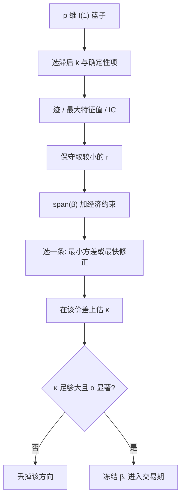

# 协整秩选择

    
迹检验给出的是「至少还有几条长期关系」的顺序决策；交易要的是一条波动能覆盖成本、样本外仍回调的价差。秩选对了只说明空间的维数，不说明你该交易空间里的哪一个方向。

<footer>—— Johansen, Journal of Economic Dynamics and Control 1988 与 Econometrica 1991；信息准则选秩见 Aznar and Salvador, Journal of Time Series Analysis, 2002 一类讨论</footer>

[上一课](/quant/kalman-spread)把状态写成价差的均衡水平或潜在 OU，可交易信号用预测步偏离；新息若仍像单位根，问题在 $\beta$ 或协整破裂，不是把均值再平滑一次。缺口是篮子的秩。两资产配对默认 $r=1$ 或 $0$，三只以上 $r$ 必须显式选择：$r=0$ 不该做水平组合，$r$ 过大则把近单位根方向当成可交易价差。本课写秩作为交易规格如何选。不重写 Kalman 的 $Q,R$。后课对冲比断裂默认已经读完：顺序检验不是后验概率。

## 问题

$p$ 维 $I(1)$ 系统的协整秩 $r$ 是 $\Pi=\alpha\beta'$ 的列空间维数。$r$ 选小了，真实平稳组合被留在差分里，你可能把一条可交易价差扔掉，或更糟：在 $r=0$ 时仍用水平回归硬造价差。$r$ 选大了，空间里混进弱根，对应的「价差」半衰期极长、接近随机游走，[OU](/quant/ou-spread) 的 $\kappa$ 估出来接近 0 却仍被拿去开仓。Johansen 迹检验从 $r_0=0$ 往上，第一次不拒绝当作 $\hat r$。有限样本里滞后阶、确定性项、厚尾都会改尺寸，两个检验还经常给出不同的 $\hat r$。

交易问题比检验问题更窄。你通常只想要 **一条** 组合，不是 $r$ 条同时开仓。即便 $\hat r=2$，也要在平面里再选方向：最小方差、最快误差修正、或与成本、流动性对齐。秩选择回答的是「空间有几维」，组合选择回答的是「这一维怎么张成」。把软件打印的「协整方程 1」当头号信号，是把特征根排序误读成夏普排序。

### 顺序检验不是后验概率

迹的 $H_0:r\le r_0$ 是嵌套的。渐近水平是这条链上的，不是 $P(r=\hat r\mid\mathrm{data})$。第一次不拒绝之后停下来，并不意味着更大的 $r$ 被证伪得很强；功效不足时会系统性偏小。最大特征值一次只加一根，对「恰好多一条」更敏感，对「还剩好几条弱根」更钝。预先规定：主规则用迹、最大特征值作稳健性；两者差 1 时取较小的 $r$——交易上少一条假价差，比多一条近单位根更安全。不要看哪个 $p$ 值更漂亮就取哪个。

确定性项的 case 必须先于秩选定死。价差若应在某水平摆动，把常数限制在协整内；让每条腿独立漂移，迹会更容易报出更高的 $r$，因为趋势被水平项吸收，看起来像多了一条「关系」。那条关系往往不可交易。

## 方法

**检验路径。** 先用信息准则选 VAR 滞后 $k$，再在预选的 Johansen case 下跑迹与最大特征值，报告 $r_0=0,\ldots,p-1$ 的统计量与临界值，而不是只报「软件选了 $r=2$」。邻近 $k$ 上 $\hat r$ 若跳，说明识别不稳，应缩短篮子或先降维。小样本用 Bartlett 修正或 bootstrap 临界值，日频金融的名义 5% 不可当真。

**信息准则。** Aznar–Salvador 等把秩选写成惩罚似然：更大的 $r$ 改善拟合，但惩罚参数个数。准则相对顺序检验更少「第一次不拒绝」的路径依赖，但对惩罚系数敏感，同样会在 $N/T$ 大时乱选。实务上把它当交叉验证：检验给出 $\hat r_{\mathrm{LR}}$，准则给出 $\hat r_{\mathrm{IC}}$，不一致则取小者，并降低杠杆。不要把准则最小的 $r$ 直接映射成开仓条数。

**从秩到一条价差。** 给定 $\hat r$，施加经济约束（美元中性、对基准回归、排除某条不可空的腿）后得到 $\hat\beta$。若 $\hat r>1$，在约束空间里解一个二次型：例如最小化 $\beta'\hat\Omega\beta$ 且 $\beta$ 在 $\hat\beta$ 的列空间中，得到最低方差平稳组合；或最大化 $\alpha$ 方向上的调整速度。这是识别，不是再做一次迹检验。约束被似然比拒绝时，说明「你想交易的中性篮子不在协整空间」——仍可能有短持有回归，但不应引用 Johansen 的 $p$ 值当许可。

$$
\hat r=\min\bigl(\hat r_{\mathrm{trace}},\hat r_{\mathrm{maxeig}},\hat r_{\mathrm{IC}}\bigr)
\quad\text{再在 } \mathrm{span}(\hat\beta)\text{ 里选一条可执行方向。}
$$

取小不是定理，是交易上的保守约定，应在文档里写死。

### 滚动秩与形成期冻结

全样本 $\hat r$ 含未来。可复制的做法与 GGR 类似：形成期估秩与 $\beta$，交易期冻结。滚动重估秩会使篮子维数跳，组合换手无经济含义——昨天 $r=1$ 做一对，今天 $r=2$ 突然多一条正交腿。若必须跟踪结构变化，应把「秩变化」当成 [对冲比断裂](/quant/hedge-ratio-break) 一类的事件：先平仓，再在新形成期重估，而不是让仓位在维数跳变时连续变形。

高维时先降维再 Johansen：行业指数、前几个主成分、或流动性最好的 $p\le 5$ 只。$p=10$、$T=250$ 的迹几乎不可用。这与 [篮子 PCA 残差](/quant/pca-residual-basket) 的分工是：PCA 不声称 $I(0)$，Johansen 声称但维数必须小。

$\alpha$ 接近 0 的关系在样本内可以像协整（残差像平稳），预测上几乎不回调。选秩之后必须看载荷：没有误差修正的「平稳组合」是统计假象或极慢的根，不该占用名义。

## 机制

高斯 VAR 的似然只通过残差协方差与 $\Pi$ 的秩依赖数据。把 $r$ 提高，是允许更多水平通道进入差分的条件均值，拟合必然变好。惩罚或临界值是在拦「把噪声根当成通道」。金融日频里噪声根很多：短期相关、异方差、跳跃都会抬高小特征根，使迹偏爱更大的 $r$。因此交易用的秩应系统性小于检验在名义 5% 上给出的秩——你要的是强通道，不是全部不能拒绝的通道。

机制上，秩还决定对冲比的自由度。$r=1$ 时 $\beta$ 只识别到一条线（再加规范化）；$r=2$ 时有一个平面的等价类，未约束的两条特征向量会在样本间旋转，换手巨大。这就是为什么 $\hat r>1$ 时必须加经济约束或二次型选择：不是为了好看，是为了让 $\beta$ 可复制。没有这一步，篮子 PCA 往往比未约束 Johansen 更稳，因为主成分有正交和方差排序，尽管它们不是协整向量。

### 过拟合 $r$ 如何表现为假 alpha

样本内 $r$ 偏大，会多出一条「价差」在形成期来回摆，Z-score 频繁触发，夏普虚高。样本外该方向继续像单位根，开仓后单边走扩，时间止损在最宽处成交。这与协整破裂不同：破裂是真关系断了；过拟合秩是关系从来不够强。诊断是形成期 $\hat\kappa$ 已经很小、或残差 ADF 只在估计的 $\beta$ 上勉强拒绝。对这种方向，正确动作是丢掉，而不是加宽阈值硬做。

## 边界与工程取舍

不要在未固定 $k$ 与确定性项之前比较不同篮子的 $\hat r$。不要把 $p$ 只股票的 $\hat r=3$ 当成三个独立策略同时加杠杆——估计误差相关。不要用全样本迹给交易期背书。厚尾与结构断裂使检验过拒或乱跳，应分割样本；前半 $r=1$、后半 $r=0$ 时，合并的 $\hat r$ 没有交易含义。

与 Engle–Granger 的分工：两资产、要报告一个对冲比，用两步，$r$ 不是选择变量。多腿、要约束、要问有几条长期关系，用 Johansen，然后用本篇的保守规则落到一条可执行价差。指数套利还要处理成分股更换，秩在调仓日应视为未知，先平再估。A 股停牌会使某条腿的水平冻结，特征根扭曲，形成期必须剔除或插值规则事先写死。

Johansen（1991）的渐近是 $T\to\infty$、阶数正确、新息高斯 iid。把 $\hat r$ 写成「市场承认有 $r$ 条套利关系」是把检验当成了定价理论。秩是统计维数，套利还要成本、借券与同步成交。

## 小结

- 协整秩是空间维数，不是开仓条数；$\hat r>1$ 时必须在空间里再选一条可执行方向。
- 迹与最大特征值、信息准则不一致时，交易上取较小的 $r$，少做近单位根。
- 形成期估秩、交易期冻结；滚动让 $r$ 跳变应视为事件，先平仓再重估。
- 过拟合 $r$ 会在样本内制造假回归、样本外单边走扩，与协整破裂不是同一诊断。
- 出处：Johansen, 1988/1991；秩的信息准则见 Aznar and Salvador, 2002；检验细节见 [Johansen](/quant/johansen)。
