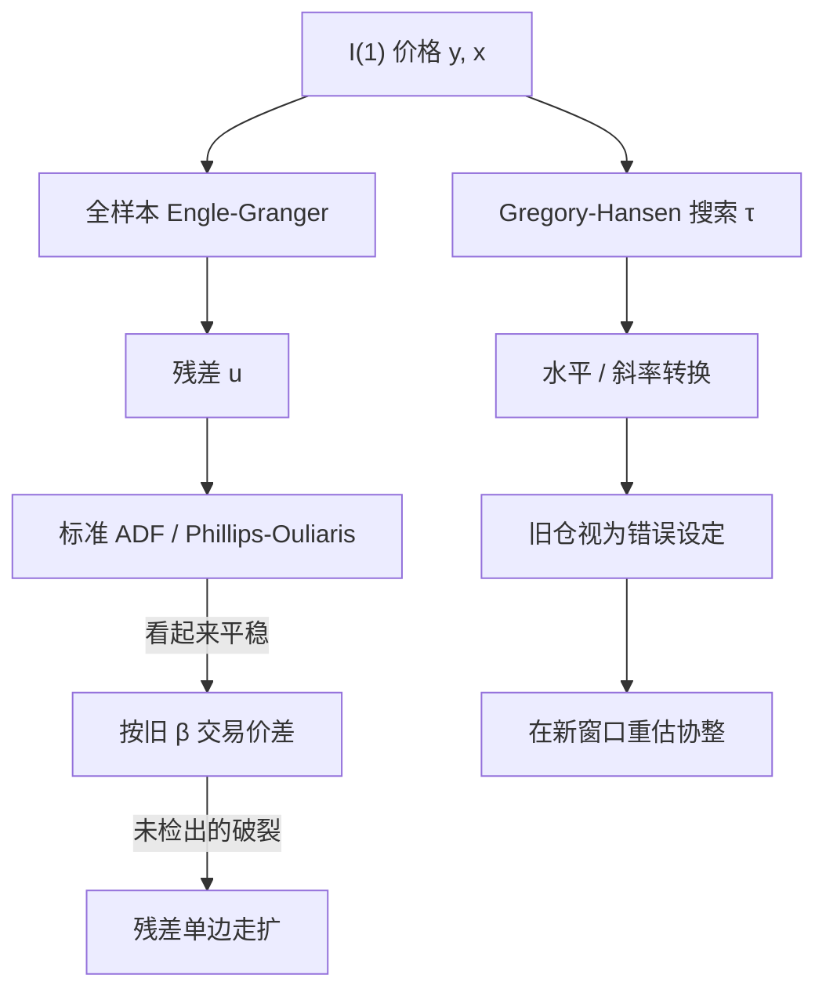

# 协整破裂

    
若协整关系本身会在未知时点发生水平或斜率转换，标准残差单位根检验会把「带断裂的协整」误判成「根本没有协整」。

    <footer>—— Gregory & Hansen, Residual-based Tests for Cointegration in Models with Regime Shifts, Journal of Econometrics, 1996</footer>

配对与统计套利常把两只（或多只）价格当成一个协整系统：价差是平稳的，偏离会回到误差修正项所描述的均衡。Engle 与 Granger 1987 年把这一结构写成残差平稳加误差修正；Johansen 把它推进到向量系统。真正会让策略穿仓的，往往不是「从来没有协整」，而是曾经有、后来断了。Gregory 与 Hansen 1996 年的工作正是针对未知时点的机制转换：水平漂移、趋势转换、或连斜率一起换。检验与交易是两件事——能检出断裂，并不等于你能在断裂发生的那几天按旧残差去平仓而不付出冲击。

## 问题

设对数价格 $y_t$、$x_t$ 都是 I(1)。Engle–Granger 的零假设是「无协整」：残差 $\hat{u}_t=y_t-\hat\alpha-\hat\beta x_t$ 仍是单位根。若真实关系在 $t=\tau$ 处从 $( \alpha_1,\beta_1 )$ 跳到 $( \alpha_2,\beta_2 )$，全样本一条直线拟合会把两段均衡揉成一条过宽的带，残差看起来像随机游走。ADF 或 Phillips–Ouliaris 于是拒绝不了「无协整」，或者更糟：样本前半段显著、你已经开仓，后半段系数变了，残差朝一个方向走、再也不回来。

配对交易里这表现为「价差的历史标准差」突然失效。公司行为（分拆、增发、指数调入调出）、行业监管、会计口径、以及 2008、2020 这类宏观机制转换，都会让 $\beta$ 不再是同一个数。问题不是要不要协整，而是：在未知断裂下，残差平稳性检验的势会塌掉，而交易规则却仍把旧 $\beta$ 当成均衡。

### 水平漂移、趋势与机制转换

Gregory–Hansen 把备择写成三类。水平漂移（level shift）：截距在 $\tau$ 处跳一下，$\beta$ 不变，像一只股票除权或基准利率台阶。趋势转换：确定性趋势的斜率也变。机制转换（regime shift）：截距与斜率都变，这是配对里最常见、也最伤的一种——对冲比本身换了。检验统计量是在可能的断裂日期上取 inf 的残差 ADF（或 $Z_t$、$Z_\alpha$），临界值比标准 Engle–Granger 更宽，因为搜索断裂本身消耗了自由度。

「价差 Z-score 到 2 就开仓」默认协整向量在形成期内不变。Gregory–Hansen 要问的是：形成期内部是否已经发生过一次水平或斜率转换。若发生过，历史标准差被两段制度拉大，阈值看起来很保守，实则对当前制度过松。

## 方法

实务上不要只用全样本 EG。至少做三层。第一层：滚动窗口 Engle–Granger 或 Johansen，看 $\hat\beta$ 与残差半衰期是否稳定。第二层：在候选窗口上跑 Gregory–Hansen 的 ADF\*、$Z_t^\ast$，并报告估计的 $\hat\tau$。第三层：把 $\hat\tau$ 附近当成不可交易区间——不是把断裂日当天的残差当成「更大的 alpha」。Hansen 1992 年对 I(1) 回归参数不稳定性的检验、Bai–Perron 的多断裂估计，可以作辅助，但协整残差的单位根零假设与普通回归的参数稳定性零假设不是同一个检验。

误差修正模型在断裂后必须重估。旧的

$$
\Delta y_t=\lambda(y_{t-1}-\alpha-\beta x_{t-1})+\cdots
$$

中，$\lambda$ 的符号与幅度只在旧均衡附近有意义。断裂后若仍用旧 $(\alpha,\beta)$，误差修正项会变成一个带漂移的错误信号，看起来像「价差还会回归」，其实是在用错误的原点。Johansen 系统在确定性项带断裂时也需要 Hansen 或 Johansen–Mosconi–Nielsen 一类设定，不能把 rank 检验的 p 值直接当成交易许可。

### 从检验到仓位：确认滞后

检出断裂有滞后。inf 型统计量要在一个修剪区间（常见是样本的 15%–85%）上搜索，$\hat\tau$ 的置信带往往有好几周。交易上这意味着：当你在统计上「确认」破裂时，旧仓位可能已经沿着错误残差走出很远。因此规则应是预先规定的：残差突破形成期若干倍标准差且滚动 $\beta$ 的置信区间不再覆盖旧点，即减仓或平仓，而不是等论文里的 ADF\* 过临界值。后者是事后诊断，不是盘中触发器。

把 Gregory–Hansen 的临界值表直接拿来当日内配对的停损线，是把渐近检验误当成滤波器。日频、周频上它有用；tick 上价格是带微观结构噪声的，单位根与协整的渐近理论要对 [噪声](/quant/microstructure-noise) 另作处理。

## 机制

协整破裂伤策略的渠道有三条。识别错误：你交易的不是平稳价差，而是一段错误设定的 I(1) 残差，期望回归时间无限。拥挤平仓：同一对名字被许多账户用相近的 $\beta$ 对冲，断裂日大家同时认错，价差的一次性跳跃伴有流动性真空，见[因子拥挤](/quant/factor-crowding) 在统计套利层的同类现象。样本内过拟合：在全样本上挑「看起来协整」的对，等价于对断裂点做了隐式选择，伪平稳的对在样本外会集中爆炸。

误差修正速度 $\lambda$ 本身也会变。危机里相关结构向 1 塌缩，$\beta$ 趋近于 1 但残差波动变大，半衰期估计会系统性偏短——你以为两天能回归，实际是共同因子主导下的假回归。Avellaneda–Lee 式的残差 OU 假设与协整是近亲：OU 的均值一旦漂移，Z-score 开仓就变成在错误的原点上加仓。

### 为何「再等等会回归」特别危险

I(1) 残差的局部路径可以像平稳过程一样走一段。这会诱使账户用时间止损的反面——「还没到持有期终点，再拿着」。Gregory–Hansen 的备择明确允许新均衡存在，但新均衡的位置对旧仓位是一笔已实现亏损，不是期权。若新 $\beta$ 对应基本面的永久变化（业务分拆、指数权重永久上调），期望回归为零。容量在这里是非线性的：小账户或许能在确认后按新协整再开；大账户的平仓本身就是把残差推得更远的冲击。

## 边界与工程取舍

检验的势在断裂靠近样本两端时很弱，修剪参数不是免费的。多断裂比单断裂更符合 2010 年代之后的市场，但多重搜索会进一步抬高临界值，小样本日频配对（一年约 250 点）很容易什么都检不出，却仍会亏钱。A 股还要处理涨跌停与停牌造成的伪断裂：价格冻结几天再跳开，残差 ADF 会被几个点主导。

成本与可交易性。断裂前后买卖价差往往同时变宽，按旧价差估算的「回归利润」在冲击后不再覆盖往返成本。借券失败、成份股权重调整日的一揽子交易，都会让 $\beta$ 在你无法成交的时点跳变。不要把「检出协整」写成可套利定理：无摩擦下的误差修正期望，减去[有效价差](/quant/effective-realized-spread)与冲击之后，许多对的净期望为负。策略文档里应同时报告：无断裂子样本的残差半衰期、断裂窗口的最大不利偏移、以及假设冲击为 ADV 某比例时的容量上限。

Engle–Granger 与 Johansen 给出的是统计关系，不是法偿的收敛承诺。指数套利、ETF 申赎有制度上的收敛机制；普通股票对没有。把后者写成前者，是类别错误。

## 小结

- 协整破裂是未知时点的水平或斜率转换；全样本残差单位根检验会把带断裂的协整误判为无协整，或让旧 $\beta$ 在断裂后继续当均衡。
- Gregory–Hansen（1996）用 inf 型残差检验覆盖水平漂移、趋势转换与机制转换；临界值宽于 Engle–Granger，且 $\hat\tau$ 有确认滞后。
- 交易规则应把滚动 $\beta$ 失稳与残差单边走扩当作减仓触发，而不是把 ADF\* 当盘中信号。
- 拥挤平仓、价差走阔与冲击使断裂窗口的账面回归不可当作期望利润。
- 股票对没有指数套利那种制度收敛；新均衡可以永久偏离旧仓位。
- 出处：Gregory and Hansen, *Journal of Econometrics*, 1996；同作者 *Oxford Bulletin of Economics and Statistics*, 1996；Engle and Granger, *Econometrica*, 1987；Hansen, *Journal of Business & Economic Statistics*, 1992。
