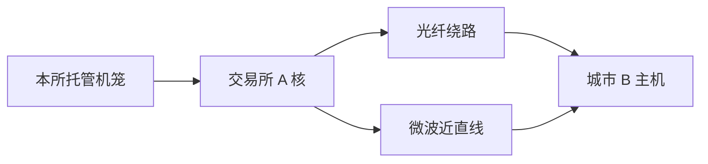

# 主机托管与微波

把服务器放进交易所机房，买的是到撮合核的对称距离；微波把城际路径从光纤的弯路改成近直线。两者改变的是相对延迟，不是优先规则本身。

<footer>—— Laughlin, Aguirre and Grundfest, Information Transmission Between Financial Markets in Chicago and New York, The Financial Review, 2014；Budish, Cramton and Shim, QJE, 2015；对照 SEC 对主机托管公平接入的讨论</footer>

[上一课](/quant/snapshot-incremental-feed)声明了行情通道。本课的缺口是**报文在物理层走哪条路**：主机托管（colocation）把竞速场从城市搬进机笼，微波（及毫米波、自由空间光）把芝加哥–纽约一类路径的时间下限从光纤折射率与绕路改写为近乎直线光速。Budish 等人把连续簿上的速度竞争写成军备竞赛；Laughlin、Aguirre 与 Grundfest（2014）测量城际信息传播。本课写相对延迟如何进入研究声明，不写如何建设或租用一条抢跑链路。A 股对照见[托管整改](/quant/cn-colocation-rectify)：公平接入是约束，不是产品差异化菜单。

## 问题

时间优先在核入口裁决。核之前的每一跳——光纤长度、交换机、跨城中继——都在给不同客户不同的「到达时刻」。托管的制度承诺通常是：同一机房同等机笼、同等线长、同等端口，使相对延迟的差小于一个可公布的上限。问题是承诺的边界：跨城的另一所、SIP 汇总点、期货与股票不在同一园区时，托管并不能把全国时钟收成一台。研究跨所领先滞后，必须声明各腿是否托管、是否微波，否则铅滞后里混进了电缆。

微波的物理：光纤沿铁路公路走，几何路径长于大圆；玻璃折射率使传播慢于真空光速。微波塔近直线、近空气光速，城际可以快若干毫秒。这改变指数期货与 ETF 之间的信息到达顺序，不改变本所 FIFO。把「微波 alpha」写进因子库，其实是在写一条时变的通讯技术路径，路径一变，样本外立即失效。

### 公平接入与「同等线长」不是零延迟

托管费买的是分布的对称，不是绝对零。交换机仍有排队，网卡仍有抖动，邻居流量仍能造成微突发。交易所公布的延迟数字往往是中位或最佳，研究要用尾部：99 分位才打进核的入队。A 股程序化细则要求会员提供交易单元与托管时遵循公平原则，不得为程序化投资者提供特殊便利；把境外「付费买更短线」的故事直接套到沪深股票竞价，与公开规则不符。

芝加哥 CME 与纽约 Nasdaq 园区之间的路径是经典测量对象。A 股对应的是上交所与中金所、深市与沪市之间的光纤，以及国际投资者经港股通的额外跳数。数字不同，要声明的对象相同：哪两台时钟、哪两种物理介质。

## 方法

延迟预算表按跳填写：策略主机 → 园区交换机 → 网关 → 撮合核；行情反向再走一遍。每跳标注介质（光纤/微波/本地铜缆）、是否托管、是否共享交换机。回测若假设「信号与成交同一瞬间」，等于删掉这张表。跨市场事件研究：用两所官方时间戳（需先经后课 PTP 校准）估计信息领先，再单独报告传输层可解释的部分。不能解释的残差才可能是经济领先；把电缆当 alpha 会高估发现能力。

比较研究应固定产品、固定日期、变的是接入方式：托管 vs 城外、光纤 vs 微波。结果报告的是到达时间分布，不是夏普。容量与费用：托管机笼、交割端口、微波租用是固定成本，进入[实盘容量](/quant/live-capacity-estimate)的成本函数，而不是进入因子 IC。

### 相对延迟会改写观测到的「毒性」

同一笔主动单，慢行情用户看见的 BBO 已过时，其限价单更容易被扫，表面上「被选中」。这是信息到达差，不必是对手有更强的私人信息。计量上应把接入类型当账户协变量，或至少当样本分层，否则[订单流毒性](/quant/toxic-flow)会把基础设施差异写成逆向选择。

## 机制

连续 LOB 把无穷小时间差变成排队权。物理层把时间差变成可购买的输入。军备竞赛的均衡是：相对延迟被压到技术下限，绝对福利未必增加——这是 Budish 等建议频繁集合竞价的动机。托管对称化本所内部；微波改变所与所之间。两者都不改核内优先公式，只改谁的报文先成为该公式的输入。

行情与订单若走不同介质，会出现「行情已到、订单通道更慢」或反向。做市策略的报价更新与撤单必须按更慢的那条腿预算，否则你在用快行情决定一张慢撤单，等于把过时报价留在簿上。这是风险，不是优化空间；本课到此停止。

## 边界

不提供链路勘察、租塔、或利用非对称接入损害其他投资者的方案。监管对公平接入、程序化托管的限制以现行公开规则为准。卫星、海底光缆、跨境互连有另外的时间尺度，不能用芝加哥–纽约微波的毫秒数去填。

## 小结

- 托管对称化本所相对延迟；微波改写城际信息到达，二者都不改核内 FIFO。
- 研究必须声明接入与介质，否则领先滞后与毒性混进电缆。
- A 股托管受公平接入与程序化规则约束，不能按境外付费抢跑来建模。
- 出处：Laughlin, Aguirre and Grundfest, *The Financial Review*, 2014；Budish, Cramton and Shim, *QJE*, 2015。
