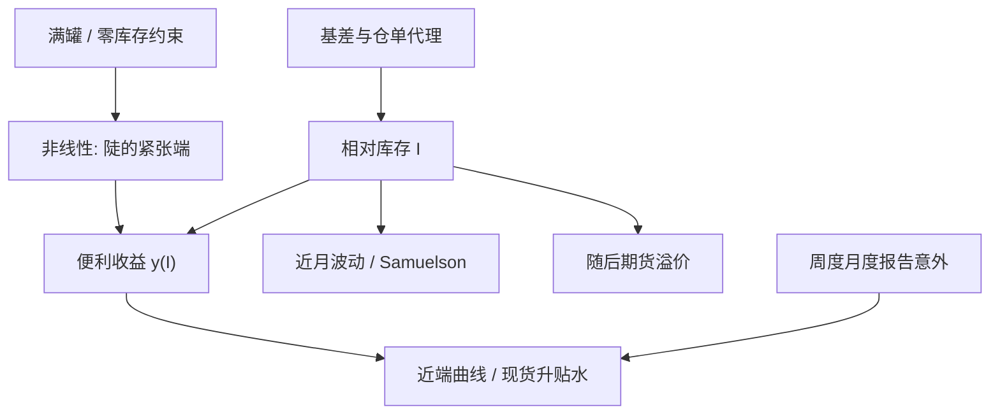

# 库存与曲线

现货升水是低库存的市场语言；曲线在紧张端变陡、波动在近月放大，都是同一条仓储供给曲线的不同投影。

<footer>—— Working, The Theory of Price of Storage, AER, 1949；竞争性仓储与价格非线性见 Deaton & Laroque, Review of Economic Studies, 1992；库存与溢价见 Gorton, Hayashi & Rouwenhorst, Review of Finance, 2013</footer>

商品期货曲线不是利率曲线的彩色复印。利率远期由无套利折现钉住；商品远期还要穿过仓储与现货可得性。Working（1949）给出最耐用的图：库存越高，现货相对远期越贴水；库存越低，现货升水越大，关系在低库存端更陡。Deaton 与 Laroque（1992, 1996）把竞争性仓储写成不能卖空的库存约束，解释价格的偏态与波动集群。Gorton、Hayashi 与 Rouwenhorst（2013）用三十一品种的实物库存证明：便利收益是库存的递减非线性函数，基差与既往收益能代理库存并预测期货溢价。本篇把**可观测库存**放到曲线与交易的中间，而不是把 backwardation 当成一个抽象标签。与 [商品便利收益](/quant/convenience-yield) 的差别是：那篇定义 $y$，这篇处理 $I$ 的测量、滞后与在曲线各段上的映射。

## 问题

库存看起来是数量，实际是一套定义。原油有商业库存与战略储备、有库欣与全球水上浮仓；农产品有农场库存、仓库库存与「隐形」渠道库存；金属有交易所仓单与场外库存。报告日不同、口径修订、季节调整，使 $I_t$ 与交易员脑中的「紧不紧」可以错位。用错误地点的库存去解释全球基准曲线，会得到稳定的伪关系。问题是选择与曲线交割机制匹配的库存：NYMEX WTI 先看库欣，CBOT 玉米看交割地仓单与 USDA 报告，LME 铜看取消仓单与区域溢价。

第二层是频率。曲线每日动，许多库存周度或月度。日度交易不得不用代理：基差本身、现货升贴水、近月波动、运费、仓单变化。Gorton 等人强调这些价格信号反映库存状态——用价格代理库存去做收益预测，在逻辑上不是循环，因为预测的是**未来超额收益**，而不是再预测当前基差。但若你的交易就是交易基差，再用基差当库存代理，就变成同义反复。

### Working 曲线的非线性

把基差对库存水平做线性回归，在高库存区往往平坦、在低库存区陡峭。线性模型会低估紧张期的曲线响应，高估「再多一点库存也无所谓」的区域。这与期权的凸性相同：仓储是对短缺的看涨期权，Delta 在实值区变大。Pindyck（2001）把现货、远期、库存与波动写成联合动态：库存低时现货波动上升，Samuelson 效应（近月比远月更吵）加强。风险系统若用平行移动去压整条商品曲线，等于假设 $u$、$y$ 与库存无关，紧张期的 P&L 解释会失败。

交易所仓单可以因为注销去交割而「下降」，现货并未离开系统，只是从仓单统计走进了厂库。把注销仓单当消耗，会误报紧张。应同时看注销、在途与区域升贴水。

## 方法

状态变量优先用**相对库存**：对五年同期均值或对仓储容量的占用率，而不是绝对桶数。农业必须做季节调整，否则每年收获都会被当成一次「供给冲击」，见 [季节性展期](/quant/seasonal-roll)。把相对库存分位映射到曲线：

- 低分位：近端 backwardation 或现货升水，近月波动高，展期对多头有利；
- 中分位：曲线由 $r+u$ 主导，弱 contango；
- 高分位：仓储约束（罐满、船位），远月可以出现超常 contango，现货贴水受仓储费上限制约。

Gorton、Hayashi 与 Rouwenhorst 的两个检验可直接做成研究流程：用滞后库存水平回归随后的期货超额收益；按库存分位排序组合。他们还检验商业与非商业持仓，发现持仓不提供超出库存与价格信号的预测——复制时应报告这一「赛马」，避免把 CFTC 持仓当默认状态变量。

跨品种相对库存驱动 [跨品种价差](/quant/intercommodity-spread)：汽油库存低、原油库存高，裂解应强。只看单一库存会漏掉加工约束。

### 从库存到对冲比

曲线不同区段对库存冲击的 beta 不同。近月合约对库欣库存的 EIA 周度意外敏感，远月更多反映全球供给与需求预期。关键利率式的做法是：把曲线分成近端、腹、远端，分别回归库存意外与宏观意外，得到分桶 01。对冲近端紧张应用近月与现货升贴水工具，而不是用远月互换「因为流动性好」。这与利率的 [关键利率久期](/quant/key-rate-duration) 同构，状态变量从期限换成了库存。

## 机制

竞争性仓储者比较「今天卖现货」与「存起来、卖远期」。均衡时，库存的边际持有成本（含资金、仓储、损耗）等于预期现货升值加上便利。不能卖空库存意味着：便宜的现货可以吸入仓储，昂贵的短缺无法通过负库存创造出来，只能靠价格上涨与需求毁灭。因此价格在低库存有尖峰、在高库存有软地板（地板仍被仓储费与质量下降穿刺）。Deaton–Laroque 的模拟与农产品年度数据匹配的是这种非线性，而不是线性 AR。曲线是该均衡在不同到期上的投影：近端看见今天的 $I$，远端看见补库与新作预期。

金融化改变谁持有**期货**，不自动改变谁持有**库存**。若指数资金持续做多近月，可以把 $F$ 相对 $S$ 抬高，反演的 $y$ 下降，看起来像「库存没那么紧」。这是金融需求，应与实物库存分列。Gorton 与 Rouwenhorst（2006）把商品期货当成资产类别时，超额来自风险溢价与展期，前提仍是期货与库存通过仓储相连；当连接被挤仓或交割故障打断（负油价那种极限），库存—曲线映射暂时作废。

凯恩斯正常 backwardation 预测「净套保空头 → 期货低于期望现货」。库存理论预测「低库存 → 高便利 → 曲线近端升水，且随后超额往往更高」。二者可同时成立，但 Gorton–Hayashi–Rouwenhorst 的赛马把预测权给了库存这一边。

### 报告日与测量误差

EIA、API、USDA WASDE、LME 仓单，都是带噪声的测量。意外相对的是市场隐含库存（可从曲线反演），不是相对上次公布。若曲线已定价一次大幅去库，公布「符合预期的去库」不应再推动近月。把公布值对滞后公布值的差分当因子，会把预期内的季节走库当成 alpha。正确的事件研究用公布减调查中位数，再看近端曲线的即时反应。

## 边界与工程取舍

战略储备释放、出口禁令、管道出险，使公开商业库存与真实可获得库存脱节。浮仓与保税区在某些品种上可以大于交易所库存。新兴市场农产品的官方库存质量参差，用美国库存去交易全球小麦曲线会错配。电、天气、运费没有可比较的库存状态，不应塞进同一张 Working 图。

回测切忌用修订后的库存序列在过去做决策。美国库存常有修订，实时交易只能用初次公布。曲线一侧必须用当时的合约价格，不能用主连连续行情，否则换月跳空会被当成库存冲击。满罐约束是硬的：高库存端的 contango 可以突然被仓储费与强制抛售主导，线性外推「再累库基差再弱」会在物理极限处翻车。

库存是缓慢状态，不是每日 alpha 信号。日度交易应交易**库存意外**与**曲线相对该状态是否错价**；把库存分位当成每天翻转的 z-score，会在报告间歇期反复挨打。

## 小结

- Working 曲线：库存与现货升水反向，且在低库存端非线性变陡；这是仓储供给，不是装饰性相关。
- Deaton–Laroque 说明不能卖空库存如何产生偏态与波动集群；Pindyck 把波动与曲线放进同一动态。
- Gorton、Hayashi 与 Rouwenhorst（2013）验证 $y(I)$ 与「库存预测溢价、持仓不额外预测」。
- 测量必须匹配交割地点与实时口径；价格代理库存只在预测未来收益时合法，不能用来解释当前基差本身。
- 金融持仓冲击与实物库存应分列；极限仓储失效时映射暂停。
- 出处：Working, *AER*, 1949；Deaton and Laroque, *Review of Economic Studies*, 1992 与 *JPE*, 1996；Pindyck, *The Energy Journal*, 2001；Gorton, Hayashi and Rouwenhorst, *Review of Finance*, 2013；Gorton and Rouwenhorst, *FAJ*, 2006。
