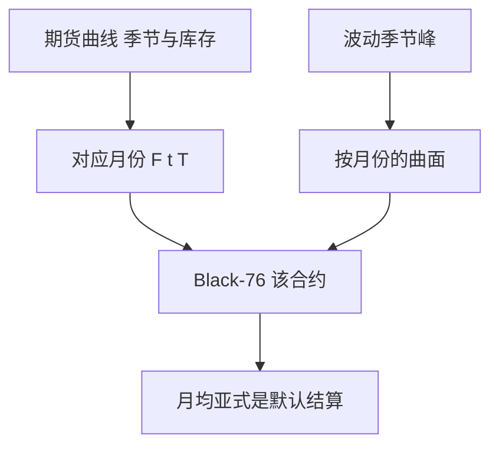

# 商品期权与季节性

商品期权写在期货合约上，不是写在一个永久现货 GBM 上；季节性出现在远期曲线的形状与波动的日历里。

<footer>—— Black, The Pricing of Commodity Contracts, Journal of Financial Economics, 1976；季节性与库存见 Geman, Commodities and Commodity Derivatives</footer>

[上一课](/quant/xccy-swap-pricing)收口 FX 线性。商品的缺口是**标的是期货曲线**：每个到期一个合约，展期、库存、季节把曲线拧成 contango 或 backwardation。主干 [Contango / Backwardation](/quant/contango-backwardation) 与 [展期收益](/quant/roll-yield) 已写曲线经济学。本课只写期权：Black-76 在哪个期货上、波动的季节、以及亚式在商品里为何是默认而不是奇异。

## 问题

用现货 GBM 去估 WTI 期权，会把便利收益、库存与展期胡乱折进 $q$。正确输入是该期权对应的期货价格 $F(t,T)$ 与该合约的隐波。不同 $T$ 的期货不是同一资产的「更长期限」，相关不满 1，日历价差期权是真正的两资产产品。问题是季节：天然气、电力、农产品的波动在冬季/收获期上升，ATM 期限结构不是单调的股权样微笑期限结构。把 [SABR](/quant/sabr) 按股权习惯按 $T$ 光滑插值，会抹掉季节峰。

商品亚式（月均结算）是场内场外的主流，因为现货与期货在交割月收敛、日结算噪声大。亚式课的算术平均在这里是合约默认。

### 波动的对象是期货，不是现货

Samuelson 效应：近月期货波动往往高于远月。期权的 Vega 桶应按合约月份，而不是按「30 天、90 天」的股权网格硬切。近月期权在进入交割与停牌规则前，流动性与跳（库存公布）主导，模型带要加事件情景。

电力与天然气还有日/小时产品，连续 GBM 完全不够，后课天气与电力再写尖峰。本课停在液体期货期权。

## 方法

每个期货到期单独的 Black-76 曲面，允许季节性节点。日历价差期权用两期货的相关，相关随到期差增大而下降。亚式用期货路径在结算窗上的平均，注意平均的是哪个合约、是否滚动。对冲用对应月份期货，禁止用远月流动性更好的合约去对冲近月 Gamma 而不记账基差。

库存与便利收益进入曲线校准，不直接进期权公式；它们通过 $F(t,T)$ 已经在价格里。

## 机制

期货是可交易的无资金标的，Black-76 的漂移为 0。季节性是确定性的日历调制乘在瞬时 vol 上，或乘在曲线形状上。期权把这两种季节都吃进去：曲线季节改变 Delta（沿曲线的滚动），vol 季节改变 Theta 租金的日历。股权里「周一 Theta」与商品里「二月 vol」不是同一数量级。

## 边界

交割量、仓单、逼仓使近月价格可以脱离扩散。模型若无跳与库存约束，会低估虚值看涨。碳排放、航运等「商品」流动性与电力不同，不要共用天然气季节模板。FX 计价的商品还有 quanto 与运费。

## 小结

- 商品期权标的是期货合约；Black-76 按月份，不要用现货 GBM。
- 季节性出现在曲线与 vol 日历上，插值不能抹平。
- 亚式月均是主流结算；日历价差是两资产相关产品。
- 出处：Black, *JFE*, 1976；Geman, *Commodities and Commodity Derivatives*。
