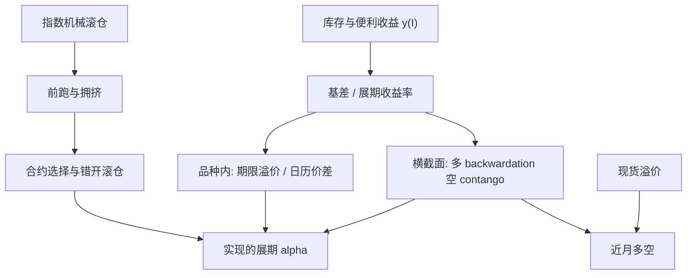

# 商品展期 alpha

完全抵押的商品期货多头，收益并不等于现货涨了多少；把近月换成远月时锁定的价差，是这个资产类别里可重复的一块，也是横截面上可排序的一块。

<footer>—— Gorton & Rouwenhorst, Facts and Fantasies about Commodity Futures, Financial Analysts Journal, 2006；期限溢价分解见 Szymanowska et al., Journal of Finance, 2014</footer>

Gorton 与 Rouwenhorst（2006）把长期商品期货事实从若干幻想里拆出来：与股票相当的平均超额、与股债的低相关、对通胀的对冲——而这些超额很大程度来自期货市场本身，而不是现货商品当收藏品一路升值。Erb 与 Harvey（2006）同时强调：指数收益对展期与多样化再平衡敏感，「商品」不是一个同质 beta。展期 alpha 指的是：用曲线形态（以及其背后的库存与便利收益）在品种之间做多 backwardation、做空 contango，或用更聪明的合约选择去打败机械近月滚仓，从而把 Gorton–Rouwenhorst 的平均事实变成一个可交易的横截面。Szymanowska、de Roon、Nijman 与 van den Goorbergh（2014）把商品期货溢价拆成现货溢价与期限溢价，后者正是曲线上不同到期的收益差。Boons 与 Prado（2019）的基差动量把基差的变化做成信号。本篇管跨品种与跨到期的**可移植规则**；同一品种内部按季节选月，见 [季节性展期](/quant/seasonal-roll)。

## 问题

完全抵押的近月期货超额，近似拆成现货收益加展期收益加抵押利息。现货腿波动大、长期漂移在许多品种上并不稳；展期腿由 $F_{\mathrm{near}}/F_{\mathrm{next}}$ 决定，慢且与库存周期相关。指数（GSCI、BCOM）用固定的滚仓窗和固定的近月规则，把所有品种的展期平均进一个 beta。问题是平均里既有正展期的石油与部分农产品，也有长期 contango 的某些金属与畜产品。被动多头在后一类上持续付展期。alpha 来自拒绝这一平均：按预期展期排序，空头那些系统付费的品种，或多头更远的合约以减轻负展期。

第二层是拥挤。指数滚仓窗事先公开。Mou（2011）提供证据：在高盛指数传统滚仓日前，相关合约的价格朝不利于指数的方向移动——前跑机械需求。机械近月策略的部分「负 alpha」其实是执行，不是仓储理论失效。展期 alpha 必须同时设计**信号**（谁该持有）与**日历**（何时换月）。

### 现货溢价与期限溢价

Szymanowska 等人（2014）的解剖：持有近月暴露的是现货溢价（与现货风险相关的补偿）；在曲线上做多一个到期、做空另一个，暴露期限溢价。二者都与基差有关，但不是同一个组合。只做「全市场多头商品」的人把两块捆在一起；只做日历价差的人几乎只要第二块。文献里不少「基差策略」混着两条腿。实现上应分别记账：横截面多空近月（现货溢价加展期），以及品种内日历价差（更纯的期限溢价）。Gorton、Hayashi 与 Rouwenhorst（2013）表明低库存品种随后收益更高——这主要给第一块提供基本面；期限溢价还依赖曲线斜率是否已被定价过度。

Erb 与 Harvey 指出，指数的再平衡本身会产生分散化收益。那不是展期 alpha：即使曲线全是平坦的，波动率与再平衡规则也能造出与几何平均有关的项。归因时应把再平衡、抵押利息、展期、现货四项分开，否则会把波动率当仓储。

## 方法

信号。最简单的是基差或展期收益率 $\rho=\ln(F_1/F_2)/\Delta T$，按品种排序，多头最高分位、空头最低分位，定期再平衡。可用库存分位、仓单、便利收益反演代替或增强 $\rho$，这与 [库存与曲线](/quant/commodity-inventory) 一致。Boons 与 Prado 的基差动量：用基差的近期变化，捕捉紧张加剧或缓解。不要把十二个月现货动量与展期信号无说明地乘在一起——Gorton 等人已指出动量部分来自选出低库存品种；乘积因子要能在控制基差后仍显著，才算新东西。

合约选择。在允许的流动性月份里，避开即将进入指数滚仓窗或即将交割的合约；对持续 contango 的品种，持有次近月或更远的活跃月，降低负展期（牺牲一些 Samuelson 波动与部分现货溢价）。这是对 Erb–Harvey「战术价值」的可操作化，也是对 Mou 前跑的规避。

组合。商品之间相关在危机中上升，多空展期不是市场中性到可以无限杠杆。波动目标应基于曲线状态：低库存、高 $y$ 时近月方差大，按名义等权会在紧张品种上超配风险。Gorton–Rouwenhorst 的长期等权多头是资产配置陈述；alpha 组合是相对价值陈述，二者杠杆与回撤预算不应共用。

### 回测中的换月会计

必须在单合约价格上模拟买卖价差与滚仓。主连连续序列往往已按某种规则调整过跳空，用它计算「展期收益」会重复或抹掉真实现金流。滚仓应在数日内完成，而不是假定结算价一次性换月。容量：指数品种的近月深度尚可，远月与小品种会迅速恶化。把 illiquid 远月写进最优展期，样本外滑点会吞掉 Szymanowska 意义上的期限溢价。

## 机制

仓储机制给出符号：低库存 → 高便利收益 → 近月升水 → 多头展期正期望，见 Kaldor、Working 与 Gorton–Hayashi–Rouwenhorst。横截面排序等于在交易 $y(I)$ 的截面。凯恩斯（1930）与希克斯（1939）的套保压力给出另一条符号故事：净生产商套保的品种远期偏低。两条故事在低库存且生产商套保时同向；在消费商套保或金融多头拥挤时可能冲突。实证赛马把预测权更多地给库存与基差，而不是给 CFTC 净持仓。因此展期 alpha 的一阶应是曲线与库存，套保压力最多当正交检验。

金融需求机制给出执行：指数与 ETN 的滚仓是可预测的订单流。前跑与拥挤使机械近月的实现展期差于「用结算价算的纸面展期」。聪明滚仓的 alpha 有一块是不做别人必须做的那笔流动性需求，而不是发现了新的 Working 曲线。

把展期 alpha 写成「永远做多整个商品指数」并不被 Gorton–Rouwenhorst 支持到可以忽略品种选择。他们的平均事实依赖样本与等权；Erb–Harvey 对单个品种长期收益的警告仍然有效。alpha 是相对的。

### 与外汇套息的类比与限度

商品展期像外汇套息：都是持有高利差（这里是正基差）资产、做空低利差。UIP 在外汇失败，仓储理论在商品上给出更硬的基本面——库存可测，$y$ 可反演。限度是：商品有交割与仓储极限（曲线可以断），外汇 G10 没有同等的「满罐」。危机中商品多空会一起碰到流动性；套息会碰到美元短缺。不要把 Du–Tepper–Verdelhan 的 CIP 基差因子直接当商品展期的对冲工具。

## 边界与工程取舍

超级周期与金融化改变谁在曲线上、不自动废除 $y(I)$，但会改变近月的平均 contango（2000 年代中期之后部分指数品种更常付展期）。样本必须跨过这一段再下结论。负油价、交割地点失效时，近月信号无定义，应有停机规则。碳排放、电力、部分运费合约的「展期」更接近期限结构风险溢价，缺乏稳定库存测量，不宜与原油农产品混成同一分位。

不要用 PPP 或 CIP 的语言去包装商品展期。卡塞尔锚的是汇率与物价；凯恩斯—希克斯在商品里要落到库存与套保，而不是落到利率平价。文献引用应停在仓储、Gorton–Rouwenhorst、Szymanowska、Erb–Harvey、Mou、Boons–Prado 这一支。

纸面夏普常来自在结算价上瞬间换月、忽略限仓与交割通知。实盘的展期 alpha 是扣掉这些之后仍与库存分位同向的那一段。若只在拥挤窗口里相对指数做价差，你交易的是 Mou 的订单流，应如实命名。

## 小结

- Gorton 与 Rouwenhorst（2006）确立商品期货作为资产类别的平均事实；展期是平均超额的核心成分，但平均不等于最优。
- 展期 alpha 是按基差、库存或基差动量在品种与到期之间排序，并避开机械滚仓窗（Erb and Harvey, 2006；Szymanowska et al., 2014；Boons and Prado, 2019；Mou, 2011）。
- 机制一阶是仓储与 $y(I)$（Working；Gorton, Hayashi and Rouwenhorst, 2013），不是把凯恩斯套保压力当默认因子。
- 现货溢价与期限溢价应分开记账；主连连续行情不能用来回测展期现金流。
- 与季节性展期、便利收益、库存—曲线是同一套仓储语言的交易层；与外汇 CIP/PPP 不是同一套。
- 出处：Gorton and Rouwenhorst, *Financial Analysts Journal*, 2006；Erb and Harvey, *FAJ*, 2006；Gorton, Hayashi and Rouwenhorst, *Review of Finance*, 2013；Szymanowska, de Roon, Nijman and van den Goorbergh, *Journal of Finance*, 2014；Boons and Prado, *Journal of Finance*, 2019；Mou, 2011；凯恩斯与希克斯见 *A Treatise on Money*, 1930 与 *Value and Capital*, 1939。
