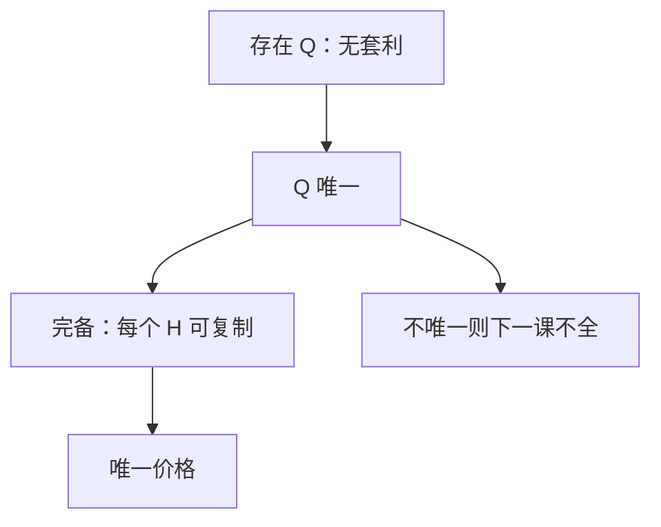

# 完备市场与唯一测度

市场完备当且仅当等价鞅测度唯一。唯一的 $Q$ 给出每个未定权益的唯一无套利价格，并保证可复制。

<footer>—— 据 Harrison and Pliska, 1981；Delbaen and Schachermayer, The Mathematics of Arbitrage, 2006；Shreve, Stochastic Calculus for Finance II, 第 5 章整理</footer>

上一课[风险中性测度](/quant/risk-neutral-measure)用第一基本定理给出「存在 $Q$」。缺口是：存在不等于唯一。许多 $Q$ 意味着同一支付可以对应一个价格区间。本课把第二基本定理钉成可用形式：完备 $\Leftrightarrow$ $Q$ 唯一，并指出 Black–Scholes 市场为何落在这一侧。

## 问题

一个布朗驱动一个可交易标的（加货币市场）时，$\theta=(\mu-r)/\sigma$ 被方程钉死，$Q$ 唯一。两个独立布朗只驱动一个 $S$ 时，$\theta$ 有一个自由分量，$Q$ 有一族。缺口是给「每个 $\mathcal F_T$-可测支付都能用可容许策略复制」起个名字——完备——并把它和唯一 $Q$ 焊在一起。没有这条，后课写「BSM 价格」会不知道凭什么是一个数而不是一段。

可复制意味着存在 $\Delta$，使终值几乎必然等于 $H$。唯一 $Q$ 保证所有无套利价格重合；完备保证这个价格真能靠交易达到，而不只是期望。

### 完备不是「市场流动性好」

完备是生成的未定权益空间是否等于 $L^2(\mathcal F_T)$（或合适的可积类），不是买卖价差小。限价簿厚不厚是微观结构，本课程不重写。这里只数独立噪声源与可交易风险源的个数是否匹配。

鞅表示：一个布朗的可积鞅都能写成 $\int\phi\,\mathrm d W^Q$。有交易的 $S$ 把 $\mathrm d W^Q$ 变成 $\mathrm d S$，于是表示变成复制。

## 方法

第二基本定理（连续时间、技术条件下）：无套利市场完备 $\Leftrightarrow$ 等价鞅测度唯一。Black–Scholes：一维 GBM + 常数 $r$，噪声维数等于可交易风险维数，$Q$ 唯一，欧式 $H=g(S_T)$ 可复制。多维：若波动率矩阵在交易资产上可逆，同样唯一。不可逆——多余的布朗或不可交易的随机波动——则不完备。计数规则极简：独立噪声个数减去可交易风险源个数，等于 $Q$ 的自由度数。

价格公式在完备时不依赖投资者偏好：谁来定价都得报 $\mathrm e^{-rT}\mathbb E_Q[H]$，否则可被复制策略套利。这是后课 PDE、delta 对冲共用同一个数的原因。

## 机制

鞅表示定理把 $Q$ 下的平方可积鞅写成对 $W^Q$ 的积分。若每个 $W^Q$ 分量都能被某个可交易资产的 $\mathrm d S$ 对冲掉，积分变成交易策略，任意合适的 $\mathcal F_T$ 支付都能达到。若有一个 $W$ 分量进不了任何 $\mathrm d S$，表示里的那一项无法交易，对应的密度扰动给出另一个等价鞅测度：在不可对冲方向上倾斜路径权重，贴现可交易资产仍然走平。唯一性失败与不可复制是同一件事的两面。因此「BSM 给出一个数」不是计算方便，是维数匹配的定理结论。

离散二叉树是完备的有限维原型：每步两个分支、一个股票加债券，恰可复制。三叉树同一步两个以上分支，立刻不完备。连续极限继承这个计数。

## 边界

本课不把 Delbaen–Schachermayer 的 NFLVR 与 $\sigma$-鞅测度写全。跳跃、随机波动作为不完备的例子只点名，机制放下一课。后课默认：BSM 市场完备，$Q$ 唯一，欧式支付有唯一无套利价。维数一旦失配，不要再把单一 Black 价格当成定理。下一课[不全市场](/quant/incomplete-market)处理多个 $Q$ 时价格变成区间。BSM 主干仍走本课的唯一侧。

## 小结

- 完备 $\Leftrightarrow$ 等价鞅测度唯一（第二基本定理）。
- 噪声维数与可交易风险维数匹配时 $Q$ 唯一。
- 唯一价格来自可复制，不是来自偏好。
- 鞅表示把 $Q$-期望变成对冲积分。
- 二叉树完备、三叉树不完备，计数与连续情形相同。
- 出处：Harrison–Pliska 1981；Shreve SDE II 第 5 章。
