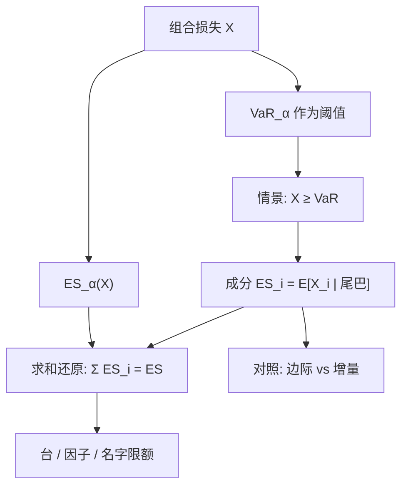

# 成分 ES 与 Euler 分配

正齐次的风险度量沿欧拉公式分解为各项的边际贡献之和；Expected Shortfall 的边际是「组合已坏过 VaR 的那些情景里，该头寸的条件期望」，因而可以把连贯的尾部资本分到台、因子或名字上。

<footer>—— Tasche, Capital Allocation to Business Units and Sub-Portfolios: the Euler Principle；ES 的连贯性见 Acerbi and Tasche, 2002</footer>

[上一课](/quant/liquidity-adjusted-var)把外生价差成本加到中间价 VaR 上，更一致的做法是在每条情景用可成交价定义 $L$；大仓位的主导项是冲击与变现时间。缺口是切开。[ES](/quant/expected-shortfall) 给出整个组合一个尾部数字，限额与资本还要问这个数字里有多少来自交易台 A 或单名 $i$。本课写正齐次风险度量上的 Euler 分配，以及边际 / 成分 / 增量三个量如何分叉。不重讲半价差加法。后课保证金模型默认已经读完：资本切开优先 ES。

## 问题

正齐次 $\rho(\lambda X)=\lambda\rho(X)$（$\lambda\gt 0$）给出 Euler 切开

$$
\rho(X)=\sum_i w_i\frac{\partial\rho}{\partial w_i},
$$

各项 $w_i\partial_i\rho$ 称为成分风险。波动上这就是 [风险预算](/quant/risk-budgeting) 里的 $w_i(\Sigma w)_i/\sigma$；尾巴上，ES 的偏导数是条件期望 $E[X_i\mid X\ge q_\alpha]$（连续分布、定义恰当的版本）。组合 ES 不能按名义权重切开：相关、尾依赖、期权凸性都会让「占净值 10%」与「占 ES 10%」脱钩。朴素用单独计算的 $\mathrm{ES}(X_i)$ 再按比例缩放，和不连贯的 VaR 一样会惩罚分散化或重复计算。需要一种分配，使得：(1) 各项之和精确等于组合 $\rho$；(2) 对边际增加仓位的方向正确（多承担组合尾巴的名字，分到更多资本）；(3) 与连贯性相容——分散化降低组合 ES 时，分配不会出现「合并后各项之和上升」。

Tasche 论证：在正齐次风险度量上，Euler 分配是满足「与边际风险定价一致」的标准选择。Denault 从博弈论的 Aumann–Shapley 值到达同一点。问题是把 $\partial\mathrm{ES}/\partial w_i$ 写成可估计的条件期望，并处理原子、非线性、以及「去掉整个台」与「微增一个基点」不是同一问题。

### 三个容易混的量

**边际 ES：** $\partial\mathrm{ES}/\partial w_i$，仓位微增对组合 ES 的导数。**成分 ES：** $w_i$ 乘边际，欧拉项，求和还原。**增量 ES：** $\mathrm{ES}(X)-\mathrm{ES}(X^{-i})$，整块去掉 $i$ 之后组合 ES 的下降。线性、椭圆、小仓位时三者方向一致；大额头寸、门槛效应（违约、障碍）时增量与边际可差很远。限额若按增量，会把「去掉我」的谈判写进数字；按成分，则把当前权重下的一阶贡献写进数字。两者都要报，不要互相改名。

VaR 作为分位数，Euler 贡献是 $w_i E[X_i\mid X=q_\alpha]$ 一类，只依赖恰好在分位数上的切片，估计极噪，且 VaR 不连贯，分配缺少「分散化兼容」的公理支撑。资本切开应优先 ES，沟通可以用 VaR，但不要用 VaR 成分去做奖金。

## 方法

连续分布上，Acerbi–Tasche 的 ES 满足

$$
\frac{\partial\mathrm{ES}_\alpha(X)}{\partial w_i}=E[X_i\mid X\ge\mathrm{VaR}_\alpha(X)],
$$

成分 $\mathrm{ES}_i=w_i E[X_i\mid X\ge q_\alpha]$。历史法或 MC：取出损失超过样本 VaR 的那些路径（或日子），在这些路径上对第 $i$ 项损失取平均，再乘权重口径（若 $X_i$ 已是该腿的损失，则不必再乘）。路径很少时，这个平均被一两个极值主导，成分会在名字之间剧烈跳动。稳定化：用核平滑代替硬阈值、用 EVT 对联合超出建模、或对分配做收缩（向名义或向波动贡献拉）。

**因子与希腊字母。** 把 $X=\sum_k \beta_k F_k+\varepsilon$ 时，可对因子损失 $F_k$ 做成分 ES，残差另成一项。期权账簿按风险因子（现货、波动、利率）切开，比按合约切开更稳。注意：因子成分之和应等于系统 ES，残差成分对应特异尾；若映射不全，残差会被当成「分散化红利」。

**与风险预算的衔接。** 波动 Euler 给出日常风险预算；ES Euler 给出尾部预算。两者的 $b$ 可以不同：日常要平，尾巴允许集中在对冲工具上。优化若最小化组合 ES 并约束成分 ES，Rockafellar–Uryasev 的凸形式仍可用，但成分约束是对条件期望的约束，估计误差会变成权重抖动，需要强先验。

### 估计：同一套路径，切两刀

VaR、ES、成分 ES 必须来自同一套情景与同一损失定义，否则切开对不上加总。FHS、Copula MC、压力年路径都可以：先在该测度下算 $q_\alpha$ 与 ES，再在 $\{L\ge q_\alpha\}$ 上对各项取条件均值。压力 ES 的成分回答「压力年里谁在喂尾巴」，日常 FHS 的成分回答「今日 $\sigma_t$ 下谁在喂尾巴」。资本配置若混用两套成分，台与台之间会套利监管口径。

## 机制

Euler 的机制是一次齐次函数的锥性质：沿当前权重射线，$\rho$ 的值等于梯度点乘权重。ES 的梯度恰好是尾部条件期望，因为 ES 是分位数以上的平均；把某腿在那些坏情景里的实现加大，平均就加大，边际为正。尾依赖高时，两个名字在同一批坏情景里同时为正，成分接近各自「单独的尾」之和，分散化奖励变小——与 ES 本身的次可加行为一致。高斯相关在 VaR 上能制造假分散化；在 ES 成分上，若联合模型仍是高斯 Copula，假分散化会进入切开的数字。要用能产生 $\lambda_L\gt 0$ 的联合模型，成分才会把崩溃同现记到相关的名字上。

次可加保证 $\mathrm{ES}(X+Y)\le\mathrm{ES}(X)+\mathrm{ES}(Y)$，但不保证成分 $\mathrm{ES}_i\le\mathrm{ES}(X_i)$。成分可以超过独立 ES（该腿在组合坏情景里特别差），也可以为负（对冲腿在组合坏情景里赚钱）。负成分是合法的：那是保险。禁止负成分、把对冲腿的贡献设为零，会破坏求和还原，也会让对冲看起来「不占资本」从而过度使用。

负的成分 ES 不是利润中心的免费午餐。它依赖联合模型：相关符号一变，对冲腿可以翻成最大正贡献。对冲的资本减免应有相关性压力，而不是锁死当前成分。

### 原子、违约与障碍

损失有原子时（违约指示、离散跳跃），朴素 $E[X_i\mid X\gt \mathrm{VaR}]$ 与积分定义可能分叉，应使用 Acerbi–Tasche 的分位数积分版本再对参数求导。障碍、可转债、缺口产品在部分情景里 $g$ 不光滑，有限差分 $\Delta\mathrm{ES}/\Delta w_i$ 比解析条件期望更安全。增量 ES 对「整个发行盘子」往往比边际更有管理含义：微增 1 元与关掉整本书不是同一决策。

## 边界与工程取舍

Euler 分配不是唯一可能：成本分配、Shapley 对离散合作博弈、监管给定的权重，都在用。选 Euler 是因为它与正齐次、与边际定价一致，不是因为它「公平」。正齐次本身排除非线性流动性；大额头寸应先把冲击写进 $L$，再 Euler，否则切开的是中间价 ES，不是可实现 ES。

成分对极端值敏感，一个错误脉冲可以让某名字占满当月 ES。清洗与 Winsorize 必须预指定。不要用成分去做事后奖金而又允许台长在月末调对冲：那是在优化分配规则而不是优化风险。与 [过拟合](/quant/backtest-overfitting) 类似，分配规则若被选择过，切开不再是度量的推论。

报告成分时同时报「占 ES 的百分比」与「占净值的百分比」。只有前者，会把小而极毒的尾巴当成整个故事；只有后者，会回到名义权重。两列并排才能看见杠杆与毒性。

## 小结

- 正齐次风险度量可按 Euler 公式切成成分之和；ES 的成分是尾巴情景里各腿的条件期望。
- 边际、成分、增量三个量在非线性与大额头寸上会分叉，限额与「关掉整本书」要用不同数字。
- VaR 的 Euler 切片噪声大且度量不连贯；资本切开优先 ES。
- 负成分对应对冲，禁止负项会破坏加总；对冲减免须做相关压力。
- 同一套情景上同时算 ES 与成分，日常测度与压力测度不要混切。
- 出处：Tasche 关于 Euler 分配的综述与论文；Denault, *Journal of Risk*, 2001；Acerbi and Tasche, 2002；Rockafellar–Uryasev 优化；对照 Roncalli 风险预算教材中的欧拉贡献。
